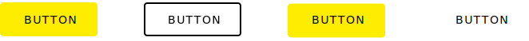
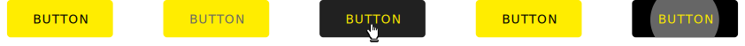
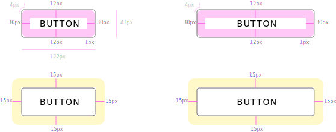
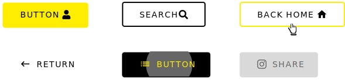

## DXC Button Visual Guidelines

#### Overview

Buttons are basic interface elements that initialize an action or function when the user interacts with them. The appearance of the button should suggest the user to take an action that leads to different scenarios.

These elements that reinforce to the user the necesity to interact are called CTA (Call to Action) components, which basically are designed to capture user attention and improve the user experience within the application.
 

##### *Appereance*

Into DXC Design System you will find several buttons with different shades, colors and sizes, each of them carefully designed following best practices to fit in every application that you want to build or integrate with this system.
 

###### Modes

We can identify four different modes that imply some visual changes according to color, border or shadow attributes.
Modes: __basic__, __outlined__, __raised__, __flat__.
 

 

###### States

The states are the different behaviours of the button component based in the interaction of the user.
For the desktop version, we contemplate five different states by which can pass.

States: __default__, __disabled__, __hover__, __clicked__ and __animation__.  
 

 

##### *Design Specifications*

To define the button design specifications, several properties were identified and assigned unmutable values ​​that makes the component recognizable along applications, independently of the customizable styles given.

With the default theme, the components will get black as a primary color for the text and yellow as accent color for background. To keep the consistency along the design system, the font used is Open Sans.

 

| Property           | Value|
|--------------------|------:|
| Margin            | `15px` |
| Padding right/left | `30px` |
| Border Radius | `4px` |
| Border thickness| `2px` |
| Min. height| `43px` |
| Min. width| `122px` |
| Max. width| `420px` |
| Font size| `14px` |
| Font wright| `Normal` |
| Capitalization | `Uppercase` |

 

###### Icon Usage

It is not limited the content of a button, like so you can place icons inside of a button to reinforce the action accordingly to the icon meaning.

Both resources, [Material Icons](https://material.io/tools/icons) and [Fontawesome Icons](https://fontawesome.com/icons) can be used in the DXC Design System, so it is apt to the user to choose between one of the two options.

Also, another point to consider is that the icon can goes before or after the text with a separation of 10 pixels respecting the main button's text.

*Do not use icons mainly for visual interest, the glyph must add information and clarification to the action that would be performed in the context of the button.
 

 

###### User Interface Design Consideration

Here, you can find more considerations in the using of buttons:

- In instances where buttons are vertically stacked, buttons should be the same length.
- Horizontally displayed buttons are dependent on the amount of text, so button lengths may vary, always considering the minimum and maximum established sizes.
- Text or images on a button should always be centered.
- There must be 30 pixels of space between horizontally displayed buttons.
- Upper case text should be used on all buttons.
- Button location, not dictated by workflow, should be centered or right aligned at the section/page margin. This can be defined by the application but should be consistent throughout.
