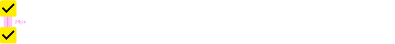

## DXC Checkbox Visual Guidelines

#### Overview

Checkboxes are inputs that offer to the user the possibility to select one or more options from a range of attributes.

Two main states can be defined in the checkbox component from this design system, it could be marked as selected or unselected whether if you want to include the item or not in the action that is going to take place. Another third state is consider as indeterminate that cannot be classify into selected or unselected.

The using of checkbox would be reasonable to proceed with setting configuration, multiple choices offered, binary response (yes/no), or accept conditions and additional features.
 

##### *Appereance*

Checkbox has a toggle mode so every checkbox component in the application remaining the same visually. It inherits colors from the definition of the theme, using primary color as text content of the checkbox and accent color as a background of the box.
 

###### Modes

As it is pointing in the description, checkbox is a boolean component that can get three defined modes, selected when the option wants to be added or included or unselected when the option should not be included.
Modes: __selected__, __unselected__ or __indeterminate__.
 

 

###### States

Five different states are defined in the life cycle of the component: __enabled__, __disabled__, __hovered__, __focused__ and __pressed__.
 

  

##### *Design Specifications*

Specifications for checkbox are simple. The size of the checkbox should displayed a box 24px x 24px due to improve the touchable area. Depends on the input of the component it can be used different variation as are describe below:

- Checkbox only
- Checkbox with text at his right
- Checkbox with text at his left

| Property           | Value|
|--------------------|------:|
| Margin right/left  | `15px`|
| Margin top/bottom  | `10px`|
| Border Radius      | `4px` |
| Border thickness   | `2px` |
| Font size (with text)| `16px` |
| Font weight        | `Regular` |

Checkbox may be either linear or stacked, the first case should be used when the checkboxes are independent of a category and they will be displayed horizontally, where device allows.

Stacked should be choose when checkbox are related and have a group label to enhance readability and show association.

    Linear
    The text should have a margin of 15 pixeles based on it's position. If the text is after the chebox, it should define the margin on the right side. Otherwise, if the label of the checkbox is before the box, the margin has to go on the left side.

  

    Stacked
    The spacing between stacked checkboxes should be 20 pixel that are determining by the top/bottom margin of the checkboxes itself. 

  

 The last property that the checkbox can get is the required attribute that would be represent once the checkbox has a paring label, indicating that the selection of that input must be done, in other case the user couldn't proceed in the application flow. 
 The representation of a required checbox is an asterisk right before the checkbox label.

 
  

