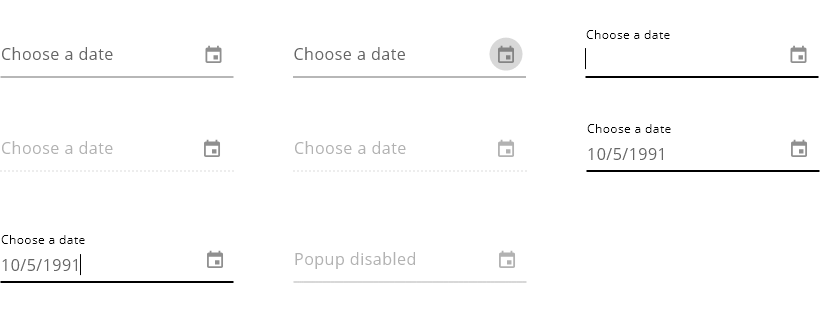
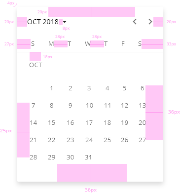

## DXC Date Visual Guidelines

#### Overview

A date input is a user interface element where the user can type or select a date in a predefined format. The date format depends on an ISO definition for each country and the preference of use within the application.

The format of the date may vary depending on language, region, country or customer. i.e.

- The default format for the United States is mm/dd/yyyy
- The default format for Australia, Europe, Africa, So America and much of Asia is dd/mm/yyyy
- The default format in China is yyyy/mm/dd

It is a good practice to give to the user some type of hint about the date format and in many cases, there is a second way to select the date with a date picker control.
In this component both options will be available to the user, so if the user gets stuck typing the correct format of the data it has an additional option with graphic representation that is easily used.

It is common to find a date picker in these scenarios: date of birth, date range or as an input to filter based on some criteria.

If the state of the input is empty, it should give a hint in the placeholder about the format required. Also, as the design system is based in some of the Angular Material guidelines, that format would be visible in case that the input component is selected or filled.

##### *Appereance*

The date input should lead the user to interact with it to select a date and give appropiate feedback to the user to know what value is selected from the wide range. It should be intuitive, navigable and useful.

###### Modes

There are three modes for the date input with slightly changes that follows the design of the rest inputs. A thin line under the input container with description and labeling, and some animations that activate when the user interacts with the component.
Modes: __basic__, __basic with custom icon__ and __basic with custom format__.
 

 

###### States

Eleven different states are defined in the life cycle of the component: __normal__, __icon pressed__, __input pressed__, __partially disabled__, __completely disabled__, __selected__, __entered__ and __disabled pop up__.
 

  

###### Calendar Pop-up

The calendar pop-up displays the different views of days, months and years.
By default, the view of the calendar will be the current month with all of its days and it will appear right below the input.

The user can navigate through the calendar to select the desire date.

###### *Design Interactions*

Different feedback and outcomes happen when the calendar pop-up is used. To see more information please, open the xd file linked with the date component in this respository.

##### *Design Specifications*

The specifications for dates are similar to the ones used with the input text component. In the case that the field will be read-only, the look and feel will be the same for both components.

The text within the input should always aligns right. By default, the font size for this type of component is 16 pixels. When the field is empty and it has some hint the space between the text and the line below the input should be 12 pixels.

In the case that the input is selected or the user is typing inside and the hint is positioned on the top, the measures are 6 pixels between the main text and the underline decoration and 6 pixels between the top hint respect the main text. As this will take more space, the height of the component will be changed from 34 pixels to 51 pixels.
Another variation could be to having an auxiliary text below the underlined item so it will take 74 pixels for the height.

The font for the hint at the top and the auxiliary text must be 12 pixels.

The thickness of the border should be 1 pixel but in case that the input will be selected, the width would change to 2 pixels with animation between the two states inherit from Angular Material default behavior.

Smaller touch points decrease the ease of use of the interface because it is costly for the user to hit the target. To prevent that, the size defined for the date picker icon is 20 pixels by 20 pixels for the desktop version and 44 pixels by 44 pixels for mobile and tablet versions of the application.
These sizes are including small padding as a touchable safe area so the size of the icon in both cases will be 2 pixels less in wide and tall.

| Property           | Value|
|--------------------|------:|
| Margin             | `10px`|
| Height (default)   | `34px`|
| Height (selected)  | `51px`|
| Height (selected + auxiliar text)  | `74px`|
| Min widht          | `230px` |
| Border thickness   | `1px/2px` |
| Font size (with text)| `16px` |
| Font weight        | `Regular` |
| Icon size       | `18x18(px)` |
| Distance between text and underline | `12px` |
 

  

###### *Calendar Pop-up Specifications*

The majority of the specifications are the same as in Angular Material datepicker component. In the table below is pointed all the relevant information.

| Property           | Value|
|--------------------|------:|
| Padding            | `20px`|
| Height (default)   | `354px`|
| Widht (default)    | `296px` |
| Circle size        | `28x28(px)` |
| Circle thickness   | `1px` |
| Font weight        | `Regular` |
| Font size          | `13px` |

  
