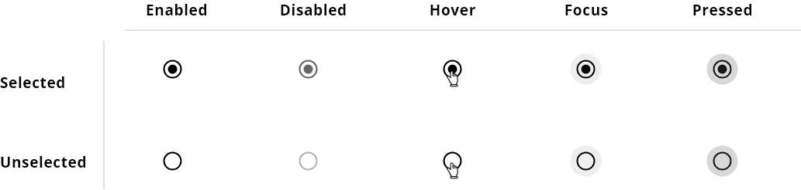

## DXC Radio Button Visual Guidelines

#### Overview

Radio buttons are elements that let the user select one option within a options group. It is the correct election when it has a list with six elements or fewer items, when the user needs to pick one mutually exclusive choice from a list of options.
Clicking a non-selected radio button will deselect whatever other button was previously selected in the list.

It is recommended to use radio buttons only for settings, in a logical order based on some criteria and not taking the alphabetical sorting because it depends on the language and the order could be seen altered.

To offer a good usability in the application the key part in the radio component is the labeling, it should be concise and clearly differentiated with respect to other options. 

By default, one option of the radio group must be pre-selected. Select the safest or convinient option, the one that affect the minimum to the application status and if the users need to refreain to from choosing an item, always should be presented a neutral option in that context.

There can be an special case that it shouldn't be a pre-selected option from the start, so it is also contemplated here.

##### *Appereance*

###### Modes

Selected mode must be used when the user select an option or by default the value of the radio button is selected. For the rest of the cases, the mode that the component should get is unselected. A radio button that is selected can be unselected by the user that should be able to touch or click either the ratio button or the associated text to deselect the option, this is the same way to select an unselected radio.

Modes: __selected__ or __unselected__.

 

###### States

Five different states are defined in the life cycle of the component: __enabled__, __disabled__, __hovered__, __focused__ and __pressed__.

 

  

##### *Design Specifications*

Radio button specifications are similar to the checkbox component since the usage of both are quite alike.
The outlined shape has 24 by 24 pixels. In case the radio is selected, the inner shape has a size of 12 by 12 pixels.

The radio button must always be pared with text, being able to place the text before or after the radio button.

| Property           | Value|
|--------------------|------:|
| Margin right/left  | `15px`|
| Margin top/bottom  | `10px`|
| Border thickness   | `2px` |
| Font size (with text)| `16px` |
| Font weight        | `Regular` |

  

Radio buttons may be displayed in a linear fashion or vertically stacked.

*Linear*

Multiple radio buttons may be displayed horizontally across the page while keeping them aligned within their respective columns. Here, it is needed to have in consideration that the linear radio buttons represent some challenge, because it's difficult to scan and localize sometime a vertical position could be better.

In any case, in the specification it is specified the ideal distance between component with label in the same horizontal edge to avoid the problem of pairing and scannability.

 

  

 

*Stacked*

Short lists of radio buttons should be stacked vertically below a descriptive label to better associate the group. Options that are listed vertically are easier to read. 
With this option, try to make one choice per line. Also, avoid nesting whenever is possible, all options should be keep at same level to not generate confusion.

  

###### User Interface Design Considerations

- Unless a selection is mandatory, a user should be able to re-click a radio button to deselect.
- Single radio buttons should not be used.
- Use animations and visual feedback to improve the user experience.
- Use radio buttons on wizard pages to make alternatives clear to the user.
- If the question that the user needs to responde is as easier as yes/no, it is recommended to use checkbox instead of radio button.

