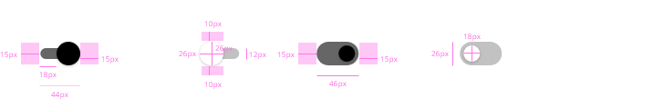
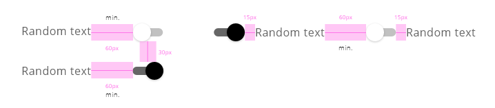

## DXC Toggle Switch Visual Guidelines

#### Overview

Switch toggles are elements that can get two simple states, each of them has an impact on the system and it can be switched on or off, there are no more options.
If the switch toggle is on one state, the action to change it will modify to value of the element to the contrary.

The main difference to using a switch toggle instead of other components with a similar purpose like radio buttons or checkboxes are the immediate effect that they should take. This grants the users control on the application, changing preferences and configuration settings.

With the use of switch toggle, it is not needed a submit button to do the appropriate action, because the action takes place at the moment that the switch is turned on or off.

##### *Appereance*

The appearance of the component should provide good visual feedback, making clear when the switch is on or off. To make a difference between states colors, shadows and fill properties can be used.
 

###### Modes

Two main modes are represented within the component.

Modes: __on__ and __off__.

 

 

###### States

Five different states are defined in the life cycle of the component: __normal__, __disabled__, __hovered__, __focused__ and __pressed__.

 

 

##### *Theming*

Colors used for the design in each theme mode.

###### Light theme

Black: #000000
Dark grey: #666666
White: #FFFFFF
Light grey: #666666 opacity 0.4
Focus ripple: #666666 opacity 0.1
Press ripple: #666666 opacity 0.25
Disable opacity checked: 0.4
Disable opacity unchecked: 0.7

###### Dark theme

Yellow: #FFED00
Dark grey: #666666
White: #FFFFFF
Dark grey unchecked: #666666 opacity 0.4
Focus ripple checked: #FFFFFF opacity 0.1
Focus ripple unchecked: #FFED00 opacity 0.1
Press ripple checked: #FFFFFF opacity 0.25
Press ripple unchecked: #FFED00 opacity 0.25
Disabled opacity: 0.7

 

##### *Design Specifications*

Schematics examples for the switch toggle component with all the variations.

 

 

 
###### User Interface Design Considerations

- Toggles should be used in place of radio buttons whenever the options are opposites of each other (i.e. yes/no, on/off, male/female, etc) or minimal in number (3 or 4 maximum) of choices where only one selection is required.
- If toggle buttons are part of a group, the layout should suggest to the user that every toggle belongs to the group.
- Try to present your lists vertically, with one choice per line. 