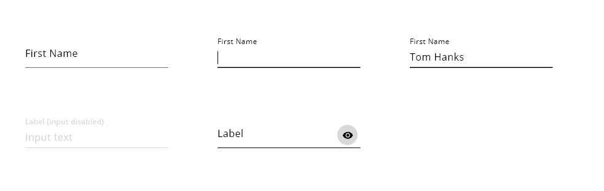
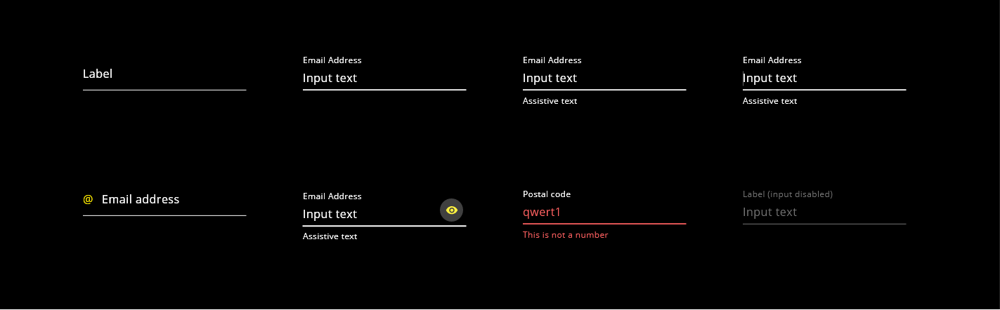
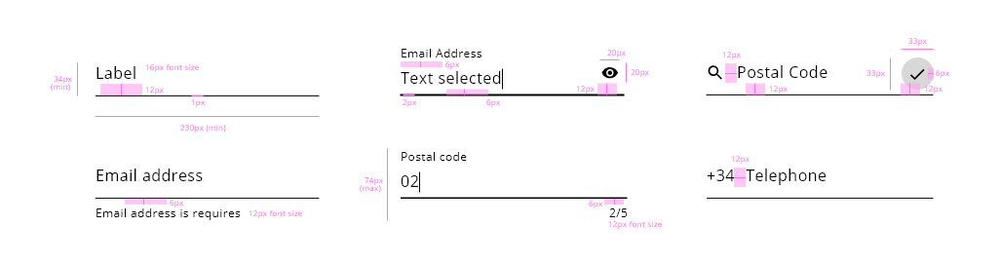

## DXC Text Input Visual Guidelines

#### Overview

Text inputs are the standard way to receive the user input into an application. There are several types of inputs to cover a spectrum, from email inputs to numbers. 
Each input should specify which property the user is editing and indicate clearly the status of the field in every interaction.

##### *Appearance*

The input appearance must be simple and clear, in this design system text inputs are represented as a placeholder with a thin underline where the text will be written. 
Other elements like assistive text, prefix or suffix icons or error handlers can be complementing the input field making the basic structure more informative.

###### Modes

Five different modes can be identify using text input component: __basic__, __basic with assistive text__, __basic with prefix__, __basic with suffix__ and __basic with prefix and suffix__.

 

###### States

The states for text input are: __normal__, __focused__, __value entered__, __disabled__ and __icon pressed__.

 

##### *Theming*

###### Light theme

Black: #000000 (text, underline and icons)  
Red error: #D0011B  
Icon ripple: #000000, opacity 0.25 
Disabled: #D9D9D9

 

###### Dark theme

White: #FFFFFF  
Yellow DXC: #FFED00  
Red error: #FF6161  
Disabled: #757575

 

##### *Design Specifications*

| Property           | Value|
|--------------------|------:|
| Margin             | `15px`|
| Height (min)       | `34px`|
| Height (max)       | `74px`|
| Widht (min)        | `230px` |
| Widht (max)        | `100%` |
| Border thickness   | `1px/2px` |
| Font size (with text) | `16px` |
| Font size smaller text | `12px` |
| Font weight        | `Regular` |
| Icon size       | `18x18(px)` |
| Distance between text and underline | `12px` |
| Icon margin right side | `6px` |
| Distance between text and underline (animated) | `6px` |
| Assistive text margin top | `6px` |

 

###### Required fields

Required fields are a variation in the normal behavior of the input fields. This indicated to the user that the input is required so it can't be skipped if the intention is to go forward in the application.

A red asterisks before the input label must indicate that the text input is a required field, with this visual clue the application is letting the user the mandatory field.

Here are the different representations of a required field:

 

The specifications for the required input follows the same guide that a normal input, with the variation of the asterisk before the label.

###### User Interface Design Considerations

- Input fields should allow users to enter any combination of letters, numbers, or symbols unless otherwise restricted or stipulated by requirements
- Avoid breaking up a number with distinct sections into separate input field (i.e. phone numbers, area codes, SSN, dates, etc) to facilitate screen reader accessibility requirements
- Allow sufficient space in an entry field to allow typical input
- User text areas, rather than a single-line input box for paragraph text and comments
- Input fields are more restrictive for mobile users to make sure the type of input field is warranted
- Only show error validation messages after the user has left the field