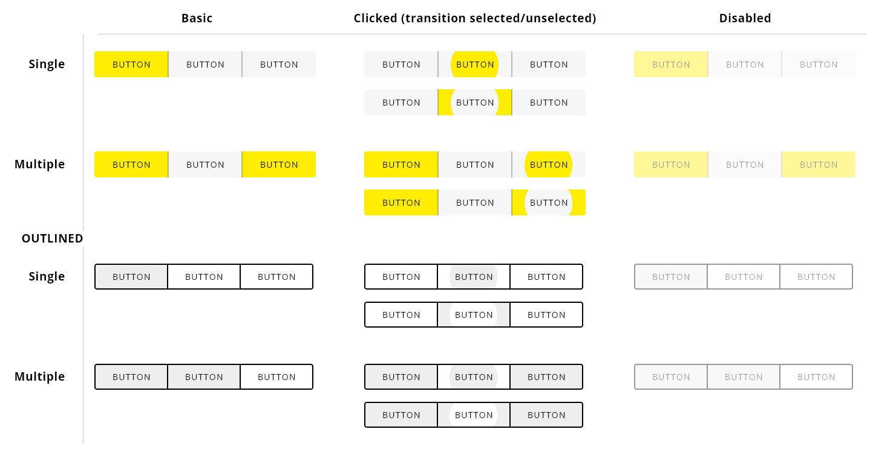
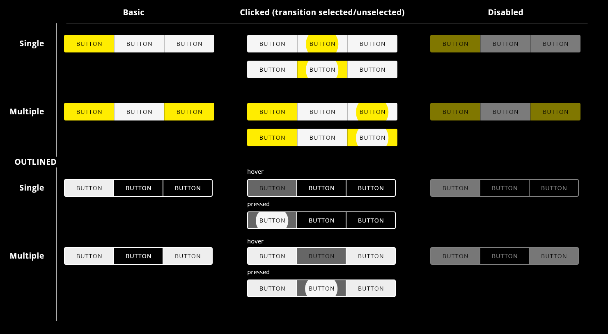

## DXC Toggle Visual Guidelines

#### Overview

Toggle buttons can be used to put together related options that share a common attribute modification.
It allows the user to switch from one selected option to another in the same control, having one option selected at a time. Also, there can be another variation that allows to select multiple options from the current toggle group.

##### *Appereance*

The appereance of the toggle looks like button component, because it is based on the same specifications to keeping consistency along the appplication, but in this case are offered fewer visual modes.

###### Modes

Two modes are presented: __basic__ and __outlined__.

 

###### States

Different states are defined in the life cycle of the component:
__Normal__, __selected__, __unselected__, __disabled__ and __clicked__.

##### *Theming*

###### Light theme

Yellow: #FEDD00  
Black: #000000  
Grey unselected option (default): #F6F6F6  
Disabled opacity (default): 0.5  
Grey selected option (outlined): #EEEEEE  
Grey unselected option (outlined): #FFFFFF  
Disabled opacity (outlined): 0.25  
 

 

###### Dark theme

Same colors are using for the default mode in the dark theme. New colors for the outline mode are defined as follow:

Grey selected option (outlined): #EEEEEE  
Hover grey unselected: #666666  
Disabled opacity (outlined): 0.5  
 

 

##### *Design Specifications*

Toggles should be used in place of radio buttons whenever the options are
- Minimal in number, i.e. 3 or 4 maximum choices where only one seelction is required
- Opposites of each other