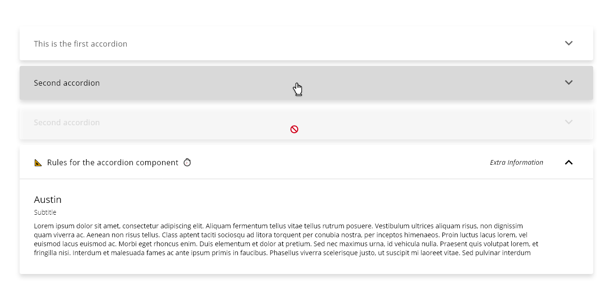
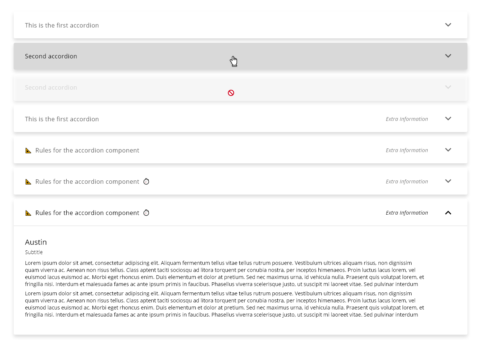
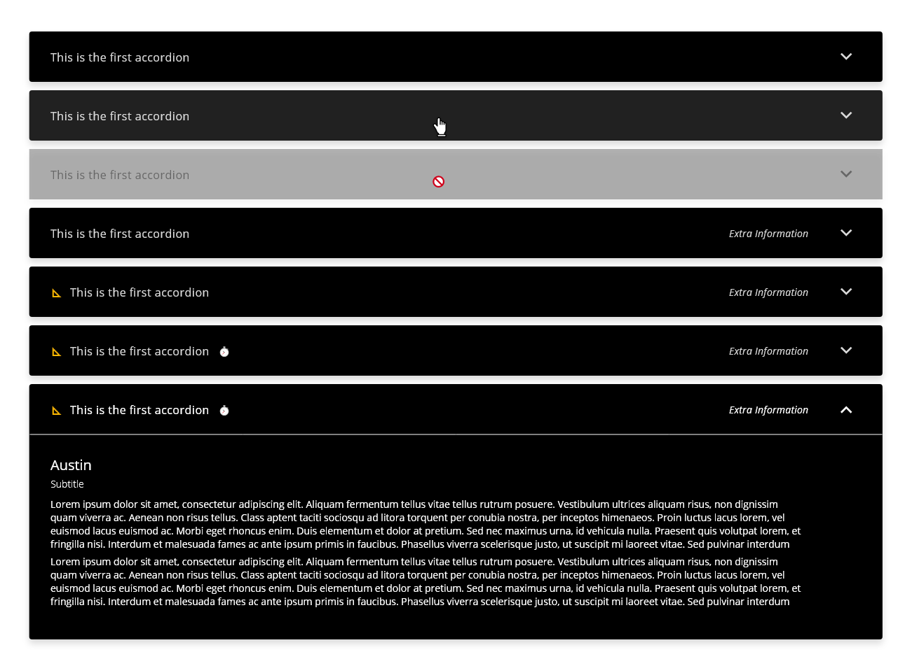
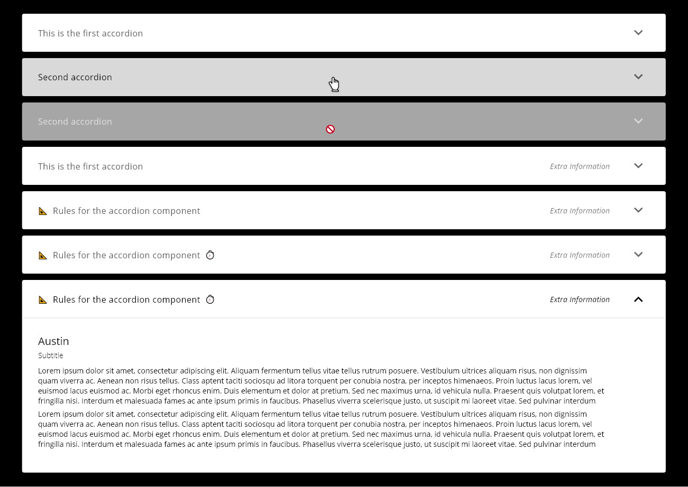
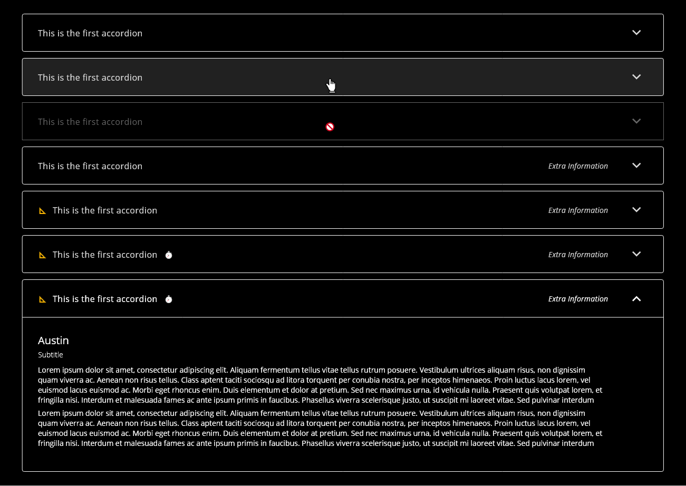
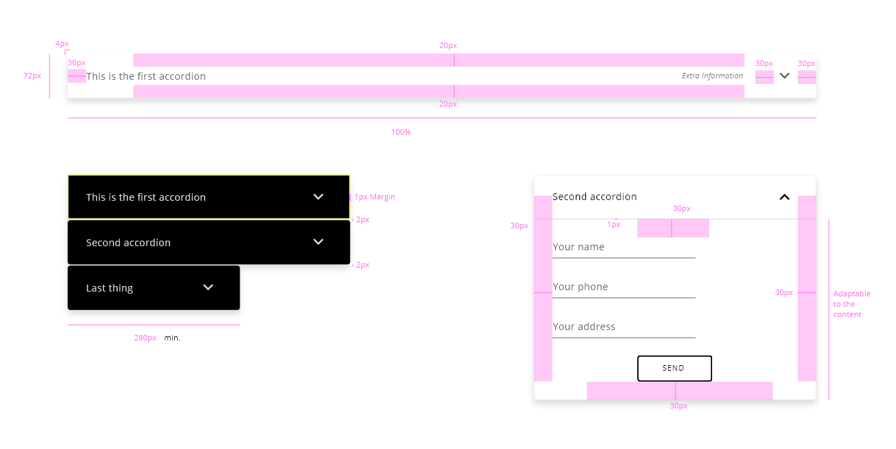
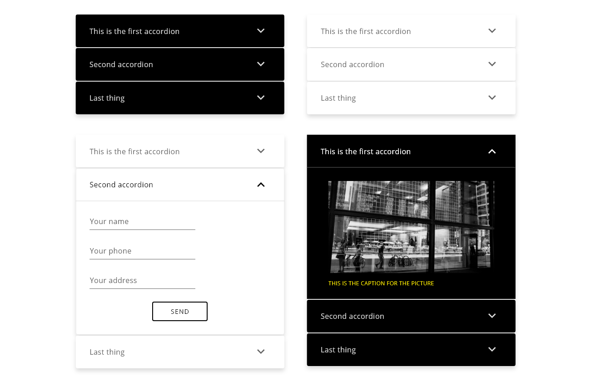
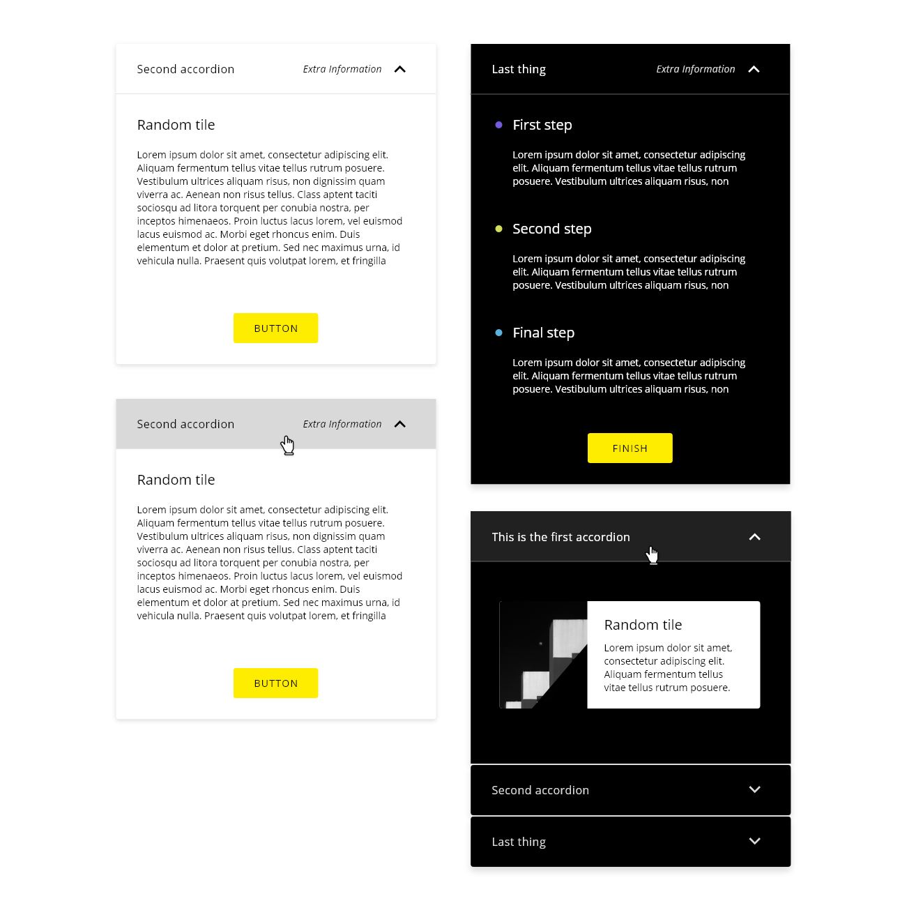

# DXC Accordion Visual Guidelines

## Overview

Accordions are an open source design feature that can show/hide alternate groups of data within separate panels. Each panel is a container component that displays a group of related data in horizontal or vertical stacks. Each has its own titled bar tab that, when clicked, opens the content of the panel. Accordions visually control the amount of relevant data per panel as well as the amount of data displayed in the viewport, reducing the demand for excessive vertical scrolling

## Appereance

An accordion trigger is always paired with a label that describes the content that can be found inside the accordion and an arrow that indicates that clicking there some action will take place.

The concept of an accordion is not more than a container of information, so the content inside the accordion will rely on the responsibility of the implementation. It can contain other components, images, tables and every custom feature that can be supported inside the element container.

### Modes

There are two different modes for each theme, one is the __default__ for the theme and the other is the __alternative__ option.

### States

The accordion component can get four different states based on the user interaction.
States: __normal__, __hover__, __disabled__, __open__.

## Theming

### Light theme

Default mode for light theme

White: #FFFFFF     
Black: #000000   
Box shadow opacity: 0.15  
Hover color: #D9D9D9  
Disabled color: #FFFFFF, opacity 0.65  

Alternative mode for light theme

White: #FFFFFF     
Black: #000000   
Box shadow opacity: 0.15  
Hover color: #212121  
Disabled color: #000000, opacity 0.30 

### Dark theme

Default mode for dark theme

White: #FFFFFF     
Black: #000000   
Box shadow: #FFFFFF, opacity 0.15  
Hover color: #D9D9D9  
Disabled color: #FFFFFF, opacity 0.65  

Alternative mode for dark theme

White: #FFFFFF     
Black: #000000   
Box shadow opacity: 0.15  
Hover color: #212121  
Disabled color: #000000, opacity 0.30 
Border color: #FFFFFF  

## Design Specifications

Accordion specifications with the content hidden

| Property           | Value|
|--------------------|------:|
| Margin            | `1px` |
| Padding right/left | `30px` |
| Padding top/bottom | `20px` |
| Border Radius | `4px` |
| Border thickness (outside)| `2px` |
| Separator | `1px` |
| Min. height| `72px` |
| Min. width| `280px` |
| Max. width| `100%` |
| Font size| `16px` |
| Font weight| `Regular` |

Specifications for the content within the accordion

| Property           | Value|
|--------------------|------:|
| Margin            | `1px` |
| Padding           | `30px` |
| Height            | `According to the content` |
| Widht             | `The same as the trigger` |

## Responsive version

The modes, states an actions for a responsive version are the same that the ones used in the desktop version. The only difference is the size of the accordion that will fit the device in which this will be displayed.
The minimum width of the component (280px) fits well in small devices.

The hover action isn't allowed on touchable screens, so it will be replaced by the tap action.

### User Interface Design Considerations

- Consider using accordions to decrease scroll, placing information inside of each section following the guidelines detailed in the design system for each component
- Make a cohesive relation between accordions, stablishing a hierarchy, a serie of steps or topics related in the same group of accordions