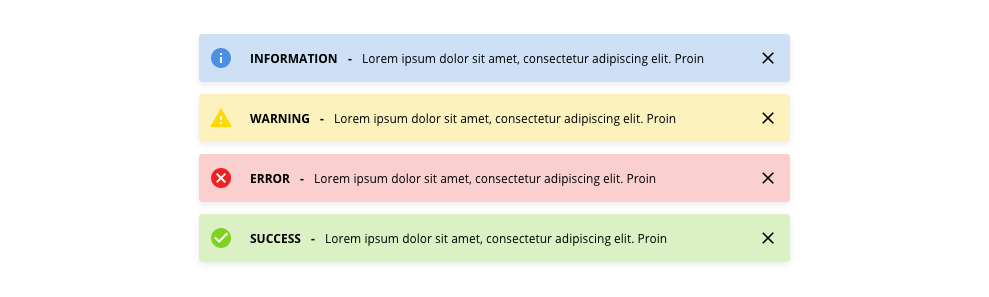
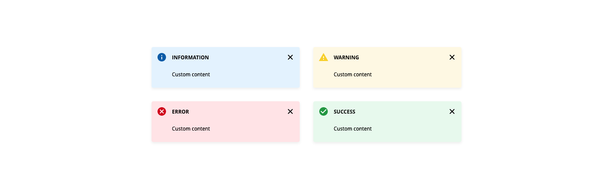
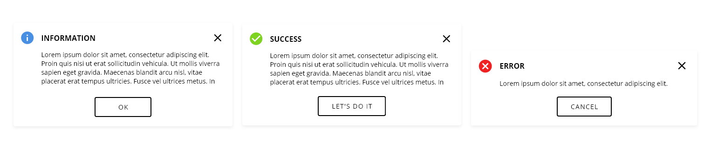
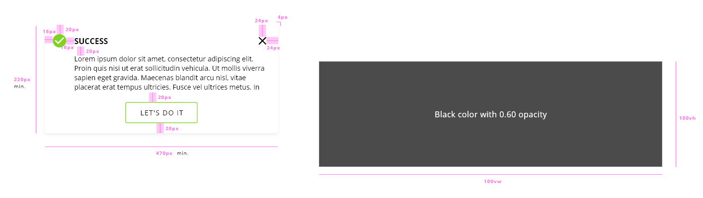

## Overview

All web-based product applications are expected to incorporate the same design,display and transition standards for message type. Mobile apps will follow guidelines specific to those devices.

## Appereance

The appereance of the alert is condicioned based on the type of alert that the applications wants to show to the user and the type of mode that is choosen for represent it. Starting with the type of alert in the DXC Design System are defined the following categories:

*Information*

Informational messages are used exclusively to assist the user with directional or explanatory text about a complex or seldom used process. 

*Confirmation*

Success messages should be used to assure user that a system calculation or data submission was completed correctly. This type of message should only be used in situations where confirmation is necessary, i.e. final submission of an application. It should not be used to notify the user of every function successfully performed by the system. These only disrupt user workflow and should be evident without continual verification.

*Warning*

Alert or warning messages should be displayed when there is a potential obstacle in completing a process as intended or there may be inadequate or incompatible system data that needs to be corrected before continuing. These messages should provide the user with both the problem and the solution needed to continue.

*Error*

Error messages convey a critical system problem that requires user and/or technical intervention to correct. Error messages should contain a solution to the problem or information on how to proceed if technical assistance is required. When error validation appears, the corresponding field associated with the error will display with a red indicator.

### Modes

There are three different modes for the alert component, each of them should be used according to the information that want to be given to the user, defined in the application level.

Modes: __condensed__, __multiline__ and __alert dialog__.

In the condensed version, the message is short and concise, avoiding word that plead, belittle or intimidate the user. It is only one line with some information about the actions that took place and the reason of the alert.

In this mode the notification should appears in the up right corner of the screen, appearing with an animation from the right side and staying visible for 10 seconds or instead with the click of the user after it dissapears.

If the message type wants to be displayed in multiple lines because the user needs more information to understand the reason of the alerts and there is an explanaition of how to avoid it, this mode is recommendable.

The position to be displayed is the same that the condensed one, in the up right corner of the interface. The difference with the previous mode is for this case that the user must interact with the alert message to close it. 

For the case that the user needs to take action in the message with a decision, the last mode should be used, which is a visual approach similar to the dialog component where the alert message is overlaid the application content to get the attencion and the focus of the user, who needs to select an action before to continue with the workflow of the page. 

In the scenario that the alert dialog doesn't have actionable items like buttons or other input elements, the message must be enough important only to displays text, because this is breaking the user flow in the applications.

### States

Actually the alert component doesn't have states, only the action that is performed when user clicks on the 'X' icon that hiddes the alert message or a clicking in a button, that will behave as the states defined in the button component.

The both actions that alert will get are the one that for some reason appears in the screen and the one that for overtime or by an action of the user the message dissapears from the interface.

## Theming

| Tokens        | Themable      | Default value |
| ------------- |:-------------:| -------------:|
| overlay       | `false`     | `black 0.80 opacity`  |

The alert component should use generic colors that are recognizable by the users independent of the application and the context and that is the reason why we don't allow to configure the theme for the alerts.

## Design Specifications

The alert component has a property that is customizable depending on the context and the scenario where the component is used. This property defines the size of the alert and it can get multiple values according to the needs of the application. 

Widths for alert component: __fill content__, __fit parent__, __small__, __medium__ and __large__.

*Fill parent* - It is used when the width will be adapted to the content of the alert itself.
*Fit parent* - This property defines that the alert will expand as much as the width of the parent, so it is directly dependent of the parent where is rendered.
*Small* - A small width for ocassions when the message is short, also applicable in mobile.
*Medium* - It is the average size, this option will fit well in a high percetange of the applications.
*Large* - A largest option to make the alert more visible in the screen and explain in detail what is causing the alert message.

| Property           | Value|
|--------------------|------:|
| Padding right/left | `12px/16px`|
| Padding top/bottom | `14px`|
| Width              | `Predefined sizes` |
| Height             | `48px` |
| Border Radius      | `4px` |
| Font size          | `12px` |
| Font weight        | `Regular/Bold` |
| Space between text and '-' | `10px` |
| Icon area width    | `41px` |
| Icon size          | `20x20px` |

| Property           | Value|
|--------------------|------:|
| Padding right/left | `12px`|
| Padding top/bottom | `14px/20px`|
| Width              | `Predefined sizes` |
| Min. height        | `92px` |
| Border Radius      | `4px` |
| Font size          | `12px` |
| Font weight        | `Regular/Bold` |
| Space between text and icon | `12px` |
| Icon size          | `20x20px` |

| Property           | Value|
|--------------------|------:|
| Padding right/left | `16px/24px`|
| Padding top/bottom | `20px`|
| Width              | `Predefined sizes` |
| Min. height        | `220px` |
| Border Radius      | `4px` |
| Font size          | `16px and 14px` |
| Font weight        | `Bold and Regular` |
| Space between text and icon | `16px` |
| Space between title and description | `20px` |
| Space between description and actions | `20px` |
| Icon size          | `20x20px` |
| Overlay size       | `100vw by 100vh` |

### User Interface Design Considerations

- Incorporate messages into the application when necessary to keep users informed of important changes.
- Messages should use positive rhetoric. Avoid using negatives. (e.g. Use “City is required.” instead of “You didn’t enter a city.”)
- Always use active instead of passive voice.
- Be concise. Avoid words that plead, belittle or intimidate (i.e. please,wrong, or else)
- Non-entry of a non-required entry field should never generate an edit message or warning message, nor deny user forward movement.
- If possible, dialog messages must always display in full without any scroll bar.
- Dialog messages will retract only when the user closes the dialog or completes through interaction.

## Links and references

- https://xd.adobe.com/view/afb409f4-884d-4236-6cf2-4766bee75b52-d985/screen/8c8ff3dd-9b8e-4b1a-8f84-fc68ac6ff5ef/