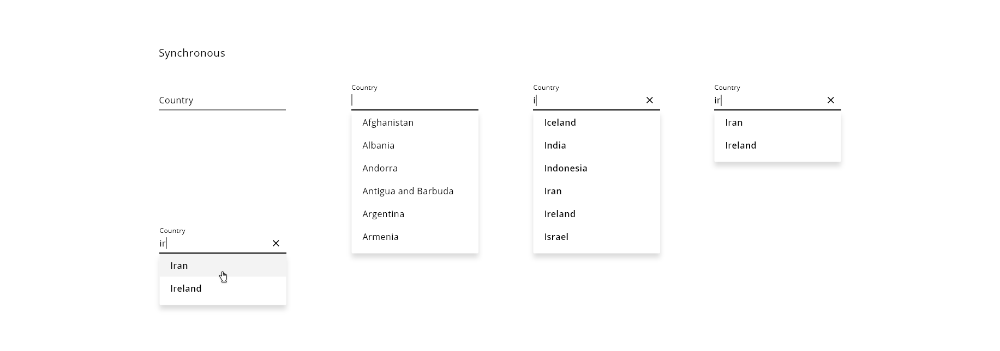
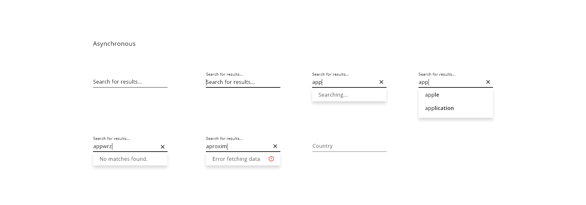

## Overview

The autocomplete component, also known as predictive search is an input field that suggests different options to the user based on his input. It is used mainly in e-commerce sites to help with the product search but also it fits in several other scenarios like addresses, countries, or color lists.  

## Appereance

As a reference, it took the input text from the design system, so basically, in terms of look and feel and behavior is very similar to that one. Apart from the typing part, it is necessary to show a list of suggestions related to the searched term. To accomplish that we reuse the concept of the select component that uses a dropdown to show information split into different rows.

### Modes

Two modes can be defined for the autocomplete component, based on the result set that is going to be searchable. 
If all the result set is on the application side, the synchronous mode is the one used.
On the other hand, if the application needs to interact with the APIs in every action of the user the mode will be asynchronous.

Modes available: __synchronous__ and __asynchronous__.

The main difference is the control of the information flow within the component because in the asynchronous case, the component needs to handle different scenarios with the fetching of information or errors.

### States

Starting with the synchronous mode, five different states can be defined.
States: __normal__, __focused__ (all the suggestions are shown), __value entered__ (the suggestions get filtered by the input), __value selected__ and __disabled__.

If the mode is asynchronous, there are a few states more to indicate communication with the APIs.
States: __searching__, __no results__ and __action error__.

## Theming and tokens

| Tokens        | Themable      | Default value |
| ------------- |:-------------:| -------------:|
| selectedOptionBackgroundColor | `true`     | `#D9D9D9`  |
| hoverOptionBakcgroundColor | `false`     | `0.34 opacity`  |
| hoverOptionColor | `false`     | `black`  |
| disabled | `false`     | `0.34 opacity`  |
| optionText | `false`     | `black`  |
| error | `false`     | `D0011B`  |

The other attributes of the autocomplete component are inherited from the input component because it is used internally in the date implementation, so a change in any token of the text field component will affect this component too.

## DXC Technology theme

https://xd.adobe.com/view/afb409f4-884d-4236-6cf2-4766bee75b52-d985/screen/736b626a-87bb-42f4-8871-64701de74177/specs/

## Design Specifications

The specifications of the component are mix with the ones from the input field and the select component. If you are interested in see the details, you can check each component page to get more information.

### User Interface Design Considerations

- Consider using this component when the information to fill is complex or large and you want to assist the user with suggestions to make the process easiest and quicker.
- If the options are a few it would be better to use a select component
- Make sure that the error coming from the API is understandable for the user