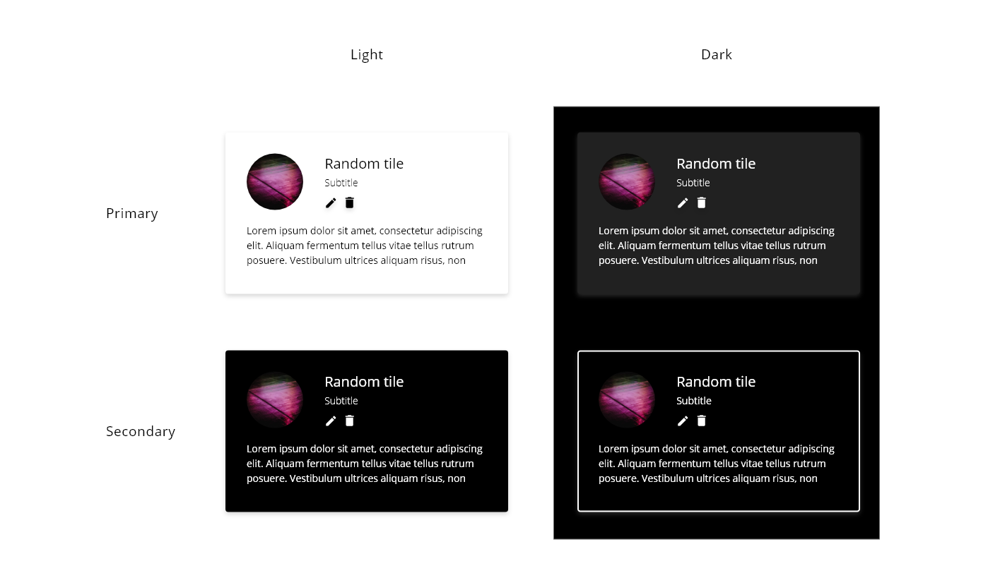
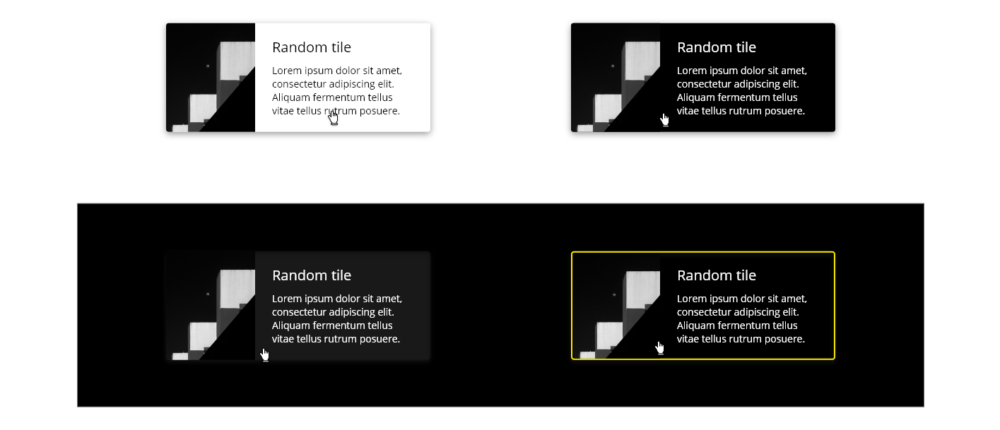
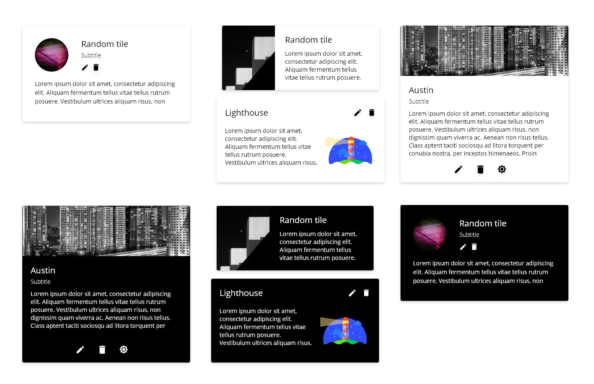
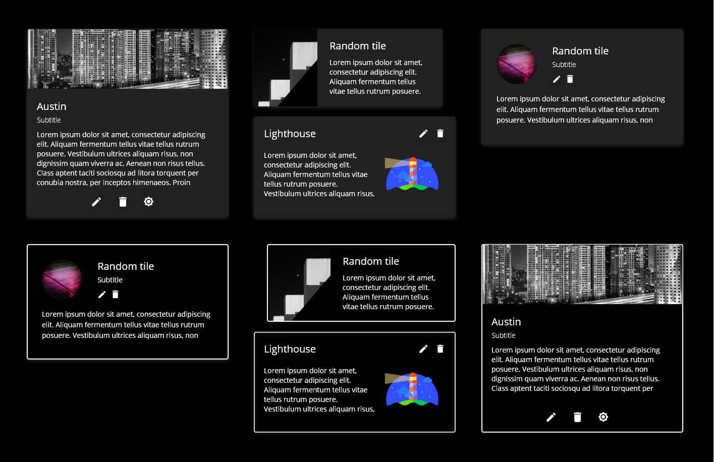
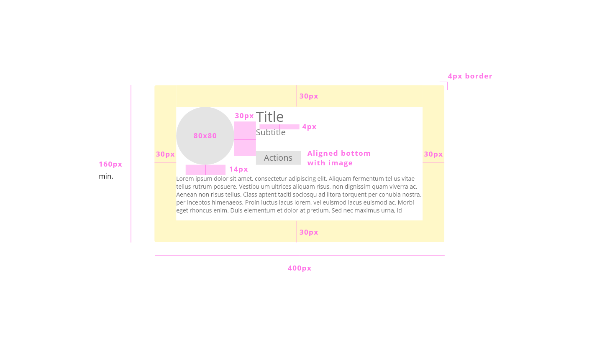
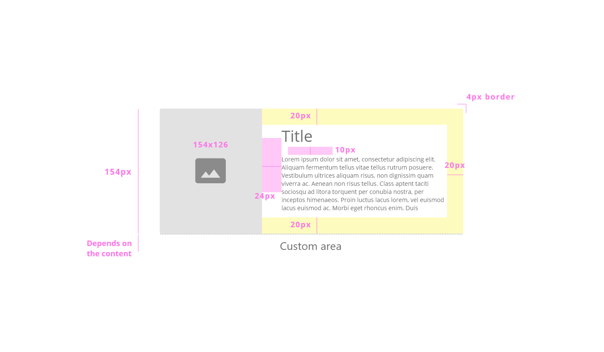
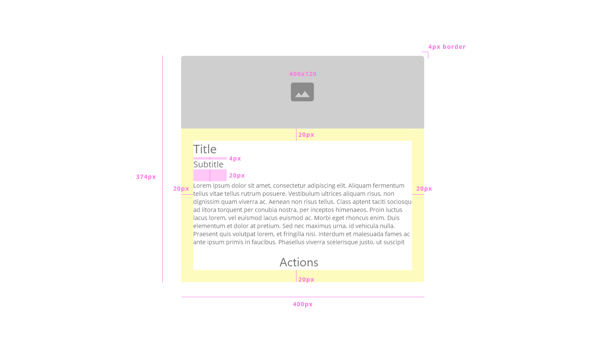
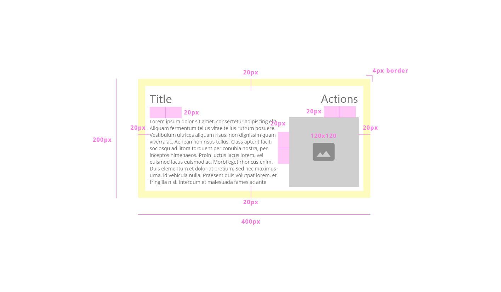

# DXC Card Visual Guidelines

## Overview

Cards are a container of information, actions and data with a hierarchy to make easy scanning the content. 
A card can be defined as a unit, so it has all the information within it, making the component useful to show images, text, and interactive elements.

The structure of the card can be seen as blocks, each block is optional to be displayed but the overall element should make a cohesive design, even if it includes text, images or other elements.

## Appearance

Even a card is defined as a unit by itself, it is common to represent cards in a set, with a grid structure in which each card has different information but from the same field. 

### Modes

There are two modes for each theme, so it can be called as __primary__ and __secondary__ modes.

### States

The only state that is controlled in the card component is the hover. As it is needed visual feedback to give the user a notion of which card is involve in the action, the rest of the states are directly dependent on the components defined inside of the card.

## Theming

### Light theme

White: #FFFFFF  
Black: #000000  
Shadow opacity: 0.16 B-6  
Hover shadow opacity: 0.40 B-10

### Dark theme

White: #FFFFFF  
Black: #000000  
Yellow: #FFED00  
Shadow opacity: 0.16 B-6 #FFFFFF  
Hover shadow opacity primary: 0.16 B-6 #D9D9D9  
Hover shadow opacity secondary: #FFED00 for border color

## Design Specifications

| Property           | Value|
|--------------------|------:|
| Margin            | `20px` |
| Padding           | `30px` |
| Border Radius | `4px` |
| Border thickness| `2px` |
| Min. height| `160px` |
| Min. width | `400px` |
| Max. width | `100%` |
| Image      | `80x80px` |
| Space title-subtitle   | `4px` |
| Space main info to paragraph  | `14px` |

| Property           | Value|
|--------------------|------:|
| Margin            | `20px` |
| Padding top/right/bottom  | `20px` |
| Border Radius | `4px` |
| Border thickness| `2px` |
| Min. height| `154px` |
| Min. width | `370px` |
| Max. width | `100%` |
| Image      | `154x126px` |
| Space photo - content | `24px` |
| Space title to paragraph  | `10px` |

| Property           | Value|
|--------------------|------:|
| Margin            | `20px` |
| Padding           | `20px` |
| Border Radius | `4px` |
| Border thickness| `2px` |
| Min. height| `374px` |
| Min. width | `400px` |
| Max. width | `100%` |
| Image      | `400x120px` |
| Space title-subtitle   | `4px` |
| Space main info to paragraph  | `20px` |
| Space paragraph to actions  | `20px` |

| Property           | Value|
|--------------------|------:|
| Margin            | `20px` |
| Padding           | `20px` |
| Border Radius | `4px` |
| Border thickness| `2px` |
| Min. height| `200px` |
| Min. width | `400px` |
| Max. width | `100%` |
| Image      | `120x120px` |
| Space title-subtitle   | `4px` |
| Space main info to paragraph  | `20px` |
| Space actions to photo  | `20px` |

### User Interface Design Considerations

- Organize the card collection so thery are easy to use, take a layout that presents the information in a clear way and apply the same styles for every card
- If a collection want be create, won't use different card styles, use the same to keep consistency