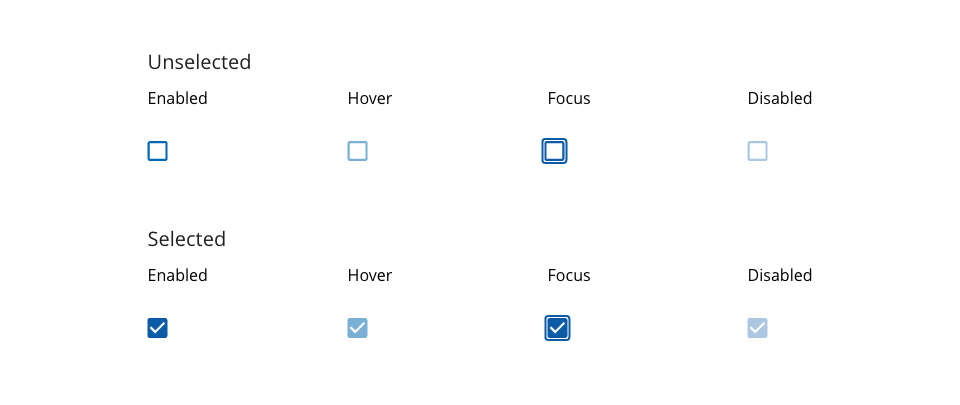
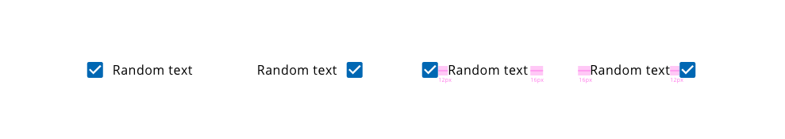
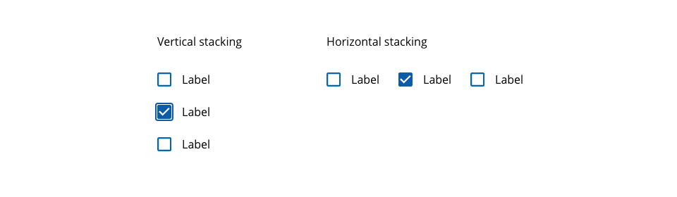
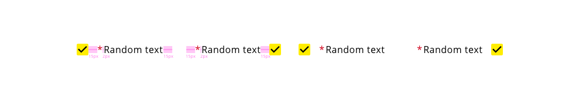

## Overview

Checkboxes are inputs that offer to the user the possibility to select one or more options from a range of attributes.

Two main states can be defined in the checkbox component from this design system, it could be marked as selected or unselected whether if you want to include the item or not in the action that is going to take place.

The using of checkbox would be reasonable to proceed with the settings configuration, multiple choices offered, binary response (yes/no), or accept conditions and additional features.

## Appereance

A checkbox has a toggle mode so every checkbox component in the application remaining the same visually. It inherits colors from the definition of the theme, using primary color as the text content of the checkbox and accent color as a background of the box.

### Modes

As it is pointing in the description, the checkbox is a component that can get two defined modes, selected when the option wants to be added or included or unselected when the option should not be included. These options are mapping accordingly with the boolean values true and false.
Modes: __selected__ or __unselected__.

### States

Five different states are defined in the life cycle of the component: __enabled__, __disabled__, __hovered__, __focused__ and __pressed__.

## Theming and tokens

| Tokens        | Themable      | Default value |
| ------------- |:-------------:| -------------:| 
| *backgroundColor| `true` | `yellow`|
| *borderColor   | `true` | `yellow`  |
| checkColor    | `true` | `black`  |
| disabled      | `false`| `0.34 opacity`  |
| text      | `false`| `black/inherit`  |

*There is a relation between the _backgroundColor_ of the component and the _borderColor_ in the case that the checkbox is unselected. The color will be the same for both scenarios.

## DXC Technology theme

https://xd.adobe.com/view/afb409f4-884d-4236-6cf2-4766bee75b52-d985/screen/2fc249e5-ca58-4175-acf6-2a214df877b7/specs/

## Design Specifications

Specifications for checkbox are simple. The size of the checkbox should display a box 20 x 20 pixels due to improving the touchable area. Depends on the input of the component it can be used different variation as are describe below:

- Checkbox only
- Checkbox with text at his right
- Checkbox with text at his left

| Property           | Value|
|--------------------|------:|
| Margin right/left  | `15px`|
| Margin top/bottom  | `10px`|
| Border Radius      | `4px` |
| Border thickness   | `2px` |
| Font size (with text)| `16px` |
| Font weight        | `Regular` |

Checkbox may be either linear or stacked, the first case should be used when the checkboxes are independent of a category and they will be displayed horizontally, where device allows.

Stacked should be chosen when the checkbox is related and have a group label to enhance readability and show association.

*Linear*  

The text should have a margin of 15 pixels based on its position. If the text is after the checkbox, it should define the margin on the right side. Otherwise, if the label of the checkbox is before the box, the margin has to go on the left side.

*Stacked*  

The spacing between stacked checkboxes should be 20 pixels that is determining by the top/bottom margin of the checkboxes itself.

*Use with text*

The last property that the checkbox can get is the required attribute that would represent once the checkbox has a paring label, indicating that the selection of that input must be done, in another case the user wouldn't proceed with the application flow. 
The representation of a required checkbox is a colored asterisk right before the checkbox label.

 
