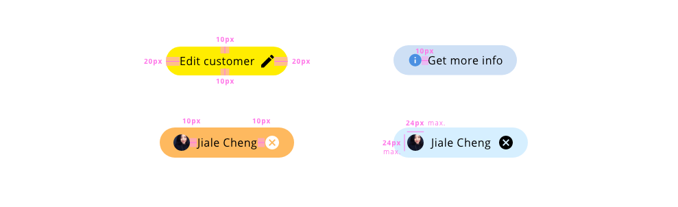

## Overview

Chips are elements that represent status, complementary information, or association between elements.

## Appereance

A rounded component defined by a label or a graphic element to indicate the information to be communicated to the user. Can be clickable on the icons, to perform an action in form of triggering a dialog or a modification in other element of the user interface. Also, they can be static or use it to categorize a different kinds of data.

### States

The only state that the design system specifies for the chip component is the hover interaction, which is very basic, changing the cursor from default to pointer in the case that the element is clickable. With the static version, the hover action doesn't need to be contemplated.

## Theming and tokens

| Tokens        | Default value |
| ------------- | -------------:| 
| backgroundColor      | `#EEEEEE`|
| outlinedColor      | `-`|
| fontColor      | `#000000`  |
| disabledBackgroundColor | `#f9f9f9`  |
| disabledFontColor | `#b1b1b1`  |

## Design Specifications

| Property      | Value      | 
| ------------- |:-------------:|
| Padding       | `20px 10px` |
| Width         | `fit-content` |
| Background Color | `#EEEEEE` |
| Color         | `black` |
| Disabled      | `0.34 opacity` |
| Border Radius | `50%` |
| Border Width  | `1px` |
| Space between text and icon  | `10px` |
| Icon          | `24px 24px` |

### User Interface Design Considerations

- Use the color with some meaning, not for purely decoration
- Do not use chips instead of buttons they have a total different aim in the UI
- Make clear and simple the content of the label
- Use chips to make tasks easier for the user

## Links and references

- https://xd.adobe.com/view/afb409f4-884d-4236-6cf2-4766bee75b52-d985/screen/6809ad30-8c5e-44e1-8e93-d85a3aa887f3/