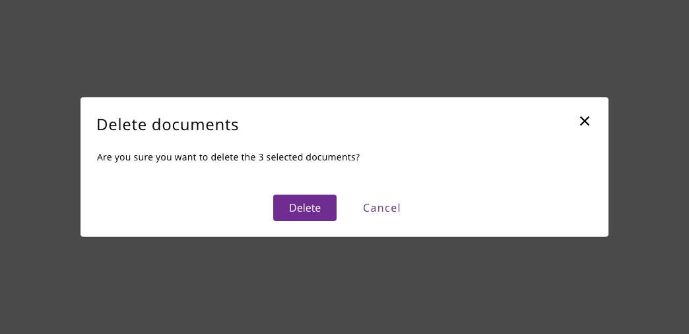
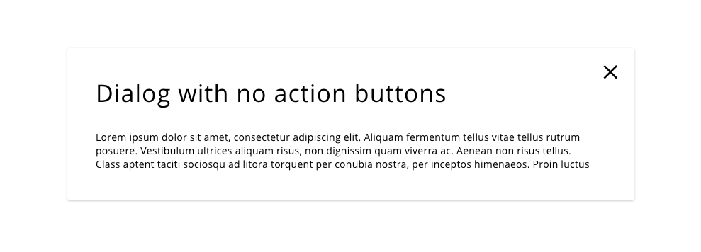
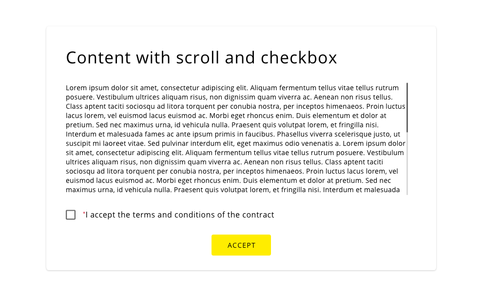
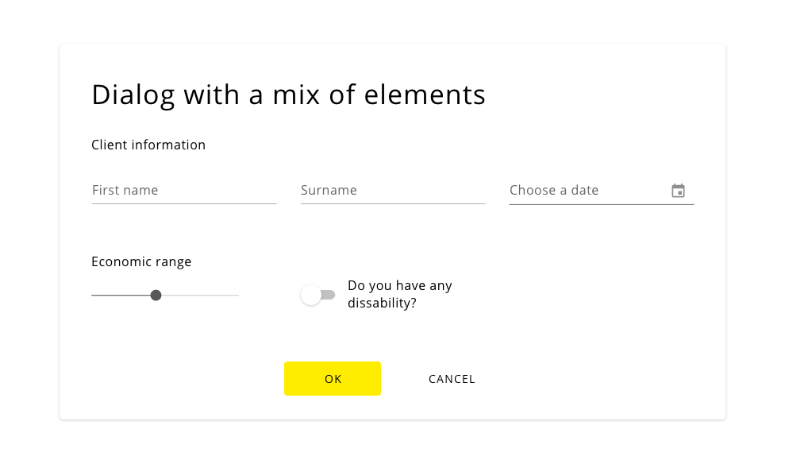
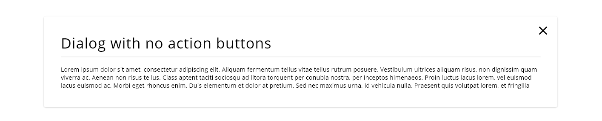
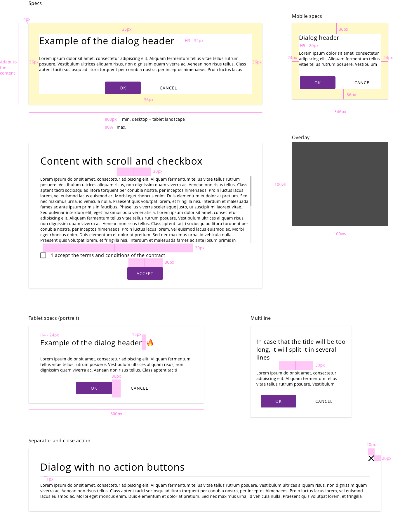

## Overview

A modal dialog is a message box or child window that requires user interaction before returning to the parent window. These boxes appear on top of the open parent window that is currently displayed on the screen. 

## Appereance

The dialog appearance is widely recognizable by the users, as it appears in the center of the screen, above the content of the applications as a call to the user to interact or put the focus in the content shown inside that box.
This dialog disables the main content until the user explicitly interacts with the modal dialog, so it requires immediate attention by the user.

### Modes

There is only one mode designed for the set of themes and combinations. As the modal is a special component because it has an overlay that separates into a new layer the content of the interface to the component, the same mode can be used for all of the scenarios.

It is true that inside this unique mode it can be chosen some modifications with the insider's components. These are detailed in the following examples:

_Content_: The dialog always should have a title to introduce the actions or information that will get displayed on the screen. Also, it can contain a descriptive text or a phrase related to the action that triggered the dialog.
After that, it can be some combinations of actions, like buttons to accept/cancel the action. There can be one, two or more buttons.
*If the dialog includes the 'X' button, there is no need to display a cancel button to dismiss the action.

_Close action_: In this case, the dialog is not including actions throw buttons, but it is an implicit element 'X' to close the dialog at any time that the user considers.

_Components_: This definition of the dialog is using several components of the design system into this container. As example terms and conditions, information can be shown into a dialog, making the user accepts the conditions using a checkbox and after that a button that will handle the confirmation.
Multiple variations can be defined with this approach, it only depends on the requirements of the applications. 
Just to say, every component should follow their own rules defined in this document.

_Getting information_: Input fields may appear within the dialog. In this example, some information is required to the user to be filled as first name, date of birth or economic range.
This is just an example to see the type of combinations that can have a place in this container.

_Separator_: In some cases, it would be good to have a separator between the title and the content, depending on the content inside the container, so there is an option to include it making it clear the part of the dialog header and the dialog content.

_Header with icons_: It could be useful include icons within the header to indicate the related information that will be treated into the dialog. Also, it can be an assistive visual clue to the description.

### States

Some basic states can be defined in the modal component. In case the modal is closed, there should be a trigger to open it in the actual screen.
Once the model is open, many interactions can take place, but they should follow the standards declared for the specific components, so the modal is just a container and other components can be placed inside.

A property that is inherited to the modal is the 'X' handler to close it or clicking out of the box to perform the same action. Then, there are only two actions that change the state of the modal itself once it is opened.

Clicking on the X icon or outside the box will trigger an action to close the modal properly.

## Theming

| Tokens        | Themable      | Default value |
| ------------- |:-------------:| -------------:|
| overlay       | `false`     | `#000000 0.80 opacity`  |
| backgroundColor       | `false`     | `#FFFFFF`  |

## Design Specifications

Specifications for desktop and tablet (landscape mode)

| Property           | Value|
|--------------------|------:|
| Padding left/top/rigth | `40px` |
| Padding bottom | `30px` |
| Border Radius | `4px` |
| Min. height | `Depending content` |
| Min. width | `800px` |
| Max. width | `80%` |
| Title font size | `34px` |
| Body font size | `16px` |
| Font weight | `Regular` |
| Space between items | `30px` |
| Separator | `1px` |
| Sparator space top | `10px` |
| Sparator space bottom | `20px` |
| 'X' icon size | `20x20px` |
| Margin top/rigth | `24px/24px` |
| Title icon space | `16px` |  
  
Specifications for tablet (portrait mode)

| Property           | Value|
|--------------------|------:|
| Min. width | `600px` |
| Max. width | `80%` |
| Title font size | `24px` |  
  
Specifications for phone

| Property           | Value|
|--------------------|------:|
| Padding top        | `40px` |
| Padding left/rigth | `20px` |
| Padding bottom     | `30px` |
| Min. width | `346px` |
| Max. width | `80%` |
| Title font size | `20px` |

## Overlay

The overlay element makes possible to get the user attention into the dialog creating a layer between the actual application and the modal information showed in the user interface. 

Specifications for overlay

| Property           | Value|
|--------------------|------:|
| Width              | `100vw` |
| Height             | `100vh` |
| Color              | `#000, 0.7 opacity` |

## Responsive version

To accomplish a responsive version of the dialog in different devices, it was designed a version for tablet and mobile that fits the restrictions that involve using the component in less space.

For that, the design system takes some considerations for the use of dialog component in tablet, phone and the variations of multiline content.

### Combining with other UI elements

There are some elements that require some guidance to use it on the dialog component, based on the nature of the component or the behavior that it has in the ecosystem. Due to resource loading or prompting messages for the user, special guides are defined to incorporate these scenarios.

For the case that the application has a modal opened and it needs to load data from the server, we can represent this situation to the user in several ways. 
- One option can be to stick to the default implementation of the spinner component and use it in the overlay mode, overlapping the loading element to the rest of the interface components and make it clear that the application is getting some resources from the APIs.
- Another approach, to avoid render an overlay on top of another overlay is to integrate the loading indicator into the modal window. This can be done placing the spinner near the title of the dialog, on the right side and the small variations of the component. Using this way we make explicit to the user that the applications are working on something without the need to distract the attention from the dialog.

Both approaches are equally valid, and its use depends on the context of the application and the content of the dialog.

If the application needs to render some type of alert regarding information or prompting an error to the user, the behaviour of the component varies from the definition that is taken in a normal scenario.

In the case that there is an error with an input field, the action to take is the one mentioned in the component's guidelines, highligthing the field to make remarkable for the user that the specific input is wrong. Then, the alert message should be placed in the right upper corner of the screen to not modify the content of the dialog and avoid the scrolling when new content is added. The alert should remain till the error is corrected or the user interacts with it to close it.

### User Interface Design Considerations

- Modal dialog boxes should overlay only a portion of the underlying page to keep the user oriented within the workflow. 
- The modal dialog should emerge from the top of the screen and be centered horizontally on the parent page. The top of the modal should align with the bottom of the banner on the parent page.  Modals should be sized according to the content
- Modals that contain tables or lists may use the available width of the device, allowing for an exterior margin where the parent page is still visible under the dialog box. Modal height, in all instances is dependent on content 
- Every effort should be made to ensure that the dialog boxes do not need to scroll, either horizontally or vertically, to display the information. Some exceptions may apply
- Modal dialog features should be used sparingly, as they disrupt workflow, but can be advantageous when used properly
- Informational modals are merely assistive and should display only read-only data
- Interactive modals require a user response, either to a procedural option or to further define data on the underlying page with additional entry

## Links and references

- https://xd.adobe.com/view/afb409f4-884d-4236-6cf2-4766bee75b52-d985/screen/878a0090-5cac-4084-8e1c-6c61f61bf552/