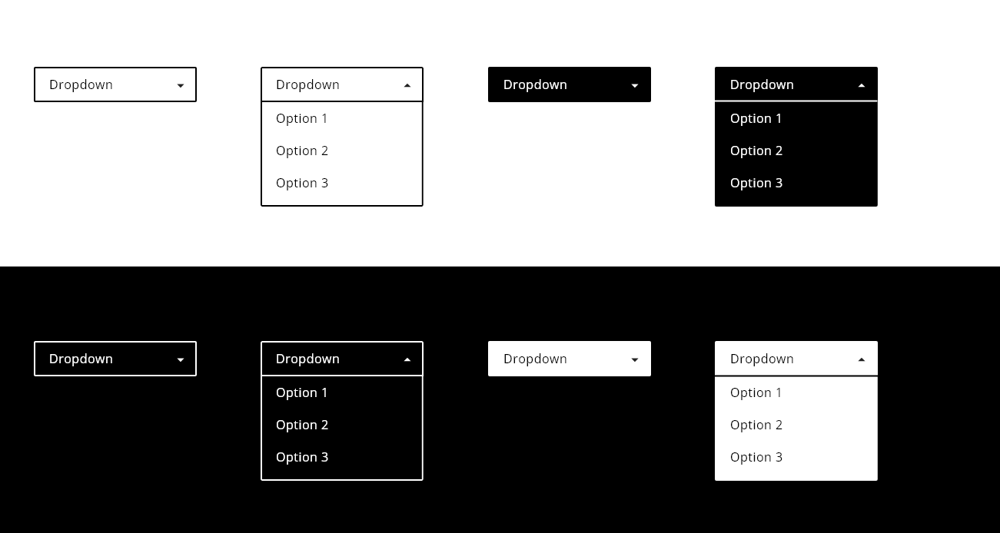
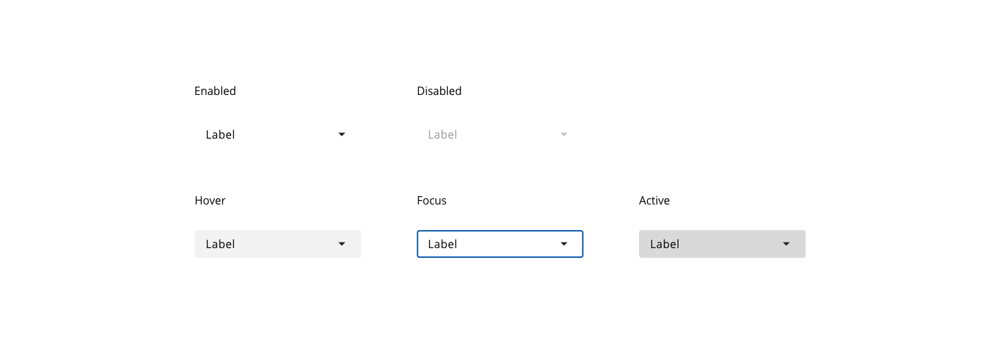
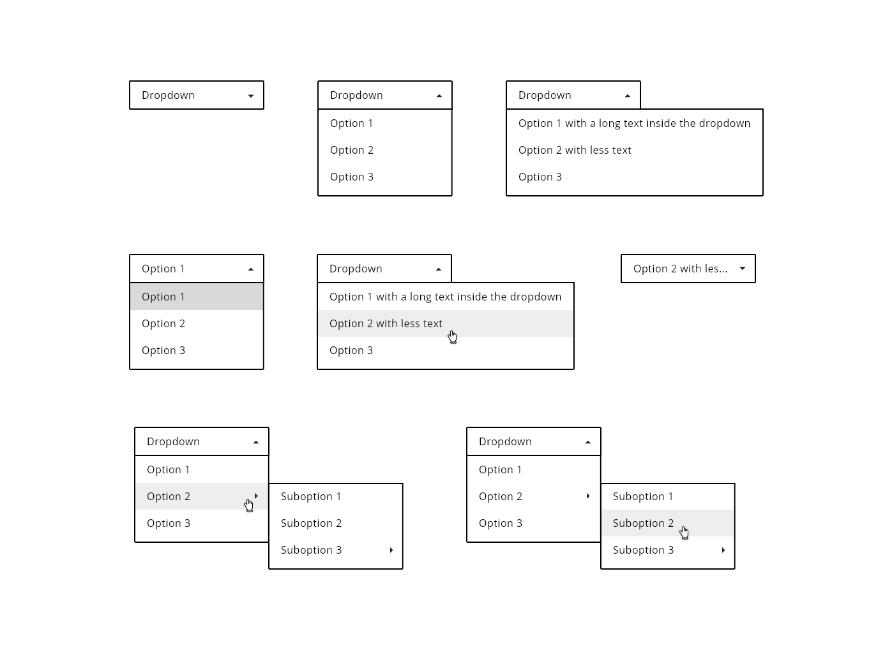
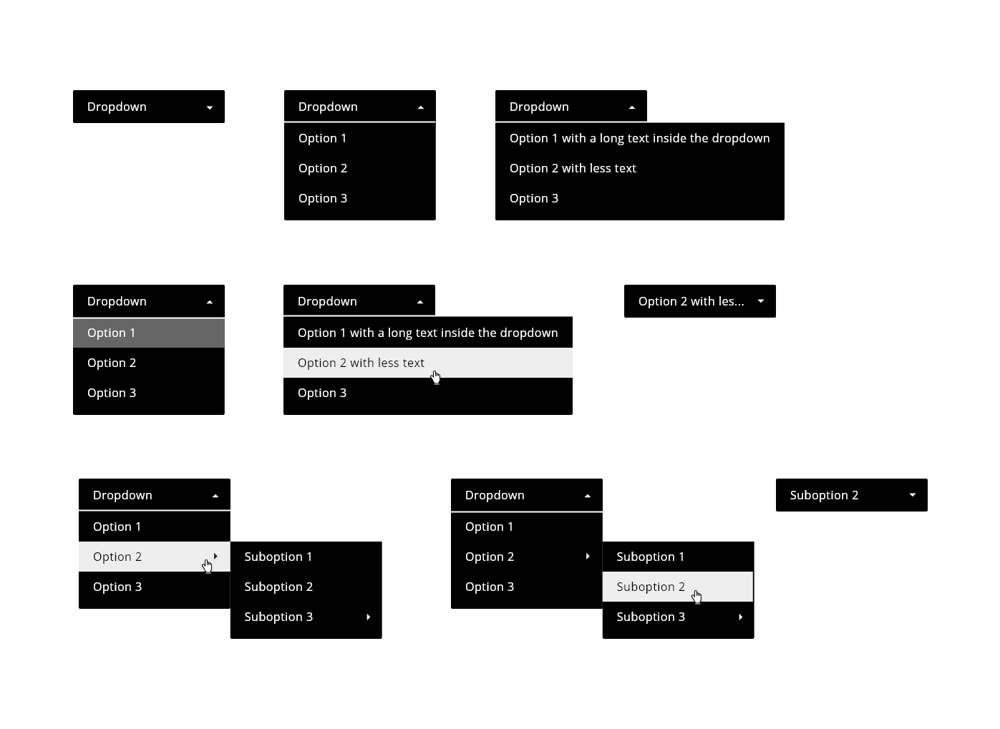
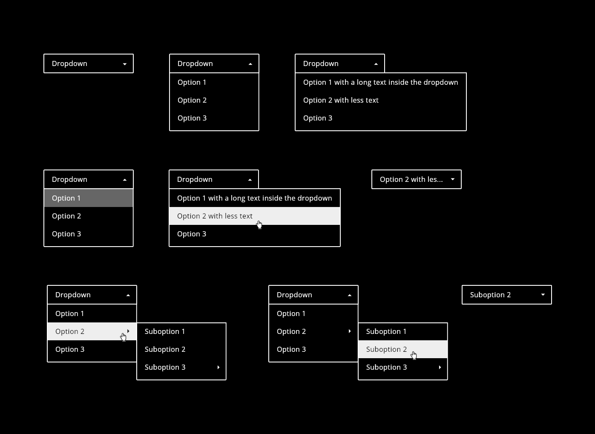
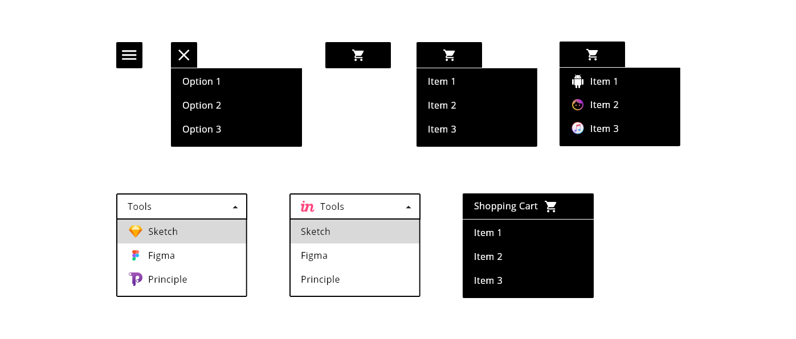

# DXC Dropdown Visual Guidelines

## Overview

The use of dropdowns has its advantages but it depends on the screen support. Dropdowns are a standard widget, so the users know how to interact with them. The options available in a dropdown component are static, so this prevents from erroneous data entered by the user since it only shows a range of correct values for that input.

A dropdown in mobile is more unusable than a dropdown in a web application, regarding screen spacing, size of elements and scannability in the number of options to display.

## Appearance

Dropdowns have the same look as select components, the difference is that while select is only to collect user's data into a form, dropdown can be used in a variety of scenarios. 

From header menus to executing different actions, dropdowns can be useful as a list of items that will be shown when the user clicks or hovers their main parent that will trigger the pop up with the options.

As it is widely used, an arrow linked with the label of the dropdown should be shown to indicate the user that more options are available but are currently hidden.

By default, every dropdown will be extending underneath his main container if the space in the screen is enough to contain all the size declared for the pop-up.

If the dropdown has options with submenus, this will be indicated with an arrow too, but in this case, the submenu appears by the right side, so the direction of the arrow should be placed in correspondence.

Once an option is selected by the user, the main container has to reflect the option chosen and the dropdown has to be closed after the user's click.

If there is a special case when the dropdown couldn't be displayed below the selector because it is hiding important information reducing discoverability and scanability in the website then consider to use other options to display the information or customize the position of the pop up to fitting the necessities of the application.

### Modes

Two modes are defined for each theme.

### States

Six different states for the dropdown elememts: __default__, __dropdown displayed__, __option hovered__, __option selected__, __submenu displayed__ and __option selected (no dropdown)__.

### Theming

### Light theme

Black: #000000  
White: #FFFFFF  
Dark grey (selected item): #666666  
Light grey (hovered item): #d9d9d9  

### Dark theme

Black: #000000  
White: #FFFFFF  
Dark grey (selected item): #666666  
Light grey (hovered item): #d9d9d9  

## Design Specifications

| Property for dropdown (hidden)  | Value |
|--------------------|------:|
| Margin   | `15px`|
| Min width   | `230px`|
| Min height   | `46px`|
| Border radius | `2px`|
| Line thickness  | `2px`|
| Padding left/right  | `18px/13px`|
| Padding top/bottom  | `10px/10px`|
| Font weight   | `Regular`|
| Icon size | `20px x 20px`|

| Property for dropdown (shown)  | Value |
|--------------------|------:|
| Margin   | `15px`|
| Border top   | `2px`|
| Border radius bottom  | `2px`|
| Options padding  top/bottom | `10px`|
| Options padding  left/right | `20px`|
| Last option padding bottom | `20px`|

## Icon Usage

It is allowed the use of icons within the dropdown component. There are several options of configuration, the icon can be placed before or after the label, also the icon can be the unique content of the dropdown placeholder and options, so the final goal of this is to keep consistency with the rest of the components of the design system such as buttons or selects, that have the same behavior.

## User Interface Design Considerations

- Consider the number of options (binary decisions or a few items) to decide to implement one component that represent in a better way the data, i.e. radio button or switch toggle.
- For a large number of well specified options, consider to use an autocomplete field to filter the amount of options while typing.
- Consider the input, might be that a text input would fit better than a dropdown.

