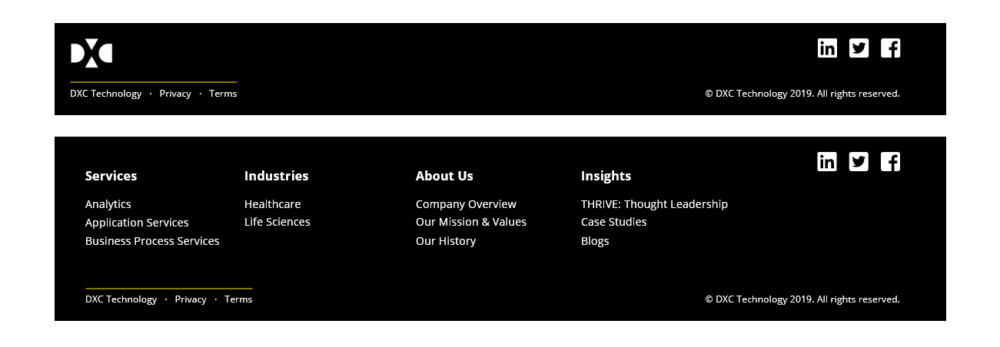
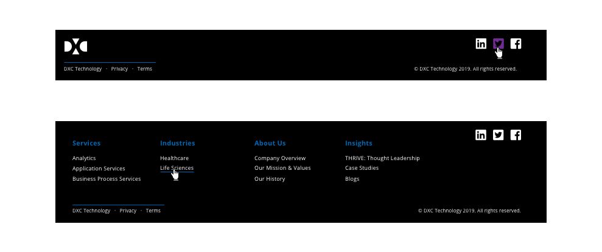
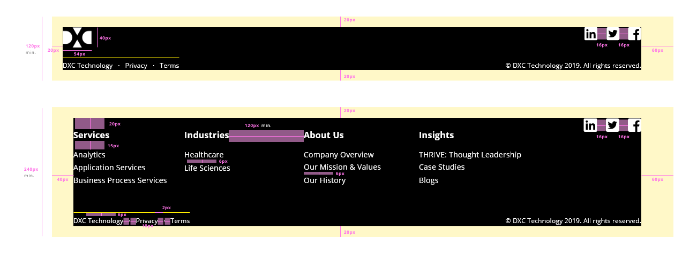
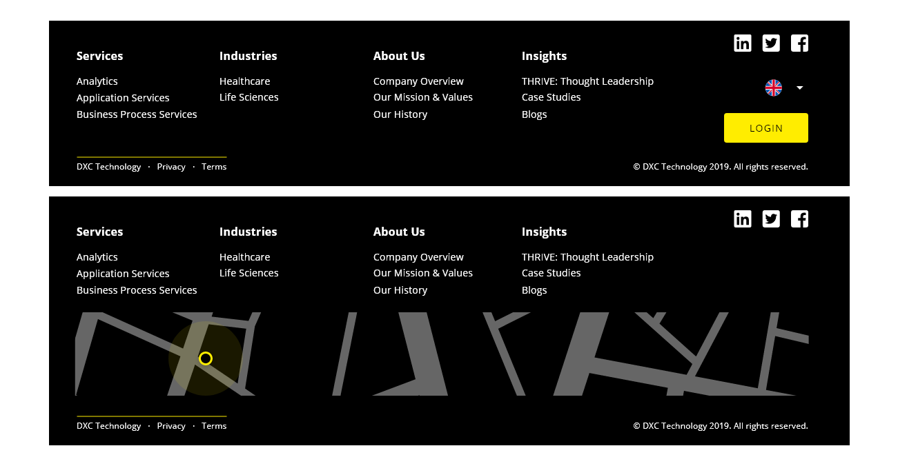

## Overview

Footers are a secondary element in a web page because they usually appear at the bottom and it is the last thing that the user interacts with. But the presence of the footer must be designed in every application, it is a key element to the overall experience.

## Appereance

This area can contain a variety of things depending on the application and two approaches are followed to use a footer element.
- The first reason is that users scan or read the page and they don't find what they are looking for or need more detail regarding some information.
- The second reason is that the user already has a conception of the footer, and the default action in the flow is to scroll down to the footer to find useful information.

### Modes

A couple of modes are defined in function of the necessities of the application, one is a short version of the footer, including brand logo, policy conditions, copyright, and social media links.

Another option is to use the complemented footer, with more information and links to other important resources.

In both designs, there is a custom area to fill with custom content.

### States

As the main aim of the footer is bringing the user information in detail about the product, the company or functionality, the unique state defined in the interaction with the component is the hover state. While the user hovers an element, this will be highlighted.

In case that the user of the design systems wanted to add other components in the custom area of the footer, the states will be the ones associated with the element itself.

## Theming and tokens

| Tokens        | Themable      | Default value |
| ------------- |:-------------:| -------------:| 
| backgroundColor      | `true` | `black`|
| textColor      | `true` | `white`  |
| lineColor | `true`     | `yellow`  |

## Design Specifications

| Property           | Value|
|--------------------|------:|
| Margin left/top/bottom | `20px` |
| Margin right | `60px` |
| Border Radius | `4px` |
| Border thickness| `2px` |
| Min. height short version| `120px` |
| Min. height large version| `240px` |
| Width| `100%` |
| Font size (copyright, terms)| `12px` |
| Font size (links)| `14px` |
| Font size (section title)| `16px` |
| Icon size | `20x20px` |

The content of the footer should be adapt to the space available depending on the screen device.

## Footer Content

By default, the footer component only includes links to other resources or elements within and without (external links) the application.
In the case that the user wants to add elements that aren't text with a link, the custom area is the correct place to put that.

A representation is shown above:

## Responsive version for mobile and tablet

The same content in the footer will be displayed for the responsive versions and the only modification will be the width of it. With less space available to display the content, some of the items will be relocated to fit well in the screen. 

On the mobile version, first we have the logo, the links and the separator line that will extendt all the width of the container. Below it the links to privacy and terms to let a space for custom component and at the bottom the copyright terms, centered.
At this stage, the custom content and the disposition is responsability of the user, the same way as it is in the desktop and tablet version.

### User Interface Design Considerations

- The footer frame should be docked at the bottom of the page and should not scroll with any of the data within working section of the screen.
- The footer frame should span the entire screen width.
- The footer frame should display the copyright information at the right margin.

## Links and references

- https://xd.adobe.com/view/afb409f4-884d-4236-6cf2-4766bee75b52-d985/screen/3c920e77-d15a-4856-81c4-d9389af085b0/