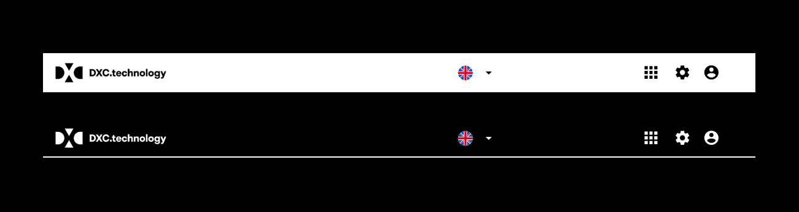
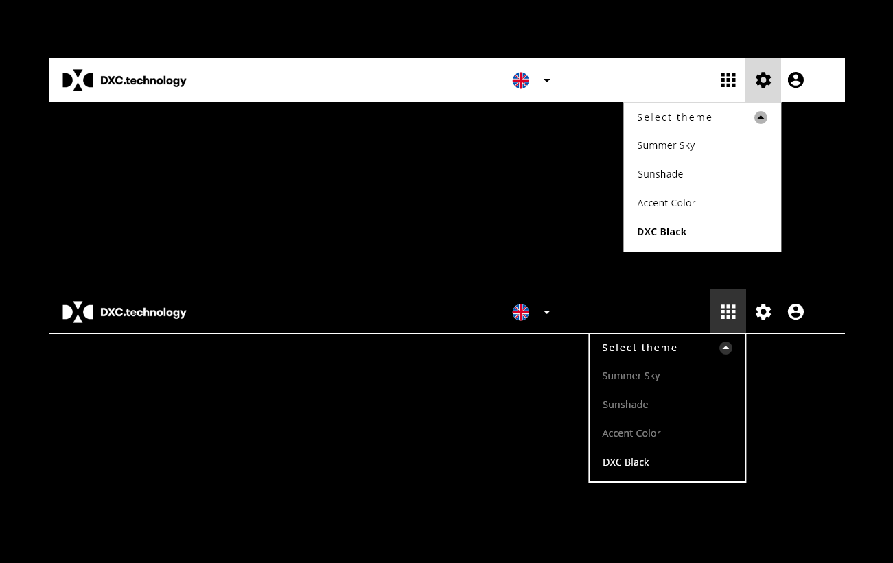

## DXC Header Visual Guidelines

The header is an important component in the interface, it is the area dedicated for the navigation across the application, the first element that the user sees when he accesses to the web page and a known place where information relative to core information, sign in or search can be found. 

#### Overview

A variety of headers can be presented over the internet, with many differences between them, position (vertical/horizontal), size, color and so on.
Some of the most used elements in the header are: brand identity elements, links to basic categories, links to social networks, basic contact, sign in and login options, search field or switch for languages.

##### *Appearance*

The header of the design system should be concise and clearly structured. Each item has its own space designated and the main areas are the following ones: Company logo, custom area, language, navigation, and account.

- Custom logo: In this area should be placed the company logo, it will go on the left side of the header, respecting the specifications that are defined in the below sections.
- Custom area: This area should be used to place items that want to be displayed in the application header and they are not offered by default. The center region will be the container of the custom content.
- Language: The language selector can be configured to appears in the header. It will offer the user a way to change the language of the whole application using a custom component already defined. 
- Navigation: The links and dropdowns with a navigational purpose should be placed on the right side of the header. There are several ways to represent a dropdown element in the menu that will be explained later on.
- Account: In the case that the application manages accounts, the element for the login and register options should be positioned on the far right except in the tablet and mobile version that will be covered in the following sections.

*All the items should be easily configurable, i.e. If the application has only one language, the language selection must not be displayed on the header.

Here is an example of the content distribution:

 

###### Modes

Following the convention of the modes that can be fount in a component, two main modes are defined for the header.
Modes: __basic__ and __underlined__.

 

###### States

The states of the component menu are just a few, as the component implements other components from the design system, the states and modes are inheriting from those components, so in case that the developer needs more information, please check the dropdown and select components.

In any case, in this document, it will be shown the main states that the component can go through.

    Normal state

 

    Hover state

 

    Language selection

 

    Login options

 

    Settings with user logged

 

    Services with user logged

 

##### *Theming*

###### Light theme

Black: #000000  
White: #FFFFFF  
Dark grey (hovered select): #666666  
Light grey (hovered item): #d9d9d9  
Yellow: #FFED00  
Basic mode - Header element hover: #666666, opacity 0.5  
Basic mode - Dropdown element hover: #EEEEEE  
Basic mode - Dropdown element selected: #FFFFFF  
Basic mode - Dropdown element not selected: #FFFFFF, opacity 0.5  
Underline mode - Header element hover: #D9D9D9  
Underline mode - Dropdown element selected: #000000, bold  
Underline mode - Dropdown element not selected: #000000, regular  

 

 

 

###### Dark theme

The dark theme is using the same color palette as the light theme, the only different is that many colors are inverted in that theme.

 

 

##### *Design Specifications*

Design specifications for main structure:

| Property           | Value|
|--------------------|------:|
| Padding right | `60px` |
| Padding left | `20px` |
| Padding top/bottom | `15px` |
| Height | `64px` |
| Min. width| `1024px` |
| Distance between icons | `20px` |
| Distance between icons and links | `40px` |
| Distance between language and navigation | `150px` |

 

Design specifications for items:

| Property           | Value|
|--------------------|------:|
| Icon size | `22x22px` |
| Distance between flag icon and caret | `12px` |
| Distance between account icon and username | `10px` |

 

Design specifications for items:

| Property           | Value|
|--------------------|------:|
| Logo size | `181x32px` |
| Line thickness | `2px` |
| Link font size | `14px` |
| Link font weight | `bold` |
| Space between icon and sublabel | `8px` |
| Sublabel font size | `10px` |
| Sublabel font weight | `bold` |
| Distance between icons with sublabels | `40px` |
| Distance between icons with sublabels to underline | `10px` |

 

###### Icon usage and types of dropdown elements

As it was mentioned previously, in the navigation part can coexist, links that will jump to the page that is linked and dropdowns, which are elements that have more information hidden. 

For the first type, there is only one type of representation, that is only the text of the link as a label. 

 

As is represented in the image, in this case, the header has 3 links to different pages into the website that will navigate when the user clicks on one of the links. This is the only representation that the design system is contemplating to represent links in the header.

The second type of elements that can be included are the dropdowns. In this case, there are 3 different combinations to represent a dropdown trigger.

- Icon only 

 

With this choice, only the icon is displayed, once the mouse is hovering it, the dropdown will be displayed.  
 
 

- Icon with sublabel

 

In this case, the icon is accompanied by a sublabel that describes which element/category is describing the icon representation.
Relative to the account item, if the user logs in, then the sublabel will replace the 'login' value by the name of the user.
 
 

- Text with caret

 

The third option is the use of text paired with a caret icon to represent that more information are available under it.
 
 
As can be seen in the images, the 3 different approaches can be combined, using the corresponding schematics for each one and always taking care of the elements surrounding. 

###### Responsive version for mobile and tablet

Due to the applications are accessible from a laptop, tablet and mobile it is necessary to think and design a header version for the corresponding device. 
The design for smaller devices tries to keep the consistency respect to the other versions, allowing the user experiences a similar interaction although the space available is less.

 

 

 

Specifications

Specifications for tablet

| Property           | Value|
|--------------------|------:|
| Logo size | `181x32px` |
| Padding right | `40px` |
| Padding left | `20px` |
| Max width | `768px` |

Specifications for mobile

| Property           | Value|
|--------------------|------:|
| Logo size | `150x26px` |
| Padding | `20px` |
| Max width | `425px` |
| Min height | `64px` |
| Distance between hamburguer and login (425px) | `40px` |
| Distance between icons with sublabels | `20px` |
| Distance between icons | `20px` |

Specifications for responsive menu

| Property           | Value|
|--------------------|------:|
| Logo variation | `45x32px` |
| Padding | `20px` |
| Width | `100vw` |
| Height | `100vh` |
| Distance first item menu to logo | `52px` |
| Distance between menu items | `20px` |
| Distance between subitems | `20px` |
| Distance between subitems to parent | `15px` |
| Close icon margin top | `24px` |
| Distance between languages options | `15px` |

 

###### Use of the custom area

 

###### User Interface Design Considerations
- Try to avoid to place items inside the custom area, the header has already all the element necessaries for navigability, use it only in exceptional cases.
- The only way that the header's height should increase is when the company logo needs to be more large to be visible, in other cases the height must be 64 pixels.
- If the hierarchy of the menu will contain many items, please consider taking the hamburguer approach for mobile and tablet version in the desktop interface.
