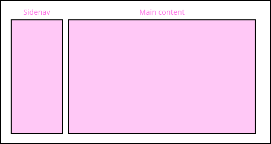

# DXC Layout Visual Guidelines

The layout design is another critical aspect of user interface design, it leads to present the content most effectively, giving a pre-set frame where other components can be placed in, improving the user experience across the site. 

There are different layout according to the purpose of the application, but a good definition of the element is crucial to represent a good visual hierarchy, with all the information organized with a user flow in mind, keeping it accessible, usable and logical for the end-user. 

## Overview

To present detailed information for each layout, we are gonna categorize each of them in a specific group, setting the following categories: *navigation*, *structure* and *relation*.

- __Navigation__: In this group are all the different layout related to the navigation of the content in the UI, from sidebars to scroll navigation and all their variations.
- __Structure__: This category is about the position of the elements in the interface. Every application is unique in a way, but all of them are following rules and patterns that make the content readable and accessible for the user, following a structure based on content and hierarchy. Some of the elements in this group are the grid system, single pages, split content or blocks.
- __Relation__: Relation refers to how items are presented in the interface, highlighting aspects like symmetry, alignment or behavior patterns (z-pattern and f-pattern). 

## Categories

### Navigation

###### Side navigation

This layout is defined by two main areas in the interface, one is a side navigation in the left, which it is used to put content related between with links to another resources or pages. The main content is the rest of the space avilable in the screen, where the source mapped to each link is displayed. 

The best scenario to use this layout is when we want the application to have a level of hierarchy where it has a side bar with all the navigation controls to related content (either in the left or right of the screen) and the principal element in the application that is the space available to fill it with functional information like descriptions, pictures, videos and other multimedia data.

The navigation elements are links that update the content of the area with different content. Also they can be links to a new page within or without the application domain, like external links to other resources. 

This approach is also used in mobile and tablet to display the menu options due to the reduced space that those devices have, providing a show/hide function to make it visible or hide it to keep the screen clear, to see the rest of the content available.

###### Tabbed sections

A form to organize the content when there is a lot of information on a single page, creating the necesity in the user to scroll to access all the information that is displayed on the screen.
With this method of navigation, navigation index elements are set to scroll to a specific point in the page, avoiding the user the need for a search for the content in a large scrolling that depending on the content will take a while to find the information that is looking for. 

The index will be always present in the view of the browser, so the user has proper feedback of where he is and where he can go. Also, the navigation among sections is smooth and clear, and the user can access quickly to the section needed.

## Design Specifications

## Responsive version for mobile and tablet

## User Interface Design Considerations

