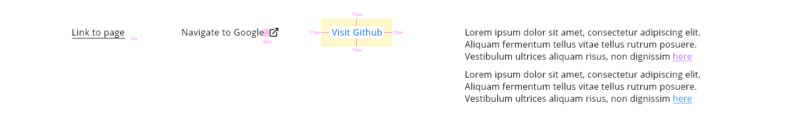

# DXC Link Visual Guidelines

## Overview

Nowadays, links are the most presented element in every web site, as they define the way of navigation across the page. They are resources that allow the user to navigate to a new page or section in the current web site, keeping the workflow of the page without losing the reference of the starting point. 

## Appearance

The appearance of the links can change from page to page, sometimes a piece of text doesn't have the visual presentation to be a link but in fact, it is, so an important aspect about the link in the visual approach and how to communicate to the user that the element that is displayed in the screen is a link and he can interact with it in the case that it will be needed.

There are a variety of types of links, but the most used are hyperlinks, text buttons, help links (terms and conditions or explanation link) and home links (usually presented as logos)

### Modes

The component has two different modes depending on the context of the use of the link element, regarding if the text link is part of a text or if it is an independent entity itself.

In the default mode, in the normal state, the link only has a different color to indicate and distinguish it as a link from the rest of the content. 

The underline mode stands out the link by the underline symbol rather than the color of the text. On this state, if the link has icon, it will be also underlined to indicate that is part of the link component.

Modes: __default__ and __underline__.

### States

The states are the same for both modes, starting in the normal state where the user didn't interact with the element, following by the hover state. In this state is common the use of the pointer cursor as an indicator of the navigation once clicking in the object. 

Also, in the default state, an underline style will appear once the user hovers the link with the cursor. For the underline mode, the difference will indicate changing the color of the item. In the case that the link already has some color, the only change on hover will be the cursor.

If the user decides to click on the link, then it will pass to another state defined as a visited state. For both possibilities, this status will be represented with a purple color to indicate to the user that the link was already visited in a previous interaction.

 
## Theming

The only change is regarding the theming is the use of color to accomplish with the accessibility standards for people with disabilities. So the color blue and purple will change the intensity to adopt the W3C standards.

| Color              | Value|
|--------------------|------:|
| Blue (light theme) | `#006BF6`|
| Blue (dark theme)  | `#4797FF` |
| Purple (light theme) | `#8800F6` |
| Purple (dark theme)  | `#C175FF` |

## Design Specifications

| Property           | Value|
|--------------------|------:|
| Recommended Margin | `10px`|
| Min width          | `0` |
| Max width          | `100%` |
| Font size          | `16px` |
| Font weight        | `Regular` |
| Space between text and icon | `10px` |
| Icon size          | `16x16px` |
| Underline height   | `1px` |

### Icon Usage

An icon can be used either in the normal or underlined mode to represent more graphical the purpose of the link, placing the icon before or after the link that is representing.

The safe space between the icon and the label has to be 6 pixels and the size of the icon matches the 16px of the font size.

### User Interface Design Considerations

- Provide visual cue to suggest clickability for all types of links
- Distinguish the visited and unvisited for navigation links
- Clearly explain where the link will take you to
- Front-load the most relevant keyword