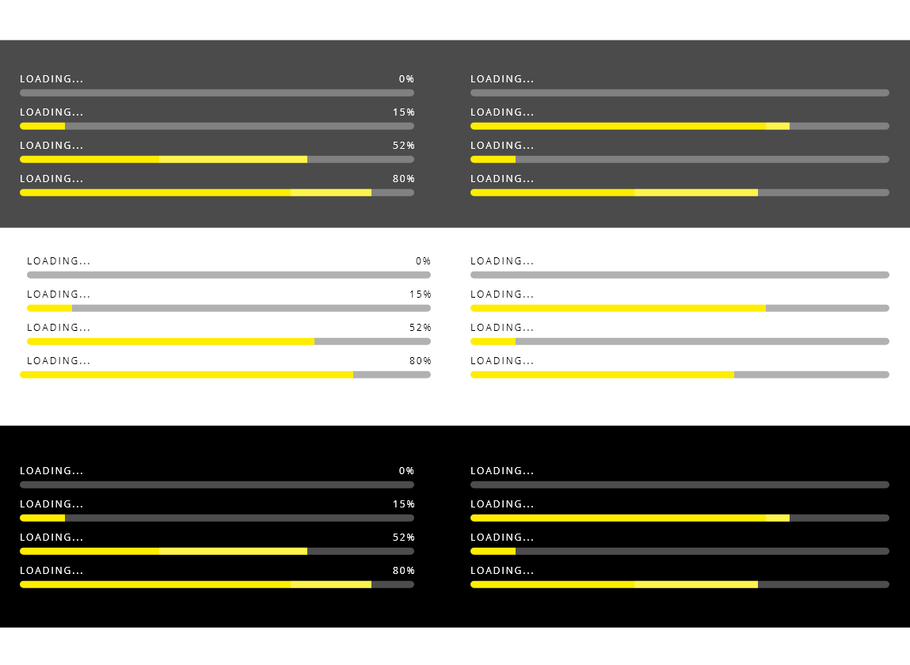
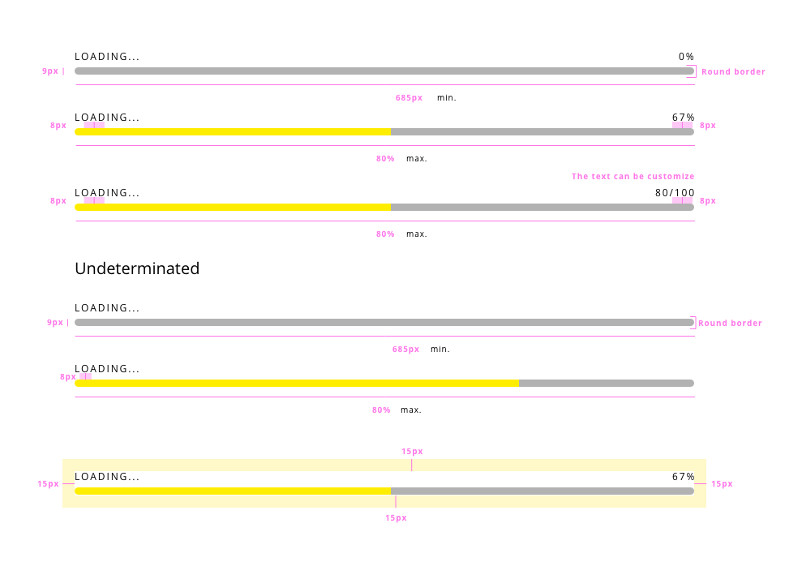

# DXC Progress Bar Visual Guidelines

## Overview

Progress indicators offer visibility of system status to the user, giving feedback to indicate that the application is taking some time to processing data. The main aim of these components is to reduce the user's uncertainty about offering something to look at while the user is waiting for the end. 

A progress bar should be used in any scenario that will take more than 1 second in performing the action, for anything that takes less than that time, it will be distracting for the user.

## Appearance

The appearance of the progress bar is recognized by the user as a long bar that indicated the part of the action that is completed filling the space available. It is used in many operative systems as part of file transferring, looking for updates or installation process.

### Modes

There are two modes for the progress bar components, depend on the track progress.
One mode is a determinate state that goes from 0 to 100% in a linear progression.
The other one is indeterminate, so it hasn't defined limits for the duration, there is no number indicator to estimate the remaining time.

A third mode can be added based on the context of use. The simplified version of the progress bar has been thought to use on responsive versions of the component, making the interface more clear with a minimalistic component. It also can contain information about the progress or a label to indicate the action.

Modes: __determinate__, __indeterminated__, and __simplified__.

### States

Three different states can be defined, but in this case, they are not related to the interaction of the user. 

- The progress bar is empty
- The progress bar is in process
- The progress bar is done

These states corresponding with the progress of the process in the application.

## Theming

Both themes (light and dark) have a similar look with colors when the component is using the overlay option.

Colors
Text color (with overlay): #FFFFFF  
Text color (no overlay): light - #000000 / dark - #FFFFFF
Actual progress indicator color: #FFED00
Progress bar color (light): #FFFFFF, opacity 0.3
Progress bar color (dark): #000000, opacity 0.3
Overlay color: #000000, opacity 0.7

## Design Specifications

| Property           | Value|
|--------------------|------:|
| Min. width         | `685px`|
| Max. width         | `80%`|
| Height             | `9px`|
| Spacing text with bar | `8px`|
| Font size          | `12px`|

Overlay

| Property           | Value|
|--------------------|------:|
| Max. Width         | `100vw`|
| Max. Height        | `100vh`|

### User Interface Design Considerations

- Do not use this type of component in actions that will take less than 1 minute to the system
- Use the determinate type if it is possible, the user can have an estimation on how it is gonna take
- Add additional information to clarify to the user the action for which is waiting ("Sending documents...")