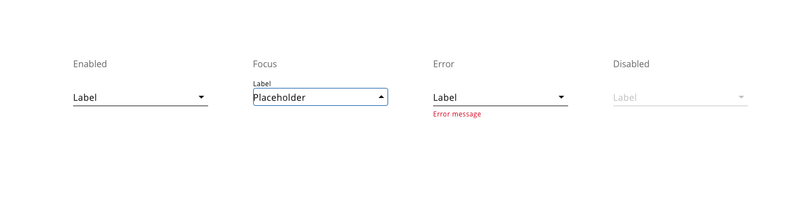
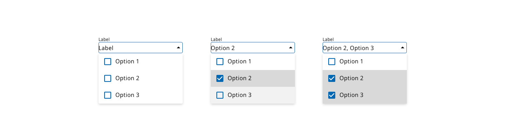
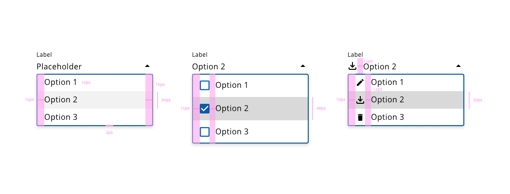

## Overview

A select component is a right choice to preventing errors with predefined options, also they reduce the vertical space by showing several options in a reduced space. Selects are used in forms, letting the user select an option instead using an input.

## Appearance

Select is widely recognizable, despite the options are not shown at the first instance, an icon with a down arrow indicates that clicking in the field the list will be visible. In the input, the placeholder defines the attribute that will get the value. 

* The options list will be displayed immediately above the placeholder, to get visible all the time which form fill attribute is the user filling.
* In case that an option is selected when the dropdown turns visible, it should be at the top of the dropdown whenever this would be possible.
* Multiple option selection will get an appearance with a checkbox that indicates the elements from the list that are selected or not.


## States

### Select input

States are defined for select component based on the interactions that the user can reproduce. The states are: **enabled**, **focus** and **disabled**:



### Options list

The options have two states: **hover** and **selected**:


## Multiple selection

Allows the user to select more than one option from the list. To indicate which items are selected and which not, the design for multiple selections integrates a checkbox pairing with each option from the dropdown.



## Design Specifications

### General

#### Size

The component `width` can adopt the following values:

width | value
-- | --
```small``` | 60px
```medium``` | 240px
```large``` | 480px
```fillParent``` | -

#### Margin

Select `margin` can use the values:

margin | value
-- | --
```xxsmall``` | 6px
```xsmall``` | 16px
```small``` | 24px
```medium``` | 36px
```large``` | 48px
```xlarge``` | 64px
```xxlarge``` | 100px

These values can be applied independently to each side of the component:
```top``` ```bottom``` ```left``` ```right```

### Select input

Select input specifications are the same as the [text-input](https://developer.dxc.com/design/components/text-input)

### Options list

#### Single select

| Property for single     |                           Value |
| ----------------------- | ------------------------------: |
| List item padding       |           6px 16px |
| Height (default)        | auto - adapted to the content |
| Font size               |                          16px |
| Font weight             |                       Regular |
| Icon size               |                    20px x 20px|
| Spacing between icon and label | 12px  |


#### Multi-select

| Property for multiple   |                 Value |
| ----------------------- | --------------------: |
| List item padding       |             6px 16px |
| Font size               |                16px |
| Font weight             |             Regular |
| Checkbox size           |         20px x 20px |
| Icon size               |                    20px x 20px|
| Spacing between checkbox and label | 12px  |
| Spacing between icon and label | 12px  |




## User Interface Design Considerations

### Single select

- A dropdown element should allow the user to select one option from a list.
- The select component should always display a label, different from any name in the option list.
- If the options list is extensive, consider letting the user type for suggestions filtering the whole number of options.
- A default choice can be displayed as the placeholder before user selection. It must be placed as the first item on the options list and appear selected.
- Use progressive disclosure between linked select components.

### Multi-select

- If more than one option is applicable, a multi-selection box should be used.
- If the list of options is short (4 or less) and users can select more than one option, consider using checkboxes instead of a multi-selection list for simplicity and visual clarity.
- Multi-select fields include checkboxes for every single option in the list, the entire row must be clickable.


## Design tokens

| Tokens                        | Default value |
| ----------------------------- | ------------: |
| selectedOptionBackgroundColor |     `#D9D9D9` |
| color                         |     `#000000` |
| hoveredOptionBackgroundColor  |     `#F2F2F2` |
| error                         |     `#D0011B` |
| scrollBarThumbColor           |     `#666666` |
| scrollBarTrackColor           |     `#D9D9D9` |
| disabledColor                 |     `#B1B1B1` |
| focusColor                    |     `#005FCC` |


## Links and references

- https://xd.adobe.com/view/23e2cca4-5021-490a-a548-e99a9b4a2006-76b1/screen/5d47790c-8718-4e0a-acc4-3deea3a0a8fa/variables/

