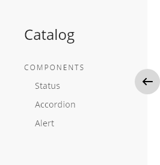

## Overview

The sidenav component is part of the layout of the application and it makes easier to divide the main screen into two different areas. The main area will have all the content and the sidenav as a secondary element as an index, including links to different resources on the web page.

## Appearance

This component looks like a container that is rendered in the left side of the application, different content can be placed within the container but the main aim of it is to serve as a guide with links to the subject treated in the main page.
A grey background defines the area which the sidenav occupies and there is an arrow that allows the user to hide or show the component on the screen. Anyway, there are able some configurations to have or not the arrow as a handler to control the visibility of the component, so in the case that the arrow won't be displayed, the component will be fixed in the screen.

### Modes

Two different modes can be set in the element, according to the needs of the application and the relation between the main content and the sidenav.
The modes for the components are __overlay__ and __push__.

The first mode, as the name is indicating, works as an overlay, leaving some content behind it on the occasion that will be displayed on the screen. That means that every time that the sidenav will be visible, some of the content of the main area remains covered by the layer.
If the selection is the push mode, this allows us to have boths content visible in the screen, not hiding information at any time but with the constraint that the main area has to manage the content because the overall space will reduce the width of the sidenav element.

## States

States are simple, it is a component that doesn't require much logic and the behavior is basic. 
It can be defined as two different modes: __default__ and __static__.

With the default mode, the component will be visible in the first load of the application (only for desktop version) and the visibility of it can be handled by the user using the arrow to trigger the event.

The main difference in the static mode is that the arrow is removed from the component, so the user doesn't have the control to switch between views and the component will remain always visible.

## Theming

| Tokens        | Themable      | Default value |
| ------------- |:-------------:| -------------:|
| backgroundColor | `true`     | `#F8F8F8`  |
| arrowContainerColor | `true`     | `#D9D9D9`  |
| arrowColor | `true`     | `black`  |
| arrowContainerOpacity | `false`     | `0.80 opacity`  |

## Design Specifications

| Property for sidenav | Value |
|----------------------|------:|
| Width                | `300px` |
| Height (default)     | `auto - adapted to the content` |
| Padding              | `48px` |
| Arrow display        | `true (default value)` |
| Arrow distance       | `50%` |

## Responsive version for mobile and tablet

The responsive version of the component for mobile and tablet works a little bit different compared with the version for desktop. As the size of the screen in those devices is reduced, the default behavior in the first load of the page will be hidden in the sidenav component. 
Taking this approach, as a first view of the page the user has all the content in the main area visible, and then he will need to interact with the component to make it visible and navigate to other resources.

Also, as an important point to mention, the only mode that works with responsive is the overlay, due to lack of space in the screen if the sidenav pushed the content of the main container.

Some properties regarding width vary, the details are indicated in the table below.

| Property for sidenav | Value |
|----------------------|------:|
| Width                | `60%` |
| Height (default)     | `auto - adapted to the content` |
| Padding              | `36px` |
| Arrow display        | `true (it cannot be false)` |
| Arrow distance       | `50%` |

## User Interface Design Considerations

- Use the sidenav element to improve the discoverability of the application, making the navigation links accessible to the users.
- Keep in mind the type of the devices that you are developing for, and handle the behavior in a way that doesn't block or reduce the available space of the main area in the application
- Try to follow and order for the sidenav content and make use of hierarchy to differentiate between a title and a link