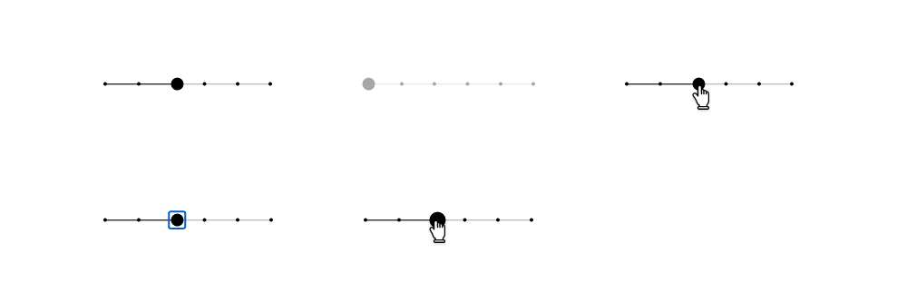
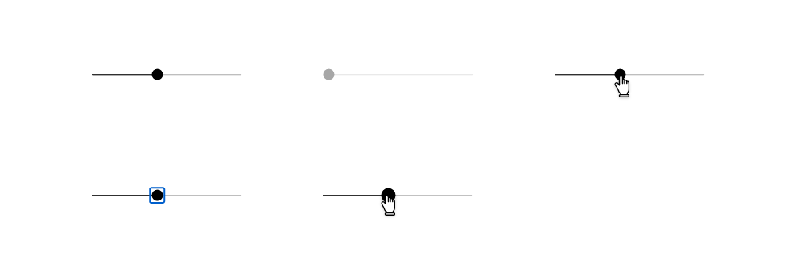
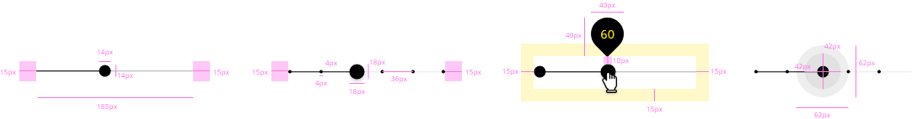
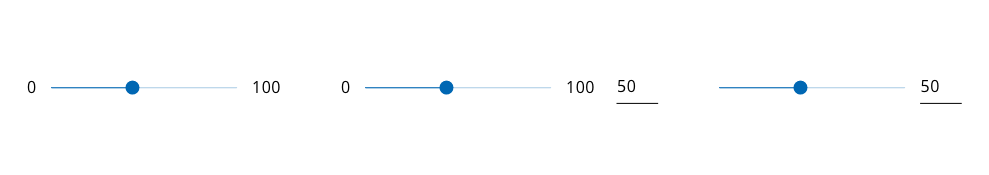

## Overview

Slider control allows users to select a specific value or a range of values from a set. Usually, slider presents a relatively large dataset and the way that the user interacts with it is helpful to explore the multiple options swiftly.

## Appereance

The appearance of the component is not that complex, it is represented most of the time with a line where are mapped all the values that can be selected. Apart from that, it is needed a control to move it side by side to pick a specific value fron the range.

### Modes

Three modes are available for a slider control.
- A discrete mode, that only can get the value marked along the slider
- A continuous mode, that can take every value mapped into slider from the beginning to the end.
- A range mode implicitly can be discrete or continuous and is used to select a range that will include all the values inside the range itself.

Modes: __discrete__, __continuos__ or __range__.

### States

Seven different states are defined in the life cycle of the component: __enabled__, __disabled__, __hovered__, __focused__, __pressed__, __dragged__ and __lock ups__.

## Theming and tokens

| Tokens        | Themable      | Default value |
| ------------- |:-------------:| -------------:|
| thumbBackgroundColor      | `true` | `black` |
| dotsBackgroundColor | `true`     | `black`  |
| trackline | `true`     | `black`  |
| disabledthumbBacgroundColor | `false`     | `0.34 opacity`  |
| disableddotsBackgroundColor | `false`     | `0.34 opacity`  |
| disabledTrackLine | `false`     | `0.34 opacity`  |
| disabledtotalLine | `false`     | `0.34 opacity`  |

## DXC Technology theme

https://xd.adobe.com/view/afb409f4-884d-4236-6cf2-4766bee75b52-d985/screen/7f570b2b-ad1e-4e1a-b44c-8bd9488f0c44/specs/

## Design Specifications

The design specifications for slider are defining in the table below.

| Property           | Value|
|--------------------|------:|
| Margin             | `15px`|
| Slider line thickness   | `1px` |
| Default knob       | `14 x 14px` |
| Selected knob       | `18 x 18px` |
| Min width       | `185px` |
| Small steppers       | `4 x 4px` |
| Space between steppers       | `36px` |
| Separation with lock up       | `10px` |
| Lockup size       | `40 x 40px` |
| Focused ripple       | `42 x 42px` |
| Pressed ripple       | `62 x 62px` |
| Font size (with text)| `16px` |
| Font weight        | `Regular` |
| Knob shape        | `y:3, blur:3` |

## User Interface Design Considerations

- Visualize the output of the slider as feedback to the user of the current state.
- As more information can give it to the user, the easier the selection will be. 
- If the value has to be specific, give some resource to the user to fill a precise input, i.e. an input next to the slider.

To accomplish these considerations, some slider's variations were designed with the purpose of offering a great user experience within the application.

