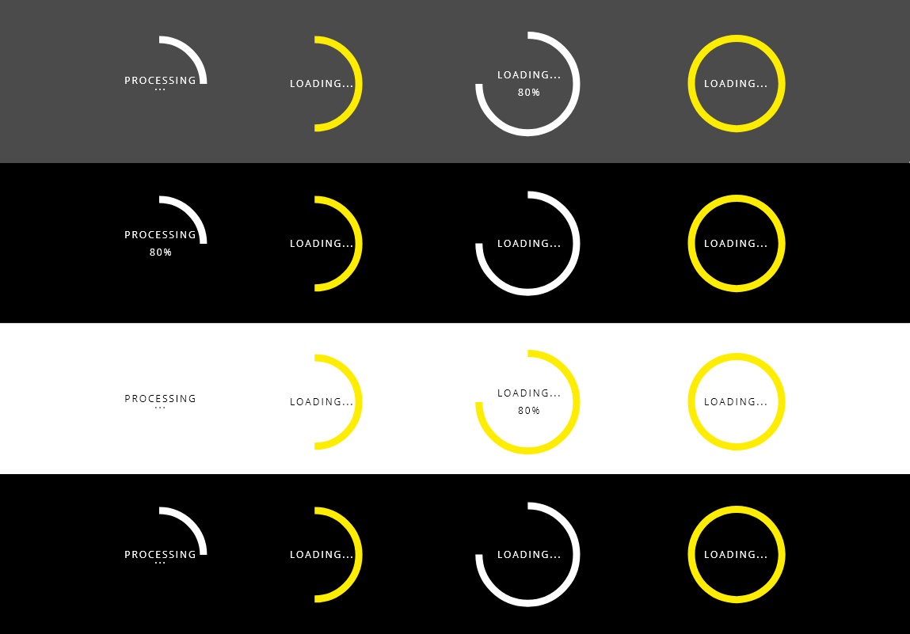

# DXC Spinner Visual Guidelines

## Overview

Loading spinner is a waiting indicator in the user interface to communicate your users that something is going on with the application and it will take a while. One of the problems that spinners have is that they don't indicate how much time the operation is going to take, for that reason the design system is including different resources to manage this consuming time for the app of taking resources.

One rule to follow with this component if the process is going to take more than 10 seconds, it is recommendable that some features like a counter or some value be linked to the component to make clear to the user the time that is going to take the processing of the information.

## Appearance

The appearance of the component is widely recognized through applications.
In the circular version, the style is a circle with a border that is spinning forever, changing the color from yellow to white in every turn.

One of the spinner mode is undeterminated, that means that they don't have logic or stepper process.

### Modes

There is only one mode in the spinner component, based on the visual reprsentation the spinner has the characteristic to be __circular__.

### States

States are not defined for this element because there is no interaction by the user. It will appear automatically, controlled by the application, and once the process is done it will hide from the main interface. 
As it is auto-management, for now, states are not contemplated.

## Theming

There is no difference between the light and dark theme unless the overlay is not included because the visual appereance will keep the same either is a light or a dark look.

An overlay separets the main application from the spinner component, making a layer to show that some action is in process. The overlay is the same used for dialog and alert components, making focus on the action that is taking place in that concrete moment.

It is another possibility to use the spinner within other component, for example, when the user clicks in a button, or the application has to do an action that will take some time, the spinner can be displayed without the overlay for those specific scenarios, so the color specifications will change accordingly.

The colors used in this component are:

Yellow: #FFED00  
White: #FFFFFF  
Black: #000000  

*In the case that the spinner would be used within the application excluding the overlay, the white color should be adjusted based on the context.

## Design Specifications

Circular type

| Property           | Value|
|--------------------|------:|
| Width              | `140px`|
| height             | `140px`|
| Border width       | `9px` |
| Radio              | `51.5px` |
| Font size          | `12px` |
| Font weight        | `Regular` |

Linear type

| Property           | Value|
|--------------------|------:|
| Min. Width         | `685px`|
| Max. Width         | `80%`|
| Height             | `9px` |
| Border radius      | `50%` |
| Font size          | `12px` |
| Font weight        | `Regular` |
| Space text and bar | `8px` |

Overlay

| Property           | Value|
|--------------------|------:|
| Max. Width         | `100vw`|
| Max. Height        | `100vh`|

### User Interface Design Considerations

- Use the spinner component in a process between more than 1 second and less than 10 seconds
- In case that the process will be slower than 10 seconds, a progress indicator and a handler to interrupt the process will be attached to the element
- The text of the action it is not mandatory but recommendable