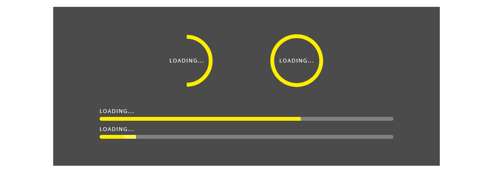
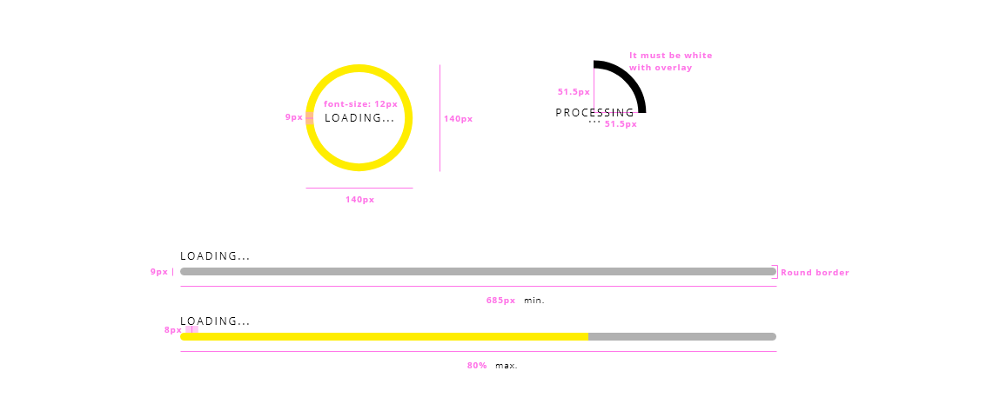

## Overview

Loading spinner is a waiting indicator in the user interface to communicate your users that something is going on with the application and it will take a while. One of the problems that spinners have is that they don't indicate how much time the operation is going to take, for that reason the design system is including different resources to manage this consuming time for the app of taking resources.

One rule to follow with this component if the process is going to take more than 10 seconds, it is recommendable that some features like a counter or some value be linked to the component to make clear to the user the time that is going to take the processing of the information.

## Appearance

The appearance of the component is widely recognized through applications.
In the circular version, the style is a circle with a border that is spinning forever, until the processing is done.

The spinner has an undeterminated state, that means that they don't have logic or stepper process.

### Modes

There are three different modes for the spinner component due to the size or the position: __default__, __tiny__ and __overlay__.
The tiny mode has never a label associated, while the default and overlay values can have a paired label.

### States

States are not defined for this element because there is no interaction by the user. It will appear automatically, controlled by the application, and once the process is done it will hide from the main window. 
As it is auto-management, for now, states are not contemplated.

## Theming

| Tokens        | Themable      | Default value |
| ------------- |:-------------:| -------------:|
| trackLine       | `true`     | `yellow`  |
| totalCircle      | `true`     | `white`  |
| textColor       | `false`     | `black/inherit`  |
| overlay       | `false`     | `black 0.80 opacity`  |

*In the case that the spinner would be used within the application excluding the overlay, the white color should be adjusted based on the context.

## Design Specifications

Circular type

| Property           | Value|
|--------------------|------:|
| Width              | `140px`|
| height             | `140px`|
| Border width       | `9px` |
| Radio              | `51.5px` |
| Font size          | `12px` |
| Font weight        | `Regular` |

Overlay

| Property           | Value|
|--------------------|------:|
| Max. Width         | `100vw`|
| Max. Height        | `100vh`|

### User Interface Design Considerations

- Use the spinner component in a process between more than 1 second and less than 10 seconds
- In case that the process will be lower than 10 seconds, a progress indicator and a handler to interrupt the process will be attached to the element
- The text of the action it is not mandatory but recommendable

## Links and references

- https://xd.adobe.com/view/afb409f4-884d-4236-6cf2-4766bee75b52-d985/screen/191779dd-dc3e-4b6c-812a-f379a44d6c03/