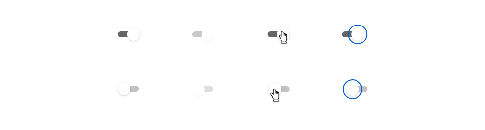
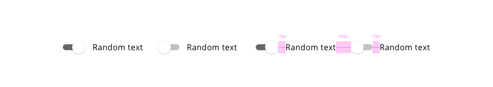

## Overview

Switch toggles are elements that can get two simple states, each of them has an impact on the system and it can be switched on or off, there are no more options.
If the switch toggle is on one state, the action to change it will modify to value of the element to the contrary.

The main difference to using a switch toggle instead of other components with a similar purpose like radio buttons or checkboxes are the immediate effect that they should take. This grants the users control on the application, changing preferences and configuration settings.

With the use of switch toggle, it is not needed a submit button to do the appropriate action, because the action takes place at the moment that the switch is turned on or off.

## Appereance

The appearance of the component should provide good visual feedback, making clear when the switch is on or off. To make a difference between states colors, shadows and fill properties can be used.

A label can be linked with the component to indicate what action will perform when the change occurs. It should be descriptive and clear about what the component is doing or affecting.

## Modes

Two main modes are represented within the component.

Modes: **on** and **off**.

## States

Five different states are defined in the life cycle of the component: **normal**, **disabled**, **hovered** and **focused**.

## Design tokens

| Tokens                                | Default value |
| ------------------------------------- | ------------: |
| checkedTrackBackgroundColor           |     `#6F2C91` |
| disabledCheckedTrackBackgroundColor   |     `#D0BDDB` |
| checkedthumbBackgroundColor           |     `#FFFFFF` |
| uncheckedThumbBackgroundColor         |     `#FFFFFF` |
| uncheckedTrackBackgroundColor         |     `#D9D9D9` |
| disabledUncheckedTrackBackgroundColor |     `#F2F2F2` |
| fontColor                             |     `#000000` |
| disabledFontColor                     |     `#B1B1B1` |
| focusColor                            |     `#005FCC` |

## Design Specifications

| Property                   |         Value |
| -------------------------- | ------------: |
| Margin right/left          |        `15px` |
| Margin top/bottom          |        `10px` |
| Switch bar                 |        `44px` |
| Text margin no switch side |        `15px` |
| Focused ripple             |   `42 x 42px` |
| Font size (with text)      |        `16px` |
| Font weight                |     `Regular` |
| Switch button shape        | `y:1, blur:3` |

Schematics examples for the switch toggle component with all the variations.

In some application the use of several switches based on the requirments could appear, that why we provide some indications in the case that the user needs to use stacked or linear switches.

_Linear_

The text should have a margin of 15 pixels based on its position. If the text is after the switch, it should define the margin on the right side. Otherwise, if the label of the switch is before the component, the margin has to go on the left side.

_Stacked_

The spacing between stacked switches should be 20 pixels that is determining by the top/bottom margin of the switch component itself.

## User Interface Design Considerations

- Switch toggles should be used in place of radio buttons whenever the options are opposites of each other (i.e. yes/no, on/off, etc).
- Try to present your lists vertically, with one choice per line.

## Links and references

- https://xd.adobe.com/view/afb409f4-884d-4236-6cf2-4766bee75b52-d985/screen/c3026d48-f954-4978-91e4-05d323ee078c/
