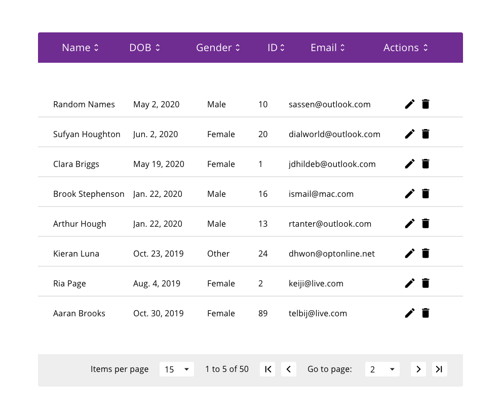
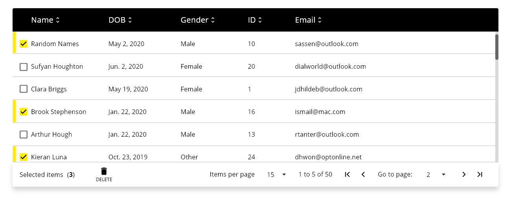
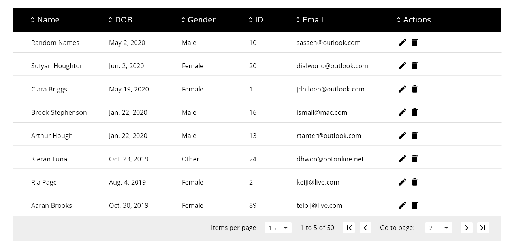
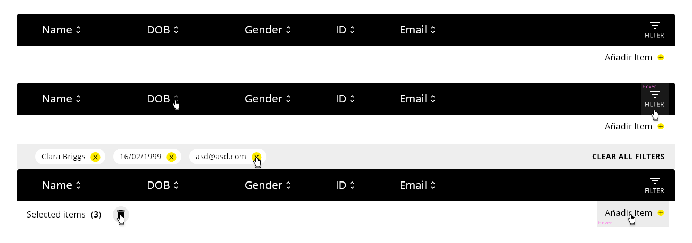
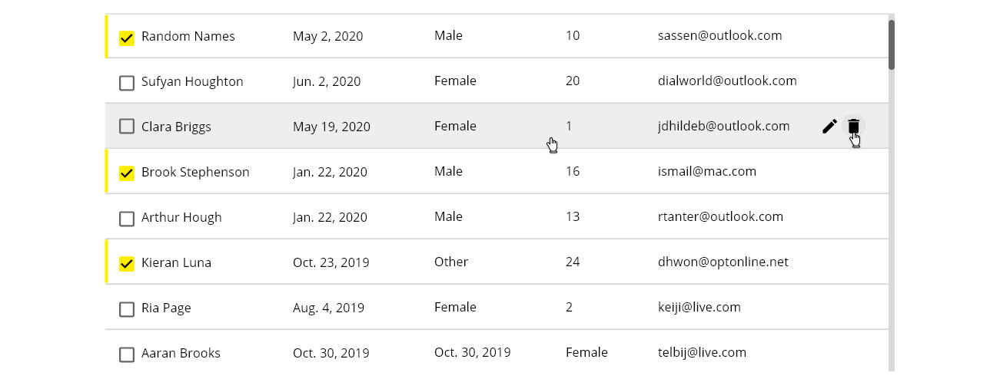
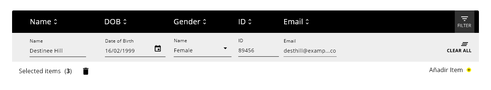
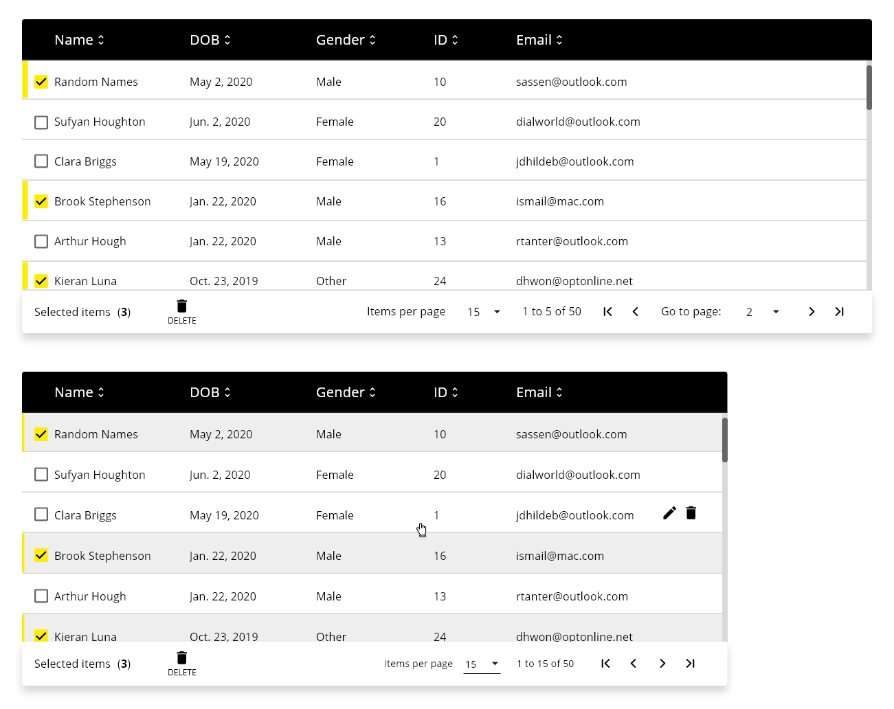
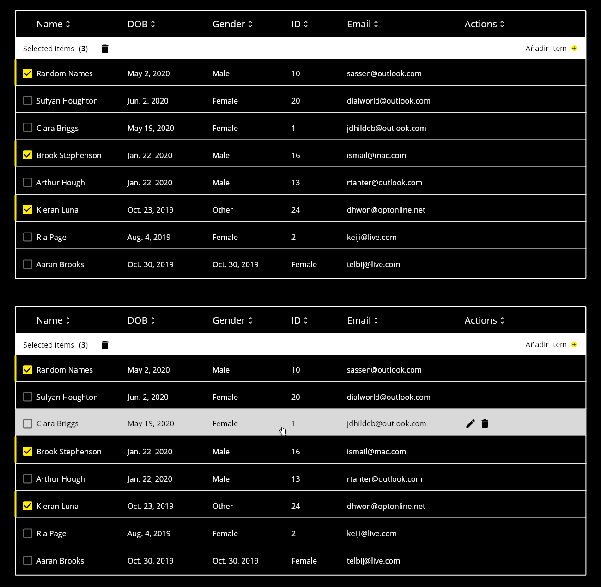
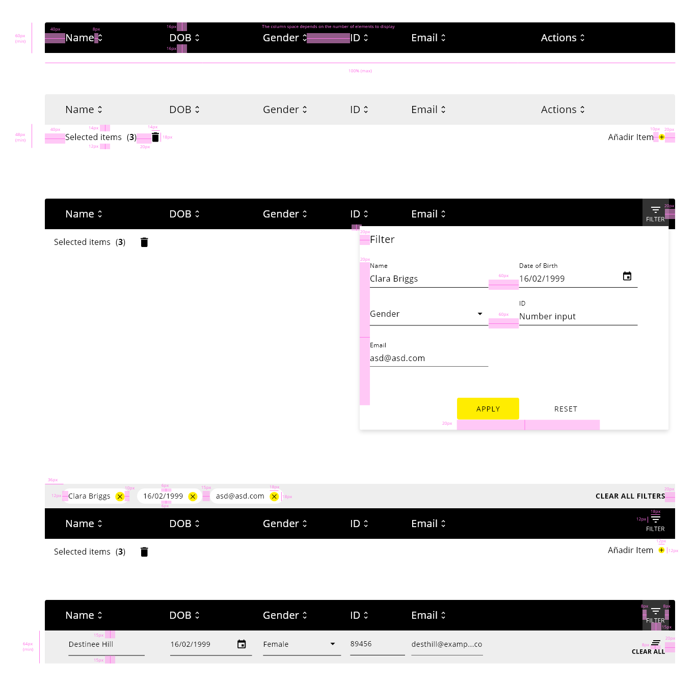

## DXC Table Visual Guidelines

#### Overview

Data table is a component with a high rate of usage within the applications. It allows to show the user a big amount of information in a simple and simplified way. All the information contained in the table has a grid structure, defining columns and tables to place the data and allows users to scan, analazy, compare and filter that information.

##### *Appearance*

It is difficult to see a design variation of a table regarding the standards definition, because it is the best way to show the data.
Every line of the table represents a register that can be modified, deleted or searchable. The different properties of the register are displayed separated with enough space in the grid representation. 
Also, some criteria can be defined to establish some type of sorting, filtering or matching with the properties that the user wants to look for.

This component into the DXC design system is formed by three main parts:

- Table header: Column properties, sorting methods and filtering options can be found in that part. Also the triggers for add items or handle bulk operations can be placed in this area.
- Table body: Thisis the main information container, where the actions that affects each row can be performed.
- Table footer: The table footer will contain the paginator element, and depending on the configuration, bulk operations can appear inside this section.

Here is an example of each section:

 

###### Modes

One mode is defined for the table component, with slightly variations based on the configuration. 

Modes: __basic__.

 

###### States

Some other components defined in the design system are used in the table component as the checkbox or dropdown. For concrete specifications about states, please, consider to see the documentation of each component.

States of the table are defined as follow:

    Normal State

 

    Hover State

 

    Multiselect selection State

 

    Dropdown configuration State

 

    Inline filtering State

 

##### *Theming*

###### Light theme

 

###### Dark theme

 

##### *Design Specifications*

Design specifications for table header:

| Property           | Value|
|--------------------|------:|
| Min. Height | `60px` |
| Max. width| `100%` |
| Padding right | `40px` |
| Padding left | `20px` |
| Padding top/bottom | `15px` |
| Space col. name and sort icon | `8px` |
| Action bar Min. height | `48px` |
| Padding right | `40px` |
| Padding left | `20px` |
| Padding top/bottom | `14px/12px` |
| Distance items and icon operations | `20px` |
| Icon size | `14px 18px` |
| Distance add item and icon | `10px` |
| Font size | `20px` |

Dropdown specifications

| Property           | Value|
|--------------------|------:|
| Padding right/left | `20px` |
| Padding top/bottom | `12px 20px` |
| Distance between inputs | `60px` |
| Distance between buttons and form | `60px` |
| Distance between title and form | `30px` |
| Font size title| `20px` |
*Input, dropdown, and button specifications are defined in each component

Filter specifications

| Property           | Value|
|--------------------|------:|
| Filter bar Min. height | `48px` |
| Padding right/left | `20px 40px` |
| Padding top/bottom | `10px` |
| Filter tag width | `Adapt content` |
| Font size | `14px` |

 

###### Responsive version for mobile and tablet
(To Do)

###### User Interface Design Considerations

- Pagination strips should be used on desktop/laptop and tablet devices, but not on mobile phones.
- The pagination strip should be right aligned below the bottom row of the table. 
- The strip is made up of 3 sections; each provides the user with information about the number of items in the table as well as how to access them.
    - Section 1: user may choose how many rows to display per rotation 
    - Section 2: dependent on section 1 setting, system shows specific line numbers in the rotation and the number of rotations in the table 
    - Section 3: provides navigation within the entire table 
    ▪ First rotation in table 
    ▪ Previous rotation 
    ▪ Specific page number access 
    ▪ Next rotation 
    ▪ Last rotation in table 