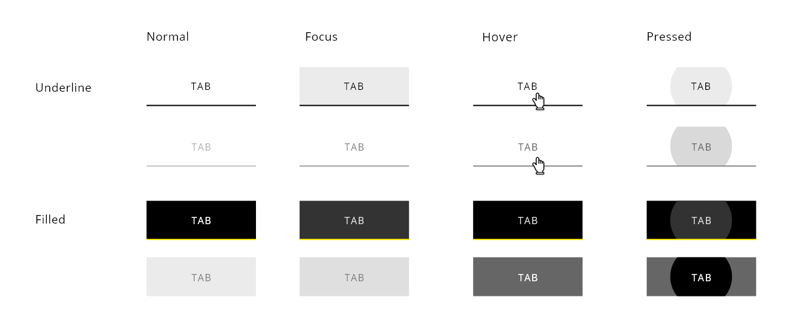
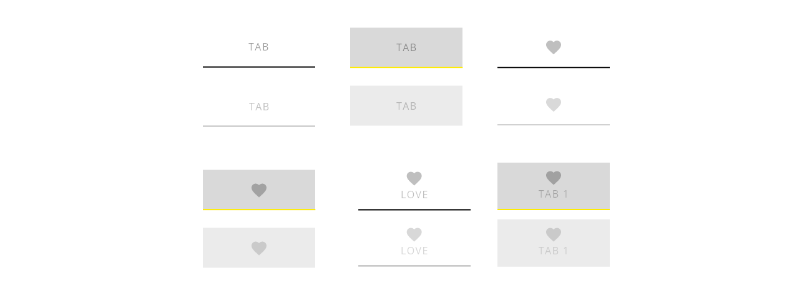
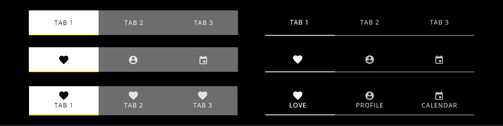
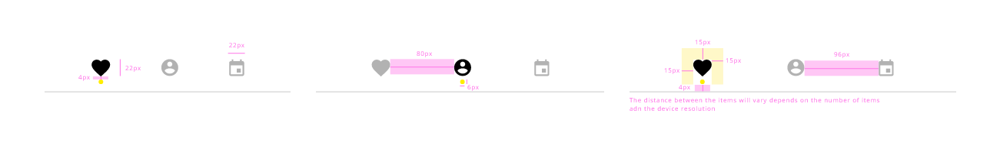

# DXC Tabs Visual Guidelines

## Overview

Tabs allow to organize all the information in different groups which are related between them and are represented in the same level of hierarchy. The user are able to interact across the sections to switch from one set of content to another, making the transition easily from one peer to the other.
This approach is an easy way to help the users find different types of content with a clear organization.

## Appereance

Each tab will be paired with content, including a clear description of the section so users can understand the content inside it. The organization have to follow some criteria in terms of importance, structured process or logic.

The tabs appereance is flat and linear, they are displayed one after another, with the using of an underline for separating the control element from the content of each tab. Only one tab can be selected at each time which is highlighted from the rest to give a visual clue about the state of the application.

The representation could include labels, icons or both of them. 
In case that there are more tabs that don't fit in the screen an indicator should be used to shows the user that information.

## Modes

Basically, there are two main modes in the tabs representation

Modes: __filled__, __underlined__.

## States

As in other component, different states can be defined with each interaction.
States: __normal__, __focus__, __hover__, __pressed__, and __disabled__.

## Theming

### Light theme

Black: #000000  
Yellow: #FFED00  
White: #FFFFFF  
Dark grey (filled): #666666, opacity 0.8  
Light grey (filled/underlined): #D9D9D9, opacity 0.5  

### Dark theme

Black: #000000  
Yellow: #FFED00  
White: #FFFFFF  
Dark grey (filled): #666666, opacity 0.8  
Light grey (filled/underlined): #D9D9D9, opacity 0.5  

## Design Specifications

| Property           | Value|
|--------------------|------:|
| Margin top/bottom  | `15px`|
| Max width         | `180px` |
| Selected underline | `2px` |
| Label bottom space | `20px` |
| No selected underline| `1.5px` |
| Unselected label bottom space | `20.5px` |
| Min height| `64px` |
| Min space between tab labels| `132px` |
| Icon size | `22x22px` |
| Min height (icon + text) | `76px` |
| Space icon with label | `8px` |
| Space text with underline | `14px` |

## Responsive version for mobile and tablet

The representation of the component for mobile and tablet can follow the same visual approach that for desktop, however, there is an alternative representation for this type of devices which allow to position the tabs at the bottom of the screen, making them as a navigational menu and the content will render above it. This tries to imitated a common pattern used in mobile in many applications.

Also, the labeling of each tag could varies, including icons, label or a combination of them. Another visual clue for a better feedback is included in this case, using a rounded circle to indicates which tab is selected apart from color intensity and highlight elements.

| Property           | Value|
|--------------------|------:|
| Margin top/right/left no text | `15px`|
| Margin with text | `12px`|
| Max width | `According to the device` |
| Min height | `64px` |
| Icon size | `22x22px` |
| Distance between dot and icon | `6px` |
| Dot size | `6x6px` |
| Distance between elements | `It varies based on the number of items` |
| Distance dot to bottom | `4px` |
| Space icon/text | `8px` |
| Space text/bottom | `12px` |

## User Interface Design Considerations

- Use tabs for navigation when dividing content into different sections. Clearly label tabs so users understand the purpose.
- Organize tabs in order of workflow, structured processes or importance.
- Tabs should look and behave like tabs.
- The active tab includes a background color to indicate focus. This may vary depending on color theme of the design.
- Center the text vertically and horizontally on the tabs.