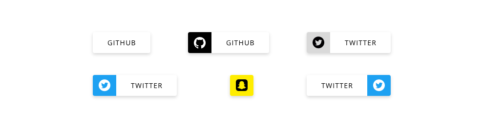

# DXC Tag Visual Guidelines

## Overview

Tag represent resources and global terms identify and linked with a text section to provide to the user more context and information regarding a topic. It usually appears in the top or bottom of the section and multiple tags can be concatenated to generate a serie of resources displayed with a visual hierarchy that calls the user's attention.

## Appearance

The tag appearance is similar to the button one (in raised mode) which gives a hint of the interactivity of the component, with a shadow that foregrounded the component calling the user attention. In some cases there will be a link to a resource completing the information displayed on the page, in others there will be a simple representation of information but it will give to the user a overview resume of the content of the section/area that wants to be represented. 

By default, the tag can include a label or/and an icon to represent the term and what is behind it. 

### Modes

There are no predefined modes for this component. The user has the option to customize the background of the icon placeholder that by default will be the same color as the default value.

### States

Also, this component is static, which means that there is only one difference between the default and hover state, changing the cursor from the default to the pointer cursor. The tag is merely a link to other resource or a place to display some information, so it is not intended that the flow of the component consider all the different states.

## Theming

Here, we have two theme options, light and dark as with other components, but it doesn't change any of the tag visual approaches from one to another. Only the background color will be affected by the chosen option. 

## Design Specifications

| Property           | Value|
|--------------------|------:|
| Recommended Margin | `30px - 12px`|
| Min width icon area| `48px` |
| Margin icon area   | `12px` |
| Min height         | `43px` |
| Max width          | `100%` |
| Font size          | `14px` |
| Font weight        | `Regular` |
| Icon size          | `24x24px` |
| Text transform     | `Uppercase` |

### Icon Usage

The icon can be included inside the tag component or not. It is apt to the user if he wants to represent the tag resource with a visual representation or just pure text. On the other hand, the text is optional too, so it can be the case that the tag element has only an icon or only a label. 

The combination of both can be represented too, and the icon will lead the component representation if the position selected is before the label. It will be at the end if on the opposite the after position value is set.

As it is mentioned in this document, the background color of the icon area can change accordingly to the definition from the user, but please, make it consistent with the application and with the accessibility guidelines for the color contrast. That election is the user's responsibility, so keep this point in mind.

### User Interface Design Considerations

- Use tag for highlight properties of a section that want to remark
- Make consistent use of the component accross the application
- Be responsible of the use of background color and icons
- If there are multiple tags, make sure to space them properly
