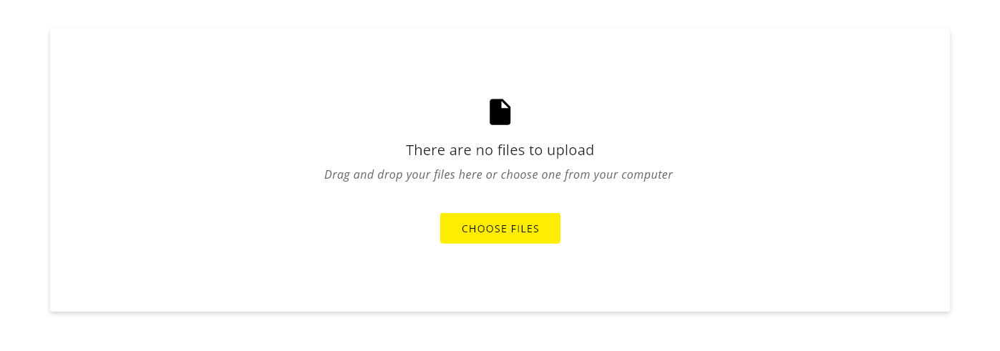
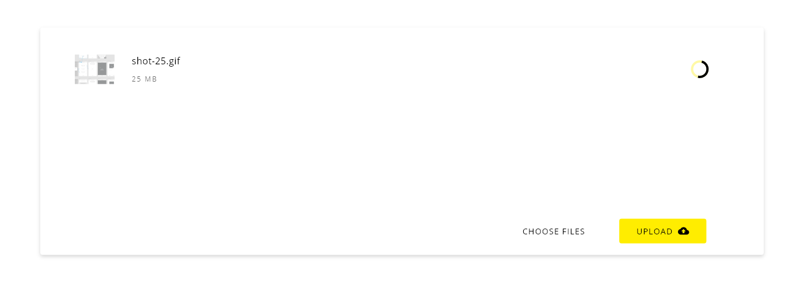
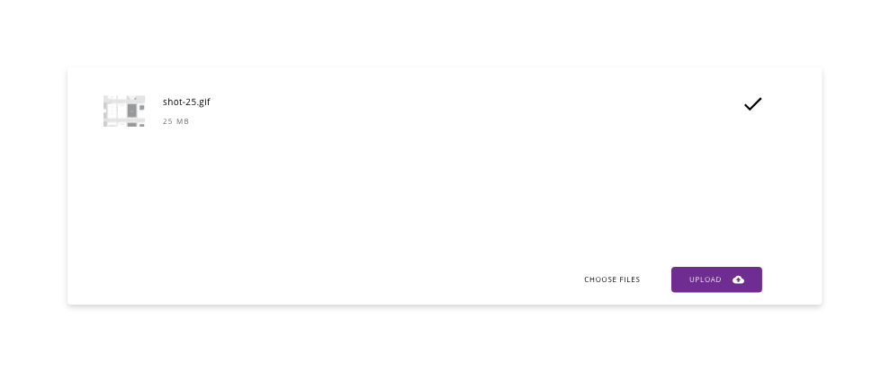
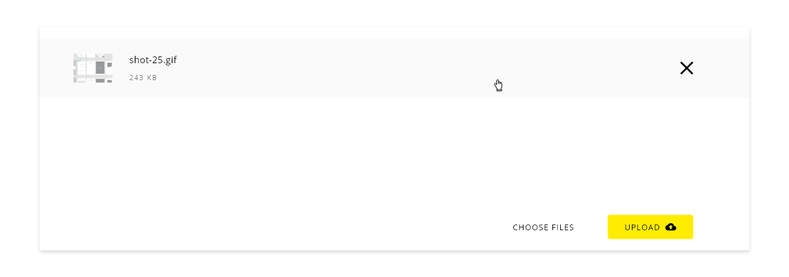
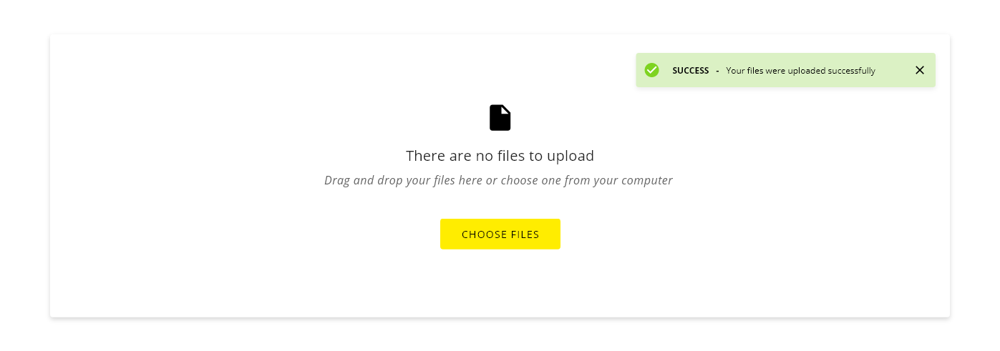

# DXC Upload Visual Guidelines

## Overview

The upload component is used to choose files from any location in the local machine and update those files to the server where the application is hosted. It is a common procedure in applications where files are required like documents, images or other information in digital formats.

## Appearance

A limited area in the user interface is reserved for this purpose, letting the user select the files in two ways, either choosing the file through the file system of the operating system or dragging the file and dropping in the respective area.
Once the file is displayed there, some characteristics are rendered:
- A thumbnail of the file (in the case that it is available)
- The name of the file
- The size or other information of the file
- An icon representing the actual status of the file (in progress, done, error) 

When all the files are well loaded and the user wants to upload the files to the server, the only action to be performed is the click on the upload button. If the action goes right, an alert message with a success status will be displayed, in other cases, an error will pop up indicating the reason.

### Modes

There is only one mode for this component specification, in the following section is introduced.

### States

*Default state*

*Drag and drop state*

*Uploading state*

*File complete state*

*Hover state with extra options*

*Upload completion state*

## Theming

The same look is using for both themes light and dark.

## Design Specifications

Since this component has many specifications to be detailed here, the best way to share the information with the interested people is throw the next adobe cloud link: https://xd.adobe.com/spec/95f3b9b7-89dd-49bf-4732-8f6c2459f9df-e3c2/screen/0a80be63-f9b6-4436-a3f1-ced47070f70d/Upload

### Responsive design

*This is pending*

### User Interface Design Considerations

- Add some explanation text in the case that it is needed to clarify the information to the user
- By default, the drag and drop appearance is handled by the browser, in case it wants to be customized is the responsibility of the developer
- If the upload process fails, please show an error message avoiding technical or undetermined information (i.e '0x94 ERROR_PATH_BUSY') that won't be understood by the user of the application