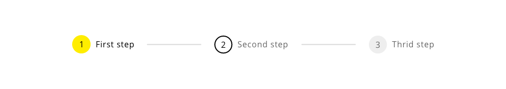
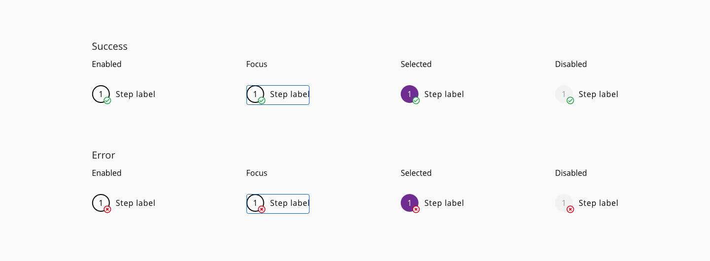

# Wizard

Wizard represents a stepped workflow as a form of linear and mandatory progression through a defined process with several bullet points where the user need to interact with the content of each step during the workflow.

## Appereance

### Modes

The basic modes defined for this component are two based on the display of the information.
An horizontal mode where the stepper element will be at the top of the container followed in the y-axis by the content of each step and at the bottom of the container the actionable elements will be displayed.

Another approach but less used is the vertical variation that will show the stepper in a vertical direction at the far left of the screen, next to the content of each step. Again, at the bottom of the component there will be room for the buttons to navigate between the steps.

Modes: **horizontal** and **vertical**.

Keeping talk about the modes, there is another distinction to mention in this part that is related with the content of the steps.
Regarding the content of the step it can be formed by different information:

- Only numbers
- Only icons
- Numbers/icons with main text
- Number/icons with main text and assitive text

### States

The several states of the wizard component are based on the actual and the previous status of the different steps that are conformed within the component.
If the step is selected it will have a visual cue that will indicate that the user is in that specific step in that moment (normally represented with a yellow color).
In case that a previous step was visited before to jump to a new one, another look will represent that state (an outlined representation of the step).
When the steps are disabled, there will be an intermediate state representation with a grey scale.

States: **selected**, **default** and **disabled**.

### Validation

There could be some scenarios in which the content of a step wants to be validated while the user is filling the fields with information or doing relevant actions in every step of the wizard.
For that case, a validation mark can be represented in every step once the user navigate to the next step in the linear progression. This will represent the status of the validation respecting the content, with a success mark or an error mark visible on the step mark.

## Design tokens

| Tokens                  | Default value |
| ----------------------- | ------------: |
| selectedBackgroundColor |     `#6F2C91` |
| selectedFont            |     `#FFFFFF` |
| borderColor             |     `#000000` |
| fontColor               |     `inherit` |
| lineColor               |     `#D9D9D9` |
| disabledBackground      |     `#D9D9D9` |
| disabledFont            |     `#666666` |

## Design Specifications

Since this component has many specifications to be detailed here, the best way to share the information with the interested people is throw the link to adobe cloud that are in the Links and references section.

### User Interface Design Considerations

- The horizontal/vertical line should not extend to the left of the first circle or to the right of the last circle
- Do not overwhelmed the component with too many steps, it won't be a good idea for the user workflow neither for the display of the information

## Links and references

- https://xd.adobe.com/view/23e2cca4-5021-490a-a548-e99a9b4a2006-76b1/screen/8408c439-e1b6-4273-b0b7-b16a2def1cef/variables/

