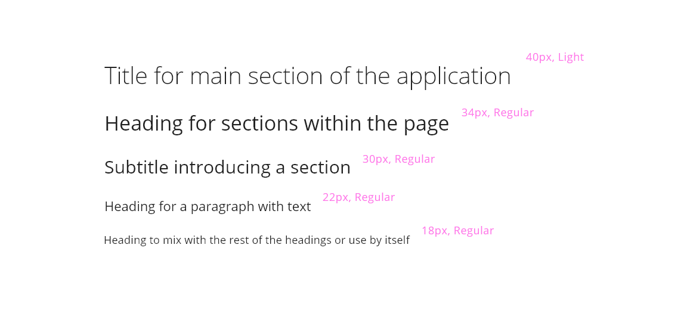

A key part of a design system is the typography. The text is used almost in every component, so it is important to choose the correct font family that will fit into the overall design to create a delightful experience and makes the user perceives typography as another element that gets the essence of the system.

## Overview

Heading component is an essential element that contributes to define a great hierarchy within the application. It helps to give semantic meaning to the content as well as contributing to define a good structure for SEO (search engine optimization).

The implementation will rely on the use of HTML tags, but there is a meaningful point to consider here because, in some occasions, the component can't make an exact match between either concept, what might be the larges heading (H1) in one part of the application may be the second largest heading in other pages, avoiding this a mutual correlation for every scenario.

## Appearance

The font family chosen for the design system is Open Sans, a humanistic sans serif typeface that was optimized for web and mobile interfaces designed by Steve Matterson. It can be found in the Google Fonts catalog and it is under Apache License.

The typeface has 5 different weights, from light to extra-bold but in our design system, we mainly use three variations, light, regular and bold. For each variation, it exists an italic form that is used in some scenarios.

Headings made use of a combination of light and regular weights, to improve the readability and consistent with other elements.

The font size goes from 60 pixels for the more prominent heading to 20 pixels for the lowest title level.

There are several scenarios where the use of heading is just right when we are talking about the title for a section, header of a table, a definition of the elements that will appear below the title or an introduction for a paragraph. 

Apart from that, many of the design system components are making use of headings in their implementation (e.g., card, dialog, sidenav and so on). 

## Design tokens

An inherit color from the definition of the application is received, so the component could change his color based on that parameter. There is no specific tokens for this component.

### Hal-Headings-H1

| Property            | Value                     | Token        | 
| :---                | :---                      | :---         |  
| `font-family`       | 'Open Sans', sans-serif;  | `type-sans`         | 
| `font-weight`       | 400                       | `type-regular`          | 
| `font-size`         | 60px / 3.75rem            | `type-scale-08`         | 
| `font-style`        | regular                     | `type-normal`          | 
| `text-transform`    | initial             |           | 
| `letter-spacing`    | 81.9px / -0.0125em          | `type-spacing-tight-01`          | 
| `line-height`       | -12.5px / 1.365em          | `type-leading-compact-01`          | 

## Design Specifications

In this section are defined the 5 variations for the heading for desktop.

## Responsive version for mobile and tablet

The system is adaptable based on the devices, and that's why the component is handling the responsive typography through a set of breakpoints to fit mobile and tablet designs. As the space available on the screen can be very different, the sizes of the headings tend to modify the sizes, make them increase or decrease across the devices.

Specifications for mobile version (size less to 480 pixels)

| Level              | Value|
|--------------------|------:|
| Heading first level | `40px, light`|
| Heading second level | `36px, regular` |
| Heading thrid level | `39px, regular` |
| Heading fourth level | `22px, regular` |
| Heading fifth level | `18px, regular` |

Specifications for tablet version (screen size between 480 pixels and 768 pixels)

| Level              | Value|
|--------------------|------:|
| Heading first level | `42px, light`|
| Heading second level | `38px, regular` |
| Heading thrid level | `31px, regular` |
| Heading fourth level | `22px, regular` |
| Heading fifth level | `20px, regular` |

## User Interface Design Considerations

- Identify where you need to use a heading and make use of them selecting the correct level
- If there is any other size/weight that helps you to establish and remark the hierarchy in your application, feel free to adopt it, but make sure that it is not breaking the harmony 

## Links and references

- https://xd.adobe.com/view/23e2cca4-5021-490a-a548-e99a9b4a2006-76b1/variables/
