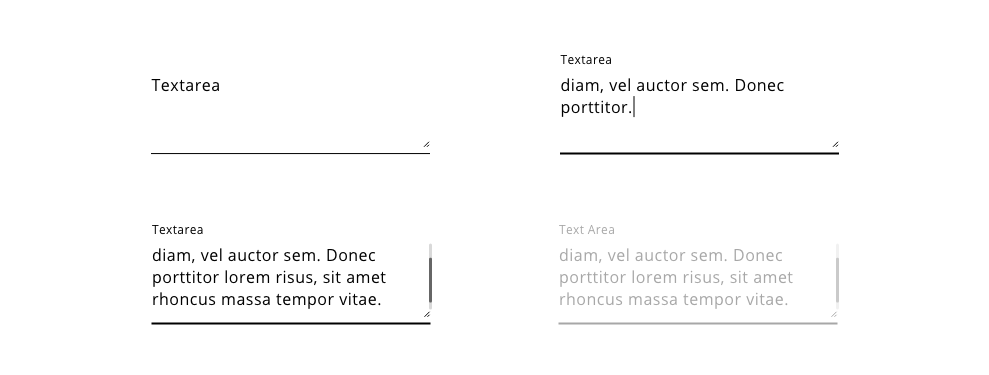
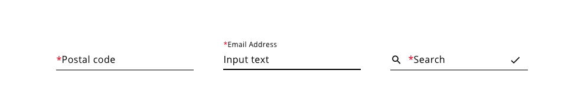

## Overview

Text inputs are the standard way to receive the user input into an application. There are several types of inputs to cover a spectrum, from email inputs to numbers.
Each input should specify which property the user is editing and indicate clearly the status of the field in every interaction.

## Appearance

The input appearance must be simple and clear, in this design system text inputs are represented as a placeholder with a thin underline where the text will be written.
Other elements like assistive text, prefix or suffix icons or error handlers can be complementing the input field making the basic structure more informative.

### Modes

Five different modes can be identify using text input component: **basic**, **basic with assistive text**, **basic with prefix**, **basic with suffix** and **basic with prefix and suffix**.

### States

The states for text input are: **normal**, **focused**, **selected**, **value entered** and **disabled**.

## Design tokens

| Tokens                        | Default value |
| ----------------------------- | ------------: |
| fontColor                     |     `#000000` |
| disabledFontColor             |     `#b1b1b1` |
| placeholderColor              |     `#D9D9D9` |
| error                         |     `#D0011B` |
| selectedOptionBackgroundColor |     `#F2F2F2` |
| hoverOptionColor              |     `#000000` |
| scrollBarThumbColor           |     `#666666` |
| scrollBarTrackColor           |     `#D9D9D9` |

## Text Area

The text area is a variation inside the text input component. The functionality of both components is the same, the user can enter text in the input area that later will be processed by the application. However, the text area is made to match with a large data text, like a description, paragraph, a long address or a comment.
When the amount of information given by the user needs to be precise and detailed, the application should use this element for that purpose.

It allows multiple lines, adapting the text to the space available and in the case that there won't be enough space then the text will be overlapped and a scrollbar will be used to scroll up and down to see the rest of the information. Also, the content area is resizable (based on the frame that is contained) so the user has the chance to increase/decrease the total area.

The text area can have the following features: Label, assistive text, min and max-width, resizable call to action and scrollbar.

The aspects that text area is not including respecting text input are:

- Prefix and suffix
- Max height fixed

## Design Specifications

| Property                                       |       Value |
| ---------------------------------------------- | ----------: |
| Margin                                         |      `15px` |
| Height (min)                                   |      `34px` |
| Height (max)                                   |      `74px` |
| Widht (min)                                    |     `230px` |
| Widht (max)                                    |      `100%` |
| Border thickness                               |   `1px/2px` |
| Font size (with text)                          |      `16px` |
| Font size smaller text                         |      `12px` |
| Font weight                                    |   `Regular` |
| Icon size                                      | `18x18(px)` |
| Distance between text and underline            |      `12px` |
| Icon margin right side                         |       `6px` |
| Distance between text and underline (animated) |       `6px` |

### Required fields

Required fields are a variation in the normal behavior of the input fields. This indicates to the user that the input is required so it can't be skipped if the intention is to go forward in the application.

A red asterisks before the input label must indicate that the text input is a required field, with this visual clue the application is telling the user the mandatory field.

Here are the different representations of a required field:

The specifications for the required input follows the same guide that a normal input, with the variation of the asterisk before the label.

### Helper text

Helper text can be used as additional instructions to the user when filling in the form. It should be visible even on focus state and it can be replaced by an error message until the error is fixed in order to prevent adding more lines of text.

**Usage**

Do:

* Keep helper text as short and specific as possible.
* Only use helper text when truly necessary to avoid overloading the user.
* Should give an example or an explanation of the field

Don’t:

* Helper text should not run longer than the input area.

**Specs**

| Property | Element | Token | Value |
| :---         |     :---     |          :--- |         :--- |
| `margin-top`  | `input-helper-text`    |     | 6px 
| `font-size`  | `input-helper-text`    |  `type-scale-01`   | 12px 
| `font-family`  | `input-helper-text`    |  `type-sans`   | Open Sans 
| `color` | `input-helper-text`      |  `Hal-Black`   |  hsl(0, 0%, 0%) |

### User Interface Design Considerations

- Input fields should allow users to enter any combination of letters, numbers, or symbols unless otherwise restricted or stipulated by requirements
- Avoid breaking up a number with distinct sections into separate input field (i.e. phone numbers, area codes, SSN, dates, etc) to facilitate screen reader accessibility requirements
- Allow sufficient space in an entry field to allow typical input
- User text areas, rather than a single-line input box for paragraph text and comments
- Input fields are more restrictive for mobile users to make sure the type of input field is warranted
- Only show error validation messages after the user has left the field

## Links and references

- https://xd.adobe.com/view/23e2cca4-5021-490a-a548-e99a9b4a2006-76b1/screen/1cad53d5-9b24-4336-a0c9-3d4b283c9088/variables/

