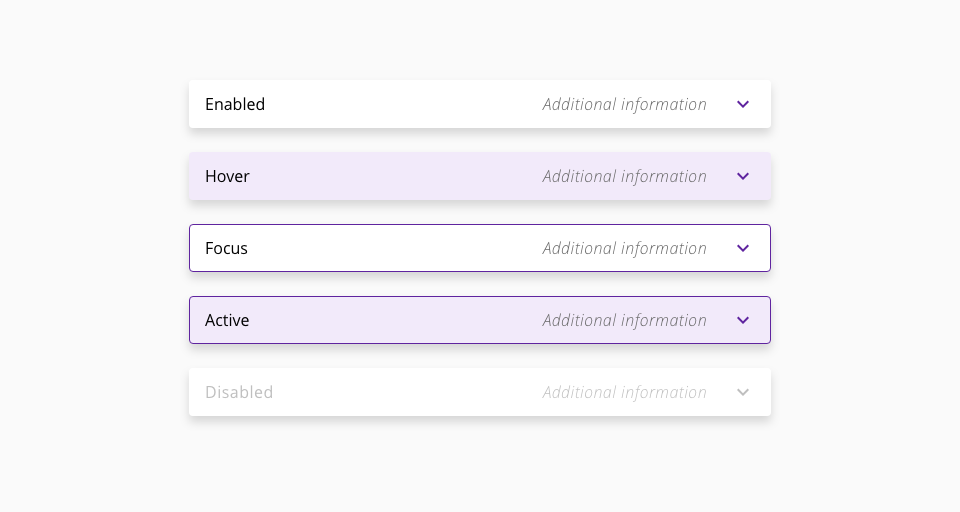
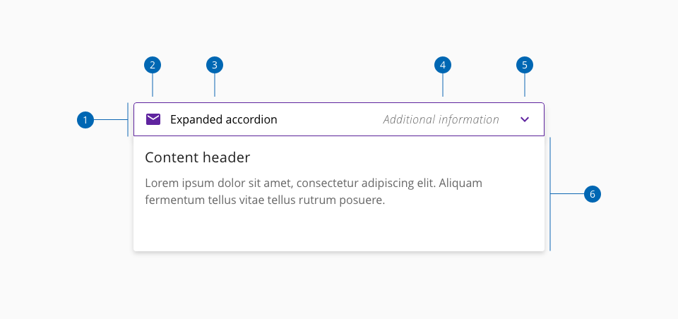
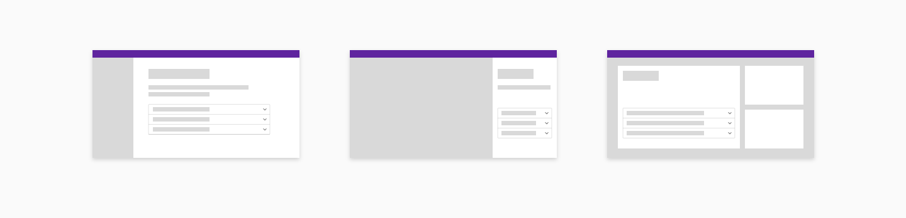
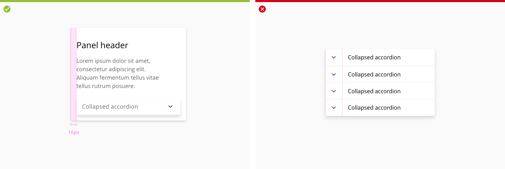
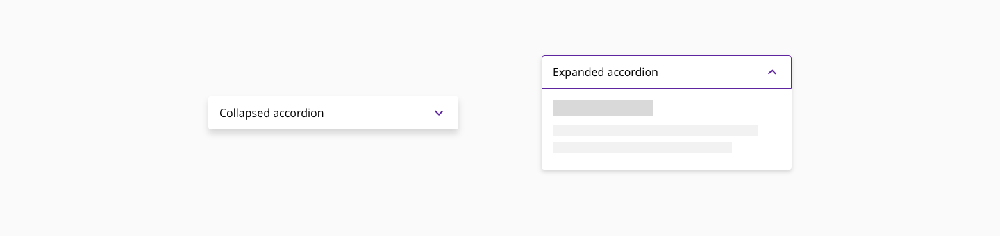
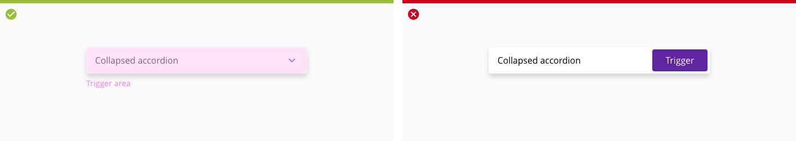
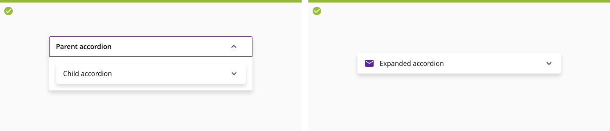
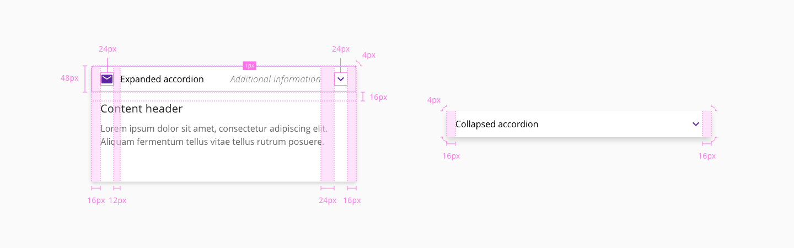

# Accordion

Accordions are used to group similar content and hide or show it depending on user needs or preferences. Accordions give users more granular control over the interface and help digest content in stages, rather than all at once.

## Usage

The accordion component delivers large amounts of content in a small space through progressive disclosure.

### Do’s

* Displaying and grouping additional information.
* To shorten pages and reduce scrolling when content is not crucial to read in full.
* Adding granular control over the information on a given page.

### Dont’s

* When most of the content on the page is needed to answer user questions.
* To display a list of clickable options, dropdown should be used instead.
* Displaying critical system information or a primary action to be taken on the page. (for example, alerts, confirmation or cancellation buttons).

## States

The accordion header can get four different states based on user interaction. States: enabled, hover, focus and disabled

## Formatting

### Anatomy

1. Header
2. Active icon (Optional)
3. Active text label 
4. Additional information
5. Caret icon for Expand/collapse
6. Expanded panel

### Placement and alignment

#### Placement

Accordions can be placed with main page content or placed inside of a container such as a side panel or tile.

_Component placement examples_

#### Alignment

By default the chevron icon is placed on the end side of the header. This allows for the title on the start side to align with other type elements in the layout.

_**Left**. Place chevron icon at the end of the accordion header._

_**Right**. Don’t place caret icon on the left.._

### Behavior and interaction

_Examples of collapsed vs expanded accordions_

The accordion component has two main states: collapsed and expanded. The chevron icon at the end of the accordion indicates which state the accordion is in. Accordions begin by default in the collapsed state with all content panels closed. Starting in a collapsed state gives the user a high level overview of the available information.

* Trigger collapsed and expanded states when clicking on either the header or icon.
* Use icons and animation to easily reflect collapsed and expanded states.
* Use a chevron icon to indicate the expand/collapse behavior.
     * When the panel expands, the chevron icon rotates 180 degrees counterclockwise.
     * When the panel collapses, the chevron icon rotates 180 degrees clockwise.

_**Left**. Trigger collapsed and expanded states when clicking on either 
the header or icon._

_**Right**. Leave the header without caret or use a button to trigger 
the expand/collapse action._

#### Accordion group

Accordion headers are stacked vertically and different hierarchy levels are allowed.

_The expandable section of an accordion group can contain different types of plain information or clickable components._

_When one accordion panel is expanded, the rest of the group should be collapsed._

#### Mobile

In small devices, extremely long pages are detrimental to the user experience. Collapsing information minimizes excessive scrolling and gives an overview of the structure and content available on the page.

* In mobile use 100% of the available screen width.

### Content

The accordion component can contain other components, images, tables, and every custom feature that can be supported inside the element container.

_**Left**. Nesting is allowed. Use in parent accordion Open Sans Semibold._

_**Right**. Icons can be used as a complement to the header label._

#### Helper text

Helper text can be shown at the end of the accordion header when needed.

* Icons and images can not be used.
* Only add a helper text when there is plenty space in the accordion header, in mobile devices is not displayed.
* Try always to use a descriptive header so is no necessity to add extra information.
* Helper text content will be truncated 48px before reaching the accordion title. Title display has priority when space is limited.

_Accordion helper text example_

## Design specifications

_Component design specifications_

### Color

| Component token                             | Element                      | Core token                 | Value (HEX)  |
| ------------------------------------------- | ---------------------------- | -------------------------- | ------------ |
| `titleLabelFontColor`                       | Label                        | `color-black`              | #000000      | 
| `disabledColor`                             | Label:disabled               | `color-grey-400`           | #bfbfbf      |
| `arrowColor`                                | Caret icon                   | `color-purple-700`         | #5f249f      |
| `iconColor`                                 | Custom icon                  | `color-purple-700`         | #5f249f      |
| `assistiveTextFontColor`                    | Helper text                  | `color-grey-700`           | #666666      |
| `hoverBackgroundColor`                      | Header background:hover      | `color-purple-100`         | #f2eafa      |
| `focusBorderColor`                          | Header outline:focus         | `color-purple-700`         | #5f249f      |
| `backgroundColor`                           | Container background         | `color-white`              | #ffffff      |
| `boxShadowColor`                            | Container shadow             | -                          | #0000001a    |
| `accordionGroupSeparatorBorderColor`        | Separator                    | -                          | #0000001a    |

### Typography

| Component token                             | Element                      | Core token              | Value                     |
| :------------------------------------------ | :--------------------------- | :---------------------- | :------------------------ |
| `titleLabelFontFamily`                      | Label                        | `font-family-sans`      | 'Open Sans', sans-serif;  | 
| `titleLabelFontSize`                        | Label                        | `font-scale-03`         | 16px                      | 
| `titleLabelFontWeight`                      | Label                        | `font-regular`          | 400                       | 
| `titleLabelFontStyle`                       | Label                        | `font-normal`           | normal                    | 
| `assistiveTextFontFamily`                   | Helper text                  | `font-sans`             | 'Open Sans', sans-serif;  |
| `assistiveTextFontSize`                     | Helper text                  | `font-scale-03`         | 16px                      |
| `assistiveTextFontWeight`                   | Helper text                  | `font-light`            | 300                       |
| `assistiveTextFontStyle`                    | Helper text                  | `font-regular`          | italic                    |
| `assistiveTextLetterSpacing`                | Helper text                  | `font-tracking-wide-01` | 0.025em                   |

### Iconography

| Component token                             | Element                      | Core token             | Value                     |
| ------------------------------------------- | ---------------------------- | ---------------------- | ------------------------- |
| `iconSize`                                  | Custom icon/Caret icon       | -                      | 24x24px                   | 

### Border

| Component token                             | Element                      | Core token             | Value                     |
| ------------------------------------------- | ---------------------------- | ---------------------- | ------------------------- |
| `focusBorderStyle`                          | Header:focus border          | `border-style-solid`   | solid                     | 
| `focusBorderThickness`                      | Header:focus border          | `border-width-1`       | 1px                       |
| `borderRadius`                              | Accordion container          | `border-radius-medium` | 0.25rem / 4px             | 

### Size

| Property                                    | Element                      | Core token           | Value        |
| ------------------------------------------- | ---------------------------- | -------------------- | ------------ |
| `height`                                    | Header                       | -                    | 48px         | 
| `min-width`                                 | Accordion container          | -                    | 280px        | 

### Spacing

| Property                                    | Element                      | Core token           | Value        |
| ------------------------------------------- | ---------------------------- | -------------------- | ------------ |
| `padding-left`                              | Header                       | `spacing-05`         | 16px         | 
| `padding-right`                             | Header                       | `spacing-05`         | 16px         | 
| `padding-right`                             | Helper text                  | `spacing-06`         | 24px         |
| `padding`                                   | Caret icon                   | `spacing-04`         | 12px         | 
| `margin-right`                              | Custom icon                  | `spacing-04`         | 12px         |
| `padding`                                   | Custom content               | [Component spacing](https://github.com/dxc-technology/halstack-style-guide/tree/master/guidelines/principles/spacing#component-spacing-tokens)                   | [[Prop] padding](https://developer.dxc.com/tools/react/next/#/components/accordion)      |
| `margin`                                   | Accordion container           | [Component spacing](https://github.com/dxc-technology/halstack-style-guide/tree/master/guidelines/principles/spacing#component-spacing-tokens)                   | [[Prop] margin](https://developer.dxc.com/tools/react/next/#/components/accordion)      |

## Accessibility

### WCAG 2.2

* Understanding WCAG 2.2 - [SC 2.1.1 Keyboard](https://www.w3.org/WAI/WCAG22/Understanding/keyboard.html)
* Understanding WCAG 2.2 - [SC 4.1.2 Name, Role, Value](https://www.w3.org/WAI/WCAG22/Understanding/name-role-value.html)

### WAI-ARIA 1.2

* WAI-ARIA Authoring Practices 1.2 - [3.1 Accordion (Sections With Show/Hide Functionality)](https://www.w3.org/TR/wai-aria-practices-1.2/#accordion)
* WAI-ARIA Authoring Practices 1.2 - [Accordion Design Pattern](https://www.w3.org/TR/wai-aria-practices-1.2/examples/accordion/accordion.html)

### Usability known issues

#### Printing 
Accordions are often not well suited for printing documents and require people to print snippets of content at a time. 

## Related links

* [React component](https://developer.dxc.com/tools/react/next/#/components/accordion)
* [Angular component](https://developer.dxc.com/tools/angular/next/#/components/accordion)

____________________________________________________________

[Edit this page on Github](https://github.com/dxc-technology/halstack-style-guide/blob/master/guidelines/components/accordion/README.md)
