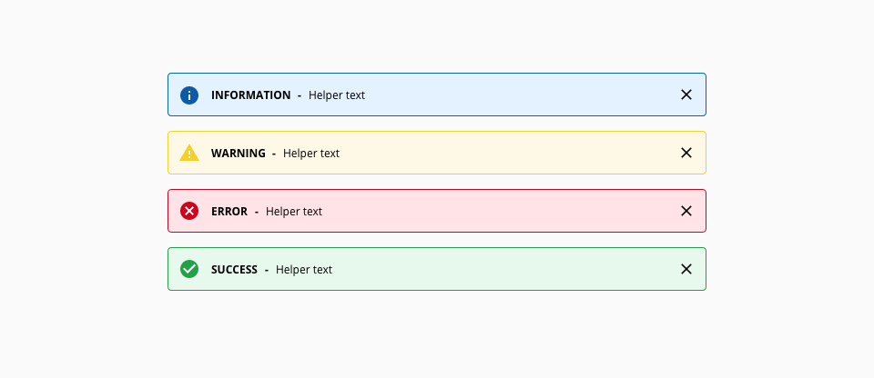
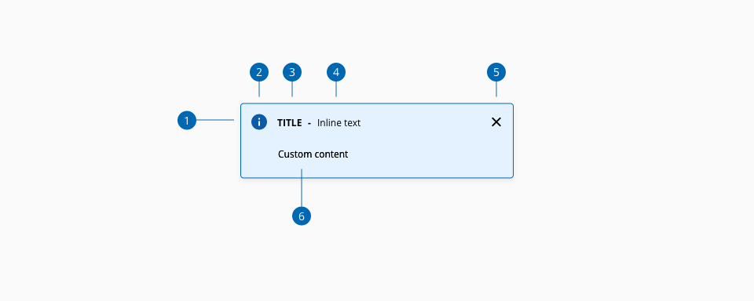

# Alert

Alert messages are meant to provide contextual feedback about important changes in the interface.

## Usage

- Incorporate messages into the application when necessary to keep users informed of important changes.
- Messages should use positive rhetoric. Avoid using negatives. (e.g. Use “City is required.” instead of “You didn’t enter a city.”)
- Always use active instead of passive voice.
- Be concise. Avoid words that plead, belittle or intimidate (i.e. please,wrong, or else)
- Non-entry of a non-required entry field should never generate an edit message or warning message, nor deny user forward movement.
- If possible, dialog messages must always display in full without any scroll bar.
- Dialog messages will retract only when the user closes the dialog or completes through interaction.

## Types

_Context-based alert types_

| Name            | Description |
| --------------- | :----------- |
| **Information**     | Informational messages are used exclusively to assist the user with directional or explanatory text about a complex or seldom used process |
| **Warning**         | Alert or warning messages should be displayed when there is a potential obstacle in completing a process as intended |
| **Error**          | Error messages convey a critical system problem that requires user and/or technical intervention to correct |
| **Success**         | Success messages should be used to assure user that a system calculation or data submission was completed correctly |

## Variants

| Name            | Description |
| --------------- | :----------- |
| **Inline**     | The notification appears in the up right corner of the screen staying visible for 10 seconds |
| **Modal**         | The notification appears centered in the screen using an overlay that obscures the content below |

## Anatomy

1. Icon
2. Label
3. Alert message
4. Close action (Optional)
5. Description (Optional)

## Content

Depending on the content that need to be displayed, more detailed descriptions can be added to the alert component as children.

## Design Specifications

### Color

|   Component token               |   Element                     |   Core token                  |   Value       |
| ------------------------------- | ----------------------------- | ----------------------------- | ------------- |
|   `infoIconColor`               |   Icon                        |   `blue-800`                  |   #0067b3     |
|   `successIconColor`            |   Icon                        |   `green-700`                 |   #24a148     |
|   `warningIconColor`            |   Icon                        |   `yellow-700`                |   #c59f07     |
|   `errorIconColor`              |   Icon                        |   `red-700`                   |   #d0011b     |
|   `infoBackgroundColor`         |   Container background        |   `blue-100`                  |   #e6f4ff     |
|   `successBackgroundColor`      |   Container background        |   `green-100`                 |   #eafaef     |
|   `warningBackgroundColor`      |   Container background        |   `yellow-100`                |   #fef9e6     |
|   `errorBackgroundColor`        |   Container background        |   `red-100`                   |   #ffe6e9     |
|   `infoBorderColor`             |   Container border            |   `blue-800`                  |   #0067b3     |
|   `successBorderColor`          |   Container border            |   `green-700`                 |   #24a148     |
|   `warningBorderColor`          |   Container border            |   `yellow-500`                |   #f7cf2b     |
|   `errorBorderColor`            |   Container border            |   `red-700`                   |   #d0011b     |
|   `titleFontColor`              |   Label                       |   `black`                     |   #000000     |
|   `contentFontColor`            |   Content                     |   `black`                     |   #000000     |
|   `focusColor`                  |   Action:focus                |   `blue-800`                  |   #0067b3     |
|   `overlayColor`                |   Overlay                     |   -                           |   #000000B3   |

### Width

The alert component has a property that is customizable depending on the context and the scenario where the component is used. This property defines the size of the alert and it can get multiple values according to the needs of the application.

Widths for alert component: **fill content**, **fit parent**, **small**, **medium** and **large**.

| Property         |  value            | 
| :---                |     :---             |   
| `small`          |  280px           |  
| `medium`     |  480px           | 
| `large`          |  820px           |  
| `fillParent`    |  -                   | 
| `fitContent`  |  -                   | 

### Typography

| Component token                             | Element                      | Core token             | Value                     |
| :------------------------------------------ | :--------------------------- | :--------------------- | :------------------------ |
| `titleFontFamily`                           | Label                        | `type-sans`            | 'Open Sans', sans-serif;  | 
| `titleFontSize`                             | Label                        | `type-scale_01`        | 12px                      | 
| `titleFontWeight`                           | Label                        | `type-bold`            | 600                       | 
| `contentFontFamily`                         | Content                      | `type-sans`            | 'Open Sans', sans-serif;  |
| `contentFontSize`                           | Content                      | `type-scale_01`        | 12px                      |
| `contentFontWeight`                         | Content                      | `type-regular`         | 400                       |

### Border

| Component token                             | Element                      | Core token             | Value   |
| :------------------------------------------ | :--------------------------- | :--------------------- | :------ |
| `borderRadius`                              | Container border             | `border-width_01`      | 1px     | 
| `borderThickness`                           | Container border             | `border-radius_02`     | 4px     |

### Spacing

| Component token                             | Element                      | Core token             | Value   |
| :------------------------------------------ | :--------------------------- | :--------------------- | :------ |
| `containerPaddingLeft`                      | Container                    | `spacing-04`           | 12px    | 
| `containerPaddingRight`                     | Container                    | `spacing-04`           | 12px    | 
| `titlePaddingRight`                         | Label                        | `spacing-03`           | 8px     |
| `inlineTextPaddingRight`                    | Message                      | `spacing-03`           | 8px     |
| `contentPaddingLeft`                        | Description                  | `spacing-09`           | 48px    |

### Iconography

| Component token                             | Element                      | Core token             | Value   |
| :------------------------------------------ | :--------------------------- | :--------------------- | :------ |
| `iconSize`                                  | Icon                         | `-`                    | 24x24px | 

## Accessibility

### WCAG

* Understanding WCAG 2.2 - [SC 4.1.3 Status Messages](https://www.w3.org/WAI/WCAG21/Understanding/status-messages.html)

### WAI-ARIA

* WAI-ARIA Authoring practices 1.2 - [3.2 Alert](https://www.w3.org/TR/wai-aria-practices-1.2/#alert) 
* WAI-ARIA Authoring practices 1.2 - [3.3 Alert and Message dialogs](https://www.w3.org/TR/wai-aria-practices-1.2/#alertdialog) 
* WAI-ARIA Authoring practices 1.2 - [Alert design pattern](https://www.w3.org/TR/wai-aria-practices/examples/alert/alert.html)
* WAI-ARIA Authoring practices 1.2 - [Alert Dialog design pattern](https://www.w3.org/TR/wai-aria-practices-1.2/examples/dialog-modal/alertdialog.html)

## Links and references

* [React component](https://developer.dxc.com/tools/react/next/#/components/alert)
* [Angular component](https://developer.dxc.com/tools/angular/next/#/components/alert)

____________________________________________________________

[Edit this page on Github](https://github.com/dxc-technology/halstack-style-guide/blob/master/guidelines/components/alert/README.md)
