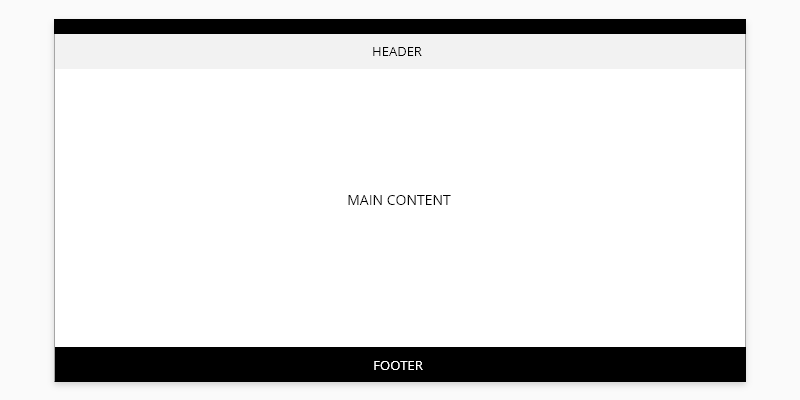
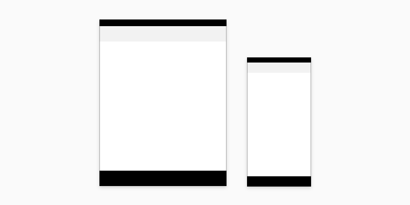
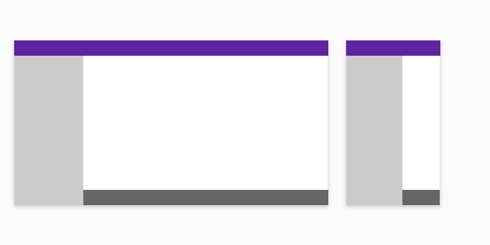
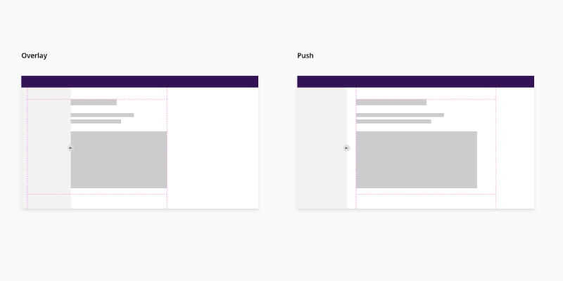

# Application Layout

Application layouts form the structure on which application components are built. Our layouts minimize complexity and focus on facilitating a consistent visual flow across all applications. They are made up of four elements: the header, the main content, footer and side navigation.

## Usage

Application layouts are used to place content across the screen for different applications.

### Layout

_main elements for the web application layout_

_main elements for the tablet and mobile application layout_

### Layout with side navigation

The side navigation functions as an optional fourth element to display additional links or information apart from the links that are displayed as part of the header or footer

## Specifications

### Application Layout Anatomy

1. Header
2. Main content
3. Footer
4. Side Navigation (sidenav)

### Behavior and Interaction

Overlay and push interactions by the sidenav component can alter the way the layout is displayed. For overlay, the sidenav simply slides over the content with no changes to position. The push interaction moves all components to the side depending on the width of the sidenav. 

_Overlay and push sidenav layout interactions_

## Accessibility

### WAI-ARIA 1.2

* WAI-ARIA Clear Layout and Design [Clear Layout and Design](https://www.w3.org/WAI/perspective-videos/layout/)

## Links

Refer to the following links for more detailed information about each of the layout elements:

* [Header Component](url)
* [Footer Component](url)
* [Sidenav Component](url)

____________________________________________________________

[Edit this page on Github](https://github.com/dxc-technology/halstack-style-guide/blob/master/guidelines/principles/layout/README.md)

