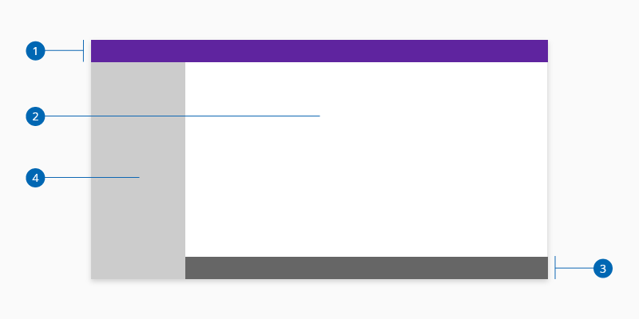

# Application layout

The application layout provides a base UI wrapper for any application built with Halstack. 

## Usage

When using the application layout component consider the following:

* Use the sidenav when the application navigation has an horizontal hierarchy
* Header and footer elements should be always present
* Only use the mode overlay if the content cannot dynamically adapt to the available space 

## Sidenav: overlay and push

Overlay and push interactions by the sidenav component can alter the way the layout is displayed. For overlay, the sidenav simply slides over the content with no changes to position. The push interaction moves the main container to the side depending on the width of the sidenav. 

_Overlay and push sidenav layout interactions_

### Mobile behavior

The default behavior for mobile device is overlay since the available space doesn't allow to push the main content.

_Desktop (push) vs mobile behavior (overlay)_

## Anatomy

1. Header
2. Main content
3. Footer
4. Side Navigation (sidenav)

## Specifications

The specifications of each of the compound component children are defined separately:

* [Header]()
* [Footer]()
* [Sidenav]()

## Accessibility

### WAI-ARIA 1.2

* WAI-ARIA Clear Layout and Design [Clear Layout and Design](https://www.w3.org/WAI/perspective-videos/layout/)

## Links

* [Adobe XD link]()

____________________________________________________________

[Edit this page on Github](https://github.com/dxc-technology/halstack-style-guide/blob/master/guidelines/principles/layout/README.md)

