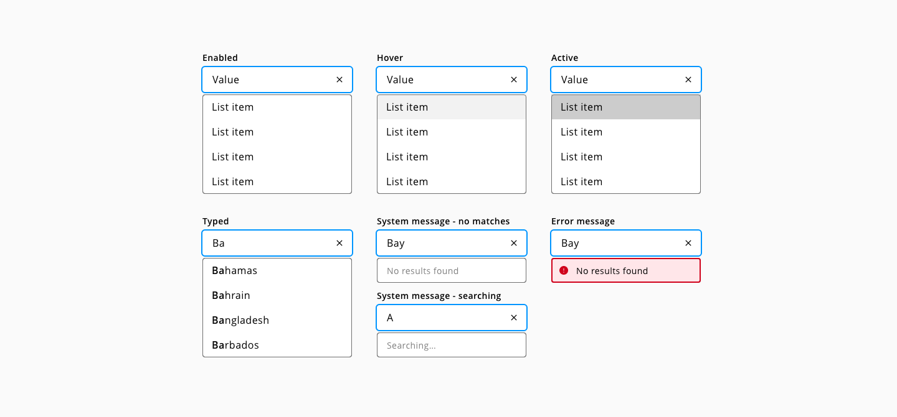

## Autosuggest

_Autosuggest functionality for the text input component_

### Specs

#### Color

| Component token                     | Element                | Token                   | Value           |
| :---------------------------------- | :--------------------- | :---------------------- | :-------------- |
| `listOptionFontColor`               | List option text       | `color-black`           | #000000         |
| `systemMessageFontColor`            | System message         | `color-grey-700`        | #666666         |
| `errorMessageBorderColor`           | Error system message   | `color-red-700`         | #d0011b         |
| `errorMessageBackgroundColor`       | Error system message   | `color-red-100`         | #ffe6e9         |
| `hoverListOptionBackgroundColor`    | List option:hover      | `color-grey-100`        | #f2f2f2         |
| `activeListOptionBackgroundColor`   | List option:active     | `color-grey-300`        | #cccccc         |

#### Typography

| Component token           | Element              | Token                   | Value             |
| :------------------------ | :------------------- | :---------------------- | :---------------- |
| `listOptionFontSize`      | List option          | `font-scale-03`         | 1rem / 16px       |
| `listOptionFontWeight`    | List option          | `font-weight-regular`   | 400               |
| `listOptionFontStyle`     | List option          | `font-style-normal`     | normal            |

| Property        | Element              | Token                   | Value           |
| :-------------- | :------------------- | :---------------------- | :-------------- |
| `font-family`   | List option          | `font-family-sans`      | Open Sans       |
| `font-weight`   | List option typed    | `font-bold`             | 600             |
| `font-family`   | System message       | `font-family-sans`      | Open Sans       |
| `font-size`     | System message       | `font-scale-02`         | 0.875 / 14px    |
| `font-weight`   | System message       | `font-regular`          | 400             |
| `font-family`   | Error message        | `font-family-sans`      | Open Sans       |
| `font-size`     | Error message        | `font-scale-02`         | 0.875 / 14px    |
| `font-weight`   | Error message        | `font-regular`          | 400             |

## Links and references

* [React component](https://developer.dxc.com/tools/react/next/#/components/autosuggest)
* [Angular component](https://developer.dxc.com/tools/angular/next/#/components/autosuggest)
* [Adobe XD component](https://xd.adobe.com/view/a8c4a40a-e4ef-4161-8917-8172a165d626-fd97/)

____________________________________________________________

[Edit this page on Github](https://github.com/dxc-technology/halstack-style-guide/blob/master/guidelines/components/autosuggest/README.md)