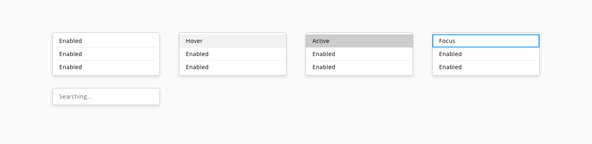
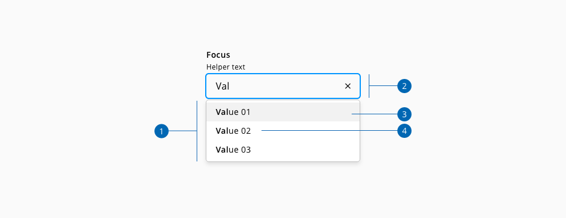
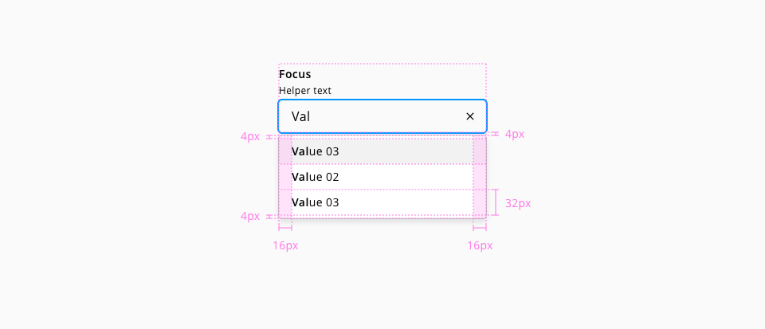

## Autosuggest

Suggests a list of options to fill a text input. A user can either select a suggestion or enter their own answer.

## Usage

* Use the autosuggest component to help users select from a list of standard responses when needed
* If the value for the textbox must be chosen from a predefined set of allowed values, use the [select](https://developer.dxc.com/design/guidelines/components/select) component instead
* Keep Suggestions simple and avoid scroll

## States

List option states: **enabled**, **hover**, **active** and **system**.

_List option states examples_

## Anatomy

1. List dialog
2. Text input
3. List option
4. List option value

## Specs

_Component specifications_

The specifications for the autosuggest input can be found in the [input text specs](https://developer.dxc.com/design/guidelines/components/input-text)
### Color

| Component token                     | Element                | Token                   | Value             |
| :---------------------------------- | :--------------------- | :---------------------- | :---------------- |
| `listOptionFontColor`               | List option value      | `color-black`           | #000000           |
| `listOptionBorderColor`             | List option divider    | `color-grey-200`        | #e6e6e6           |
| `listDialogBorderColor`             | List dialog            | `color-grey-400`        | #bfbfbf           |
| `listOptionBackgroundColor`         | List dialog            | `color-white`           | #ffffff           |
| `hoverListOptionBackgroundColor`    | List option:hover      | `color-grey-100`        | #f2f2f2           |
| `activeListOptionBackgroundColor`   | List option:active     | `color-grey-300`        | #cccccc           |
| `systemMessageFontColor`            | System message         | `color-grey-700`        | #666666           |

### Typography

| Component token                     | Element                | Token                   | Value             |
| :---------------------------------- | :--------------------- | :---------------------- | :---------------- |
| `listOptionFontSize`                | List option            | `font-scale-02`         | 0.875rem / 14px   |
| `listOptionFontWeight`              | List option            | `font-weight-regular`   | 400               |
| `listOptionFontStyle`               | List option            | `font-style-normal`     | normal            |

| Property                            | Element                | Token                   | Value             |
| :---------------------------------- | :--------------------- | :---------------------- | :---------------- |
| `font-family`                       | List option            | `font-family-sans`      | Open Sans         |
| `font-weight`                       | List option typed      | `font-bold`             | 600               |
| `font-family`                       | System message         | `font-family-sans`      | Open Sans         |
| `font-size`                         | System message         | `font-scale-02`         | 0.875 / 14px      |
| `font-weight`                       | System message         | `font-regular`          | 400               |

### Border

| Property                            | Element               | Token                   | Value             |
| :---------------------------------- | :-------------------- | :---------------------- | :---------------- |
| `border-width`                      | List dialog           | `border-width-1`        | 1px               |
| `border-radius`                     | List dialog           | `border-radius-medium`  | 0.25rem / 4px     |
| `border-style`                      | List dialog           | `border-style-solid`    | Solid             |
| `border-width`                      | List option divider   | `border-width-1`        | 1px               |
| `border-style`                      | List option divider   | `border-style-solid`    | Solid             |
### Spacing

| Property                            | Element               | Token                   | Value             |
| :---------------------------------- | :-------------------- | :---------------------- | :---------------- |
| `padding-top`                       |  List dialog          | `spacing-02`            | 0.25rem / 4px     |
| `padding-bottom`                    |  List dialog          | `spacing-02`            | 0.25rem / 4px     |
| `padding-left`                      |  List item            | `spacing-03`            | 0.5rem / 8px      |
| `padding-right`                     |  List item            | `spacing-03`            | 0.5rem / 8px      |
| `padding-top`                       |  List item            | `spacing-01`            | 0.125rem / 2px    |
| `padding-bottom`                    |  List item            | `spacing-01`            | 0.125rem / 2px    |
| `padding-left`                      |  List item value      | `spacing-03`            | 0.5rem / 8px      |
| `padding-right`                     |  List item value      | `spacing-03`            | 0.5rem / 8px      |

## Links and references

* [React component](https://developer.dxc.com/tools/react/next/#/components/autosuggest)
* [Angular component](https://developer.dxc.com/tools/angular/next/#/components/autosuggest)
* [Adobe XD component](https://xd.adobe.com/view/686bad80-5f5f-47d9-a7e4-9d36ed0cc216-3d38/)

____________________________________________________________

[Edit this page on Github](https://github.com/dxc-technology/halstack-style-guide/blob/master/guidelines/components/autosuggest/README.md)