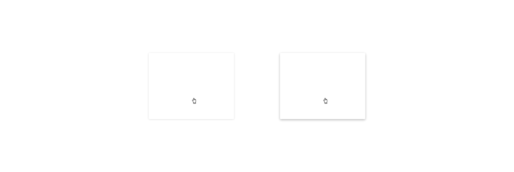

# Box




There are different ways to organise the content on the webpage to facilitate the user according to his nature of interaction with the content like forms, tables, lists etc. One of the best ways to organize the webpage is by using groups of related content, this can be achieved by using a dedicated Box component.

### Variants

| Name          | Description
| :------------ | :------------------------------------------------------------------------------------------------------------ |
| **Bordered**  | Use this variant to encapsulate other elements and build clear distinctions between areas in the page layout  |
| **Raised**    | Use this variant for dialogs (e.g. select or dropdown dialog) and clickable containers                        |

## Design specifications

### Border

| Property                        | Element                      | Core token             | Value                     |
| :------------------------------ | :--------------------------- | :--------------------- | :------------------------ | 
| `border-width`                  | Container border             | `border-width-0`       | 0                         |
| `border-radius`                 | Container border             | `border-radius-medium` | 0.25rem / 4px             | 

### Width

In the cases of `fillParent` and `fillContent` the box is going to behave as a fluid container occupying the space the parent leaves for its children or adapting its size to the children it the box has. Instead of using a fluid approach, you can set a fixed size, choosing between `small`, `medium` and `large` properties.

| Property | Value    |
| --       | --       |
| `small`  | 48px     |
| `medium` | 240px    |
| `large`  | 480px    |
| `fillParent`  |  -  |
| `fillContent` |  -  |

### Margin

margin | value
-- | --
```xxsmall``` | 6px
```xsmall``` | 16px
```small``` | 24px
```medium``` | 36px
```large``` | 48px
```xlarge``` | 64px
```xxlarge``` | 100px

And also apply different values to each side of the component:
```top``` ```bottom``` ```left``` ```right```

### Padding

padding | value
-- | --
```xxsmall``` | 6px
```xsmall``` | 16px
```small``` | 24px
```medium``` | 36px
```large``` | 48px
```xlarge``` | 64px
```xxlarge``` | 100px

And also apply different values to each side of the component:
```top``` ```bottom``` ```left``` ```right```

## Content

Any type of content can be place inside the box component.


## User interface considerations


* Organize the group layout with the information presented clearly by applying the styles in the box container.
* Box can be reused accros the UI, avoid using different shadow depths in the same page.
* Use always a minimun padding and always leave enough margin when stacking boxes so the shadows don't ovelap.

____________________________________________________________

[Edit this page on Github](https://github.com/dxc-technology/halstack-style-guide/blob/master/guidelines/components/box/README.md)
