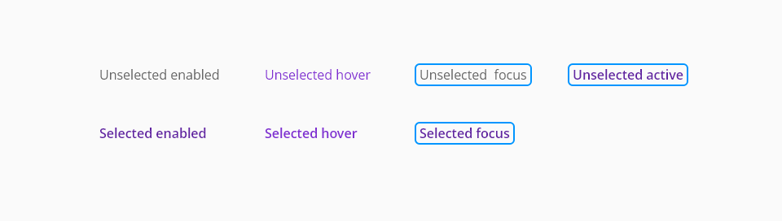
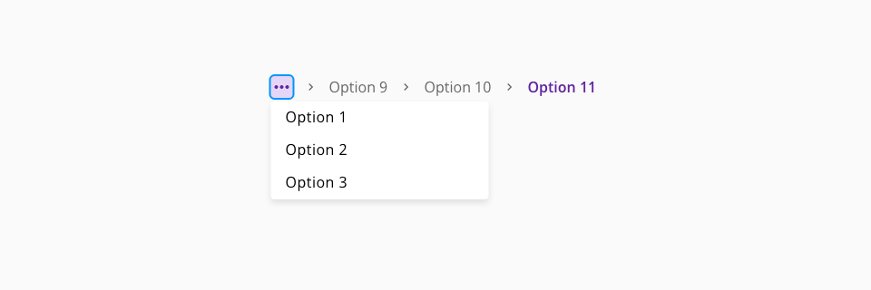

# Bread crumbs

The breadcrumbs component helps users to understand where they are within a website’s structure and move between levels.

In simple terms, a breadcrumb is a footprint that helps a visitor navigate a website in an organized way.

In technical terms, a breadcrumb is a navigational element used to indicate the current page the user is relative to the page's hierarchy.

Breadcrumbs never cause problems in user testing; people might overlook this small design element, but they never misinterpret breadcrumb trails or have trouble operating them.

## Usage

- Use the breadcrumbs component when you need to help users understand and move between the multiple levels of a website.
- Only use breadcrumb navigation if it makes sense for your site's structure.
- Don't make your breadcrumb navigation too large.
- Include the full navigational path in your breadcrumb navigation.
- Progress from highest level to lowest.
- Keep your breadcrumb titles consistent with your page titles.
- Get creative with design.
- Keep it clean and uncluttered.
- Consider which type of breadcrumb navigation makes the most sense for your site.
- Know your audience.

## States
### to be done
The states are the different behaviors of the button component based on the interaction of the user.
For the desktop version, we contemplate three different states by which can pass.

Define the different states for the component if there are any.

States: **State 1**, **state 2**

_Breadcrumbs component states_

_Breadcrumbs component breadcrumbs_states_dropdown_

_Example of the breadcrumbs component breadcrumbs_expanded_

## Anatomy
### Placement
Breadcrumbs are placed in the top left portion of the page. They sit underneath the header and navigation, but above the page title.

_Example of the breadcrumbs component anatomy_

1. Element 1
2. Element 2

## Types of Breadcrumbs
There are two types of breadcrumbs. Both types are styled the same, but the methods for populating the breadcrumb trail are different. The breadcrumb type used should be consistent across a product.

| type            | Purpose     |
| ------------------  | --------- |
| `Location-based`     |       These illustrate the site’s hierarchy and show the user where they are within that hierarchy. |
| `Path-based`     |       These show the actual steps the user took to get to the current page, rather than reflecting the site’s information architecture. Path-based breadcrumbs are always dynamically generated. |

### Location Based

Location-based breadcrumbs are a representation of a site’s structure. They help visitors understand and navigate your site’s hierarchy, which has multiple levels (usually more than two levels). This type of breadcrumb is very supportive for visitors who enters the site on a deeper level from an external source (e.g. search engine results).

### Path Based

Path-based breadcrumbs (also known as a “history trail”) show the entire path travelled by the user to reach on a particular page. This type of breadcrumb link is typically dynamically generated. Sometimes path-based breadcrumbs can be helpful, but the most time they’re puzzling — visitors often browse very wildly, jumping from one page to the other. Having such a meandering path doesn’t offer much help for user and can be easily replaced by a “Back” button in the browser. Finally, a history trail is useless for visitors who arrive directly at a page deep within the site.

### Attribute Based

Attribute-based breadcrumb lists the categories to the specific page or most often product — as this kind of breadcrumb type are useful for e-commerce sites. This type of breadcrumbs helps the visitors to understand the relationship of products and offers a different approach

## Design specifications

The design specifications section provides developers the information needed to apply the correct visual properties of the component.

_Design specifications for Breadcrumbs component_

### Color

### Typography

| Property            | Value     |
| ------------------  | --------- |
| `font-size`     |       1rem/16px |
| `font-weight`     |       400 |
| `line-height`     |       1.5em |

### Padding

| Property            | Value     |
| ------------------  | --------- |
| `padding-right`     |      24px |
| `padding-left`      |      24px |

### Border

| Property            | Value     |
| ------------------  | --------- |
| `border-radius`     |       4px |
| `border-width`      |       1px |
| `border-width` focus outline      |       2px |

### Spacing

## Accesibility

Add WCAG success criterion and WAI-ARIA design pattern and example when available

### WCAG 

* Understanding WCAG 2.2 - [SC x.x name of the succes criterion](url)

### WAI-ARIA

* WAI-ARIA Authoring practices 1.2 - [x.x title of the section](url)
* WAI-ARIA Authoring practices 1.2 - ["Name" design pattern](url)

## Best Practices

Breadcrumbs as an additional navigation
Don’t link current page in breadcrumb navigation
Use separators
Select size & padding
Don’t make it the focal point of the design
Breadcrumbs should display the current location in the site’s hierarchical structure, not the session history

## Links and references

* [Angular CDK component](url)
* [React CDK component](url)

____________________________________________________________

* [Edit this page on GitHub](url)

