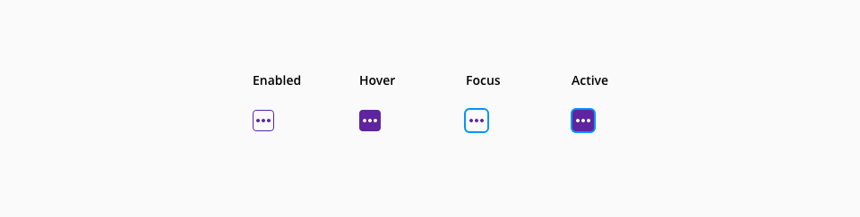
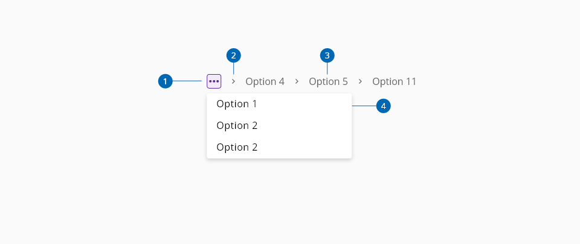
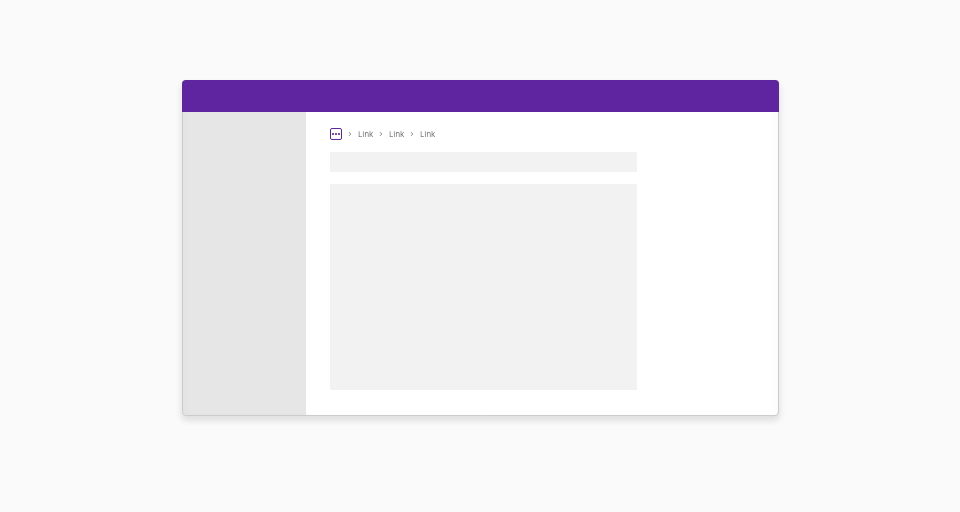
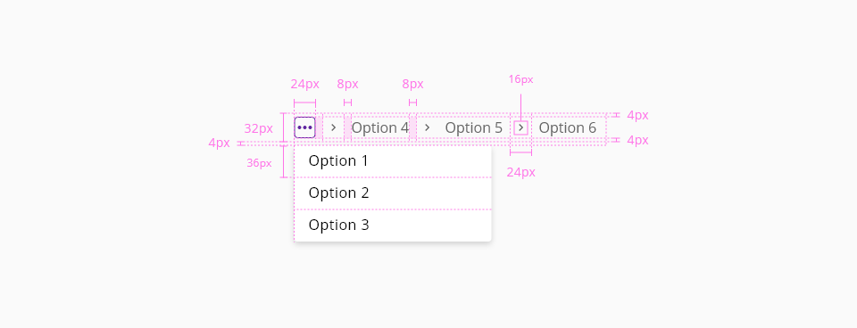

# Breadcrumbs

The breadcrumbs component is a navigational element that help users to understand where they are within a website’s structure and move between levels. The component is location based, illustrates the hierarchy of the page.

## Usage

- Use the breadcrumbs component when you need to help users understand and move between the multiple levels of a website.
- Only use breadcrumb navigation when your site page depth is bigger than 3. 
- Include the full navigational path in your breadcrumb navigation. It should be clean and uncluttered in application hierarchy.
- Progress from highest level to lowest.
- Keep your breadcrumb titles consistent with your page titles.

## States

The states are the different behaviors of the button component based on the interaction of the user.
Different states for the component are below

### Breadcrumb path link

_Breadcrumbs path link element states_

### Breadcrumbs dropdown

_Breadcrumbs dropdown item_states_

## Anatomy

1. Breadcrumbs dropdown
2. Separator
3. Breadcrumbs path
4. Breadcrumbs expanded list

## Placement

Breadcrumbs are placed in the top left portion of the page. They sit underneath the header and navigation, but above the page title.

## Design specifications

_Design specifications for Breadcrumbs component_

### Color
 
#### Base

| Component token                     | Element                     | Token                       | Value       |
| :---------------------------------- | :-------------------------- | :-------------------------- | :---------- |
| `FontColor`                         | Path link                   | `color-grey-700`            | #666666     | 

 #### Interactive

| Component token                      | Element                     | Token                       | Value       |
| :----------------------------------- | :-------------------------- | :-------------------------- | :---------- |
| `unselectedFontColor`                | Path link                   | `color-grey-700`            | #666666     | 
| `unselectedHoverFontColor`           | Path link:hover             | `color-purple-600`          | #7d2fd0     | 
| `unselectedActiveFontColor`          | Path link:active            | `color-purple-700`          | #5f249f     | 
| `selectedFontColor`                  | Path link                   | `color-purple-700`          | #5f249f     | 
| `selectedHoverFontColor`             | Path link:hover             | `color-purple-600`          | #7d2fd0     |  
| `focusColor`                         | Path link:focus             | `color-blue-600`            | #0095ff     | 

<!--
#### On Dark
##### Base

| Component token                     | Element                     | Token                       | Value       |
| :---------------------------------- | :-------------------------- | :-------------------------- | :---------- |
| `fontColorOnDark`                   | Path link                   | `color-white`               | #ffffff     | 

 ##### Interactive for Text

| Component token                      | Element                     | Token                       | Value       |
| :----------------------------------- | :-------------------------- | :-------------------------- | :---------- |
| `unselectedFontColorOnDark`          | Path link                   | `color-white`               | #ffffff     | 
| `unselectedHoverFontColorOnDark`     | Path link:hover             | `color-purple-300`          | #cbacec     | 
| `unselectedActiveFontColorOnDark`    | Path link:active            | `color-purple-500`          | #a46ede     | 
| `selectedFontColorOnDark`            | Path link                   | `color-purple-500`          | #a46ede     | 
| `selectedHoverFontColorOnDark`       | Path link:hover             | `color-purple-300`          | #cbacec     |   
| `focusColorOnDark`                   | Path link:focus             | `color-blue-600`            | #0095ff     | 

-->

##### Interactive for Dropdown

| Component token                      | Element                     | Token                       | Value       |
| :----------------------------------- | :-------------------------- | :-------------------------- | :---------- |
| `EnabledDropDown`                    | Path link                   |  `color-white`              | #ffffff     | 
| `HoverdDropDown`                     | Path link                   |  `color-purple-100`         | #f2eafa     | 
| `ActiveDropDown`                     | Path link                   |  `color-purple-500`         | #a46ede     |
| `focusColor`                         | Path link:focus             |  `color-blue-600`           | #0095ff     | 

### Typography

| Component token                      | Element                     | Token                       | Value       |
| :----------------------------------- | :-------------------------- | :-------------------------- | :---------------------- |
| `FontFamily`                         | Path link                   | `font-family-sans`          | 'Open Sans', sans-serif | 
| `FontSize`                           | Path link                   | `font-scale-03`             | 1rem / 16px             | 
| `FontWeight`                         | Path link                   | `font-weight-regular`       | 400                     |  
| `unselectedActiveFontWeight`         | Path link:active            | `font-weight-semibold`      | 600                     | 
| `selectedFontWeight`                 | Path link selected          | `font-weight-semibold`      | 600                     | 
| `LineHeight`                         | Path link                   | `font-leading-normal`       | 1.5rem                  | 

### Spacing

| Property                          | Element             | Core token      | Value                     |
| :-------------------------------- | :------------------ | :-------------- | :------------------------ |
| `margin-left`                     | Separator           | `spacing-03`    | 0.5rem / 8px              |
| `margin-left`                     | Path link           | `spacing-03`    | 0.5rem / 8px              |

### Border

| Component token    | Element            | Core token          | Value     |
| :----------------- | :----------------- | :------------------ | --------- |
| `border-width`     | Focus indicator    | `border-width-2`    | 2px       |

## Accesibility

### WCAG 

* Understanding WCAG 2.2 - [SC 2.4.4 Link Purpose (In Context)](https://www.w3.org/WAI/WCAG22/Understanding/link-purpose-in-context)
* Understanding WCAG 2.2 - [SC 2.4.8 Location](https://www.w3.org/WAI/WCAG22/Understanding/location.html)
* Understanding WCAG 2.2 - [SC 3.2.3 Consistent Navigation](https://www.w3.org/WAI/WCAG22/Understanding/consistent-navigation)

### WAI-ARIA

* WAI-ARIA Authoring practices 1.2 - [Breadcrumb design pattern](https://www.w3.org/TR/wai-aria-practices-1.2/#breadcrumb)
* WAI-ARIA Authoring practices 1.2 - [Breadcrumb Example](https://www.w3.org/TR/wai-aria-practices-1.2/examples/breadcrumb/index.html)

## Links and references

* [Angular CDK component](url)
* [React CDK component](url)

____________________________________________________________

* [Edit this page on GitHub](url)

