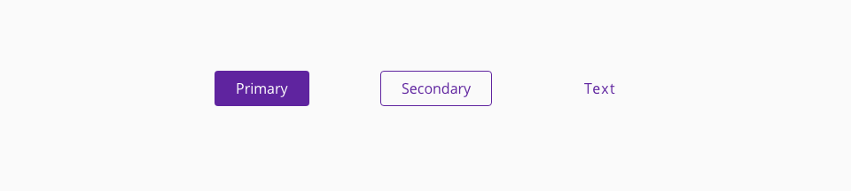
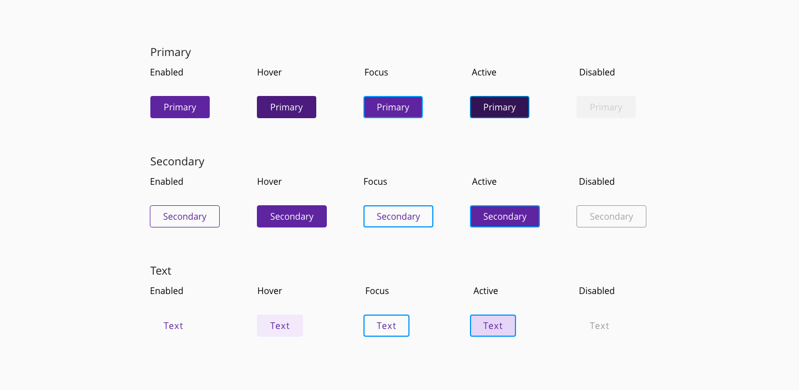
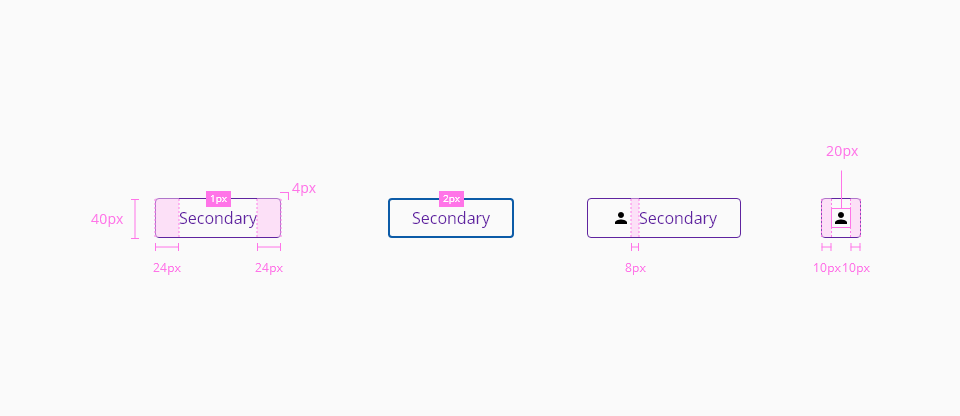
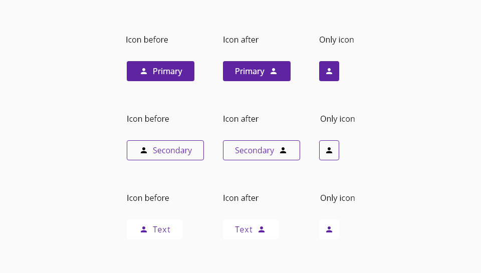

# Button

Buttons are basic interface elements that initialize an action or function when the user interacts with them. The appearance of the button should suggest the user takes an action that leads to different scenarios.

These elements that reinforce to the user the necessity to interact are called CTA (Call to Action) components, which basically are designed to capture user attention and improve the user experience within the application.


## Usage


- In instances where buttons are vertically stacked, buttons should be the same length.
- Horizontally displayed buttons are dependent on the amount of text, so button lengths may vary, always considering the minimum and maximum established sizes.
- Text or icon on a button should always be centered.
- There must be 8 pixels of space between horizontally displayed buttons.

## Variants

We can identify three different variants that imply some visual changes according to color and border attributes.

Variants: **primary**, **secondary** and **text**.


_Example of the button component variants_

## States

The states are the different behaviors of the button component based on the interaction of the user.
For the desktop version, we contemplate five different states by which can pass.

States: **enabled**, **hover**, **focus**, **active** and **disabled**.


_Button component states_

## Design Specifications



_Design specifications for button component_

### General


### Size

The component `width` can adopt the following values:

width | value
-- | --
```small``` | 60px
```medium``` | 240px
```large``` | 480px
```fillParent``` | -
```fitContent``` | -

The component `height` is fixed:

height | value
-- | --
| `min-height`        |      40px |

### Margin

Button `margin` can use the values:

margin | value
-- | --
```xxsmall``` | 6px
```xsmall``` | 16px
```small``` | 24px
```medium``` | 36px
```large``` | 48px
```xlarge``` | 64px
```xxlarge``` | 100px

These values can be applied independently to each side of the component:
```top``` ```bottom``` ```left``` ```right```

#### Typography 

| Component token            | Property          | Core token  | Value     |
| :------------------------- | ---------------- | ----------- | --------- |
| `labelFontLineHeight`         | line-height        | `type_leading_normal`   | 1.5 em    |
| `labelLetterSpacing`         | letter-spacing        | `type_spacing_wide_01`   | 0.025 em   |


 ### Primary
 
 #### Color
 
 ##### Base

| Component token                     | Element                     | Token              | Value       |
| :---------------------------------- | :-------------------------- | :----------------- | :---------- |
| `primaryBackgroundColor`            | Button container            | `purple-700`       | #5f249f     |
| `primaryFontColor`                  | Label                       | `white`            | #ffffff     | 

 ##### Interactive

| Component token                     | Element                     | Token              | Value       |
| :---------------------------------- | :-------------------------- | :----------------- | :---------- |
| `primaryHoverBackgroundColor`       | Container fill:hover	    | `purple-800`       | #4b1c7d     |
| `primaryActiveBackgroundColor`      | Container fill:active	    | `purple-900`       | #321353     |
| `primaryDisabledBackgroundColor`    | Container fill:disabled     | `grey-100`         | #f2f2f2     |
| `primaryHoverFontColor`             | Label:hover                 | `white`            | #ffffff     |
| `primaryActiveFontColor`            | Label:active                | `white`            | #ffffff     |
| `primaryDisabledFontColor`          | Label:disabled              | `grey-500`         | #999999     |

#### Border

| Component token   | Element          | Core token  | Value     |
| ----------------- | ---------------- | ----------- | --------- |
| `primaryBorderThickness`         | Container       | -   | 0px    |
| `primaryBorderStyle`         | Container        | -   | none   |
| `primaryBorderRadius`         | Container        | -   | 4px   |


#### Typography

| Component token   | Element          | Core token  | Value     |
| ----------------- | ---------------- | ----------- | --------- |
| `primaryFontFamily`         | Label        | `type-sans`   | 'Open Sans', sans-serif    |
| `primaryBorderStyle`         | Label        | `type_scale_03`   | 16px / 1 rem   |
| `primaryBorderRadius`         | Label        | `type_regular`   | 400   |


#### Padding

| Component token   | Element          | Core token  | Value     |
| ----------------- | ---------------- | ----------- | --------- |
| `primaryPaddingTop`         | Label        | `spacing-04`   | 12px / 0.75 rem    |
| `primaryPaddingBottom`         | Label        | `spacing-04`   | 12px / 0.75 rem   |

### Secondary

#### Color

##### Base

| Component token                     | Element                     | Token              | Value       |
| :---------------------------------- | :-------------------------- | :----------------- | :---------- |
| `secondaryBackgroundColor`          | Container fill              | `transparent`      | transparent |
| `secondaryFontColor`                | Label                       | `purple-700`       | #5f249f     |
| `secondaryBorderColor`              | Container border            | `purple-700`       | #5f249f     |

##### Interactive
| Component token                     | Element                     | Token              | Value       |
| :---------------------------------- | :-------------------------- | :----------------- | :---------- |
| `secondaryHoverBackgroundColor`     | Container fill:hover        | `purple-100`       | #f2eafa     |
| `secondaryActiveBackgroundColor`    | Container fill:active       | `purple-200`       | #e5d5f6     |
| `secondaryDisabledBackgroundColor`  | Container fill:disabled     | `grey-100`	     | #f2f2f2     |
| `secondaryHoverFontColor`           | Label:hover                 | `purple-700`       | #5f249f     |
| `secondaryActiveFontColor`          | Label:active                | `purple-700`       | #5f249f     |
| `secondaryDisabledFontColor`        | Label:disabled              | `grey-500`         | #999999     |
| `secondaryDisabledBorderColor`	  |  Container border:disabled  | `grey-500`         | #999999     |

#### Border

| Component token   | Element          | Core token  | Value     |
| ----------------- | ---------------- | ----------- | --------- |
| `secondaryBorderThickness`         | Container        | -   | 1px    |
| `secondaryBorderStyle`         | Container        | -   | solid   |
| `secondaryBorderRadius`         | Container        | -   | 4px   |


#### Typography

| Component token   | Element          | Core token  | Value     |
| ----------------- | ---------------- | ----------- | --------- |
| `secondaryFontFamily`         | Label        | `type-sans`   | 'Open Sans', sans-serif    |
| `secondaryFontSize`         | Label        | `type_scale_03`   | 16px / 1 rem   |
| `secondaryFontWeight`         | Label        | `type_regular`   | 400   |


#### Padding

| Component token   | Element          | Core token  | Value     |
| ----------------- | ---------------- | ----------- | --------- |
| `secondaryPaddingTop`         | Label        | `-`   | 10px / 0.75 rem    |
| `secondaryPaddingBottom`         | Label        | `-`   | 10px / 0.75 rem   |


### Text

#### Color

##### Base

| Component token                     | Element                     | Token              | Value       |
| :---------------------------------- | :-------------------------- | :----------------- | :---------- |
| `textBackgroundColor`               | Container fill              | `transparent`      | transparent |
| `textFontColor`                     | Label                       | `purple-700`       | #5f249f     |

###### Interactive

| Component token                     | Element                     | Token              | Value       |
| :---------------------------------- | :-------------------------- | :----------------- | :---------- |
| `textHoverBackgroundColor`          | Container fill:hover        | `purple-100`       | #f2eafa     | 
| `textActiveBackgroundColor`         | Container fill:active       | `purple-200`       | #e5d5f6     | 
| `textDisabledBackgroundColor`       | Container fill:disabled     | `grey-100`         | #f2f2f2     | 
| `textHoverFontColor`                | Label:hover                 | `purple-700`       | #5f249f     |
| `textActiveFontColor`               | Label:active                | `purple-700`       | #5f249f     | 
| `textDisabledFontColor`             | Label:disabled              | `grey-500`         | #999999     | 


#### Border

| Component token   | Element          | Core token  | Value     |
| ----------------- | ---------------- | ----------- | --------- |
| `textBorderThickness`         | Container        | -   | 0px    |
| `textBorderStyle`         | Container        | -   | none   |
| `textBorderRadius`         | Container        | -   | 4px   |


#### Typography

| Component token   | Element          | Core token  | Value     |
| ----------------- | ---------------- | ----------- | --------- |
| `textFontFamily`         | Label        | `type-sans`   | 'Open Sans', sans-serif    |
| `textFontSize`         | Label        | `type_scale_03`   | 16px / 1 rem   |
| `textFontWeight`         | Label        | `type_regular`   | 400   |


#### Padding

| Component token   | Element          | Core token  | Value     |
| ----------------- | ---------------- | ----------- | --------- |
| `textPaddingTop`         | Label        | `spacing-04`   | 12px / 0.75 rem    |
| `textPaddingBottom`         | Label        | `spacing-04`   | 12px / 0.75 rem   |


## Icon Usage

Any icon can be used in Halstack Design System, so it is apt to the user to choose between one of the multiple options that are offered through internet but it is recommended to use the same library of icons along the application to keeping concistency.

* Icon can go before or after the text with a separation of 8 pixels respecting the main button's text. 
* Do not use icons mainly for visual interest, the glyph must add information and clarification to the action that would be performed in the context of the button.
* A button with an icon and no text is also allowed in the design system.



_Icon usage examples_

## Links and references

* [Angular CDK component](https://clicktime.symantec.com/3KG6rdmTz1vDaXhBTFLnHVX7Vc?u=https%3A%2F%2Fdeveloper.dxc.com%2Ftools%2Fangular%2Fnext%2F%23%2Fcomponents%2Fbutton)
* [React CDK component](https://clicktime.symantec.com/38Ybc495gf78pcUbWtvBoxs7Vc?u=https%3A%2F%2Fdeveloper.dxc.com%2Ftools%2Freact%2Fnext%2F%23%2Fcomponents%2Fbutton)

____________________________________________________________

[Edit this page on Github](https://github.com/dxc-technology/halstack-style-guide/blob/master/guidelines/components/button/README.md)
