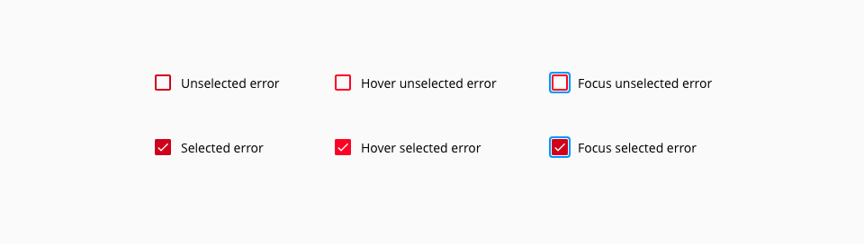
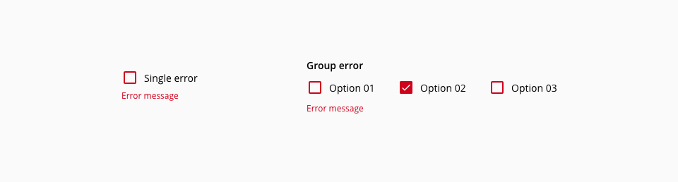
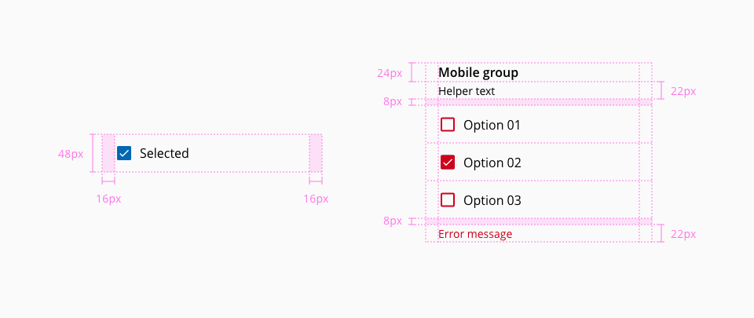

# Checkbox

Checkboxes are inputs that offer to the user the possibility to select one or multiple options from a range of attributes.

## Usage

* Use to select more than one option from a list
* Use to toggle a single option on or off
* Don't use checkboxes when only one item can be selected, use a readio button instead

## States

The checkbox component has the following states: **Unselected**, **hover unselected**, **focus unselected**, **disabled unselected**, **selected**, **hover selected**, **focus selected** and **disabled selected**.


_Example of the component states_

### Error states

There are use cases where is necessary to display an error. The component provides feedback trough the following states:  **Unselected error**, **hover unselected error**, **focus unselected error**, **selected error**, **hover selected error** and **focus selected error**.



_Checkbox error states_

## Anatomy


1. Group label _(Optional)_
2. Helper text _(Optional)_
3. Checkbox input
4. Checkbox label
5. Error message

## Stacking

Checkbox options may be either vertically or horizontally stacked.


_Checkbox group stacking types_

| Type              | Usage                                                                                                                                      |
| :---------------- | :----------------------------------------------------------------------------------------------------------------------------------------- |
| **Vertical**      | Related checkboxes that belong to the same category. The horizontal spacing between horizontally stacked checkboxes should be 8px.         |
| **Horizontal**    | Checkboxes are independent of a category*. The vertical spacing between stacked checkboxes should be 32px. Don't stack more than 3 options |

*Unless there is a specific use case that require horizontal stacking, use always the vertical type. Horizontal stacking deteriorate legibility, add complexity when handling responsive behaviors and the labeling position can be mistaken.

## Error handling



_Checkbox single and group error examples_

Depending if the checkbox component is isolated or part of a group, there are two ways to display the error message.

| Type              | Usage                                                          |
| :---------------- | :------------------------------------------------------------- |
| **Single**        | The error message is displayed just after the checkbox input.  |
| **Group**         | Error messages should be displayed at the en of the group      |


## Design Specifications


_Design specifications for the checkbox component_

### Color

#### Base

| Component token                      | Element                           | Core token               | Value        |
| :----------------------------------- | :-------------------------------- | :----------------------- | :----------- |
| `borderColor`                        | Border                            | `color-blue-800`         | #0067b3      |
| `selectedBackgroundColor`            | Fill                              | `color-blue-800`         | #0067b3      |
| `checkColor`                         | Check mark                        | `color-white`            | #ffffff      |
| `labelColor`                         | Checkbox label                    | `color-black`            | #000000      |
| `GroupLabelColor`                    | Group label                       | `color-black`            | #000000      |
| `helperTextColor`                    | Helper text                       | `color-black`            | #000000      |
| `errorMessageColor`                  | Error message                     | `color-red-700`          | #d0011b      |

#### Interactive

| Component token                      | Element                           | Core token               | Value        |
| :----------------------------------- | :-------------------------------- | :----------------------- | :----------- |
| `hoverSelectedBackgroundColor`       | Fill:hover                        | `color-blue-700`         | #0086e6      |
| `errorSelectedBackgroundColor`       | Fill:error                        | `color-red-700`          | #d0011b      |
| `disabledSelectedBackgroundColor`    | Fill:disabled                     | `color-grey-400`         | #bfbfbf      |
| `hoverBorderColor`                   | Border:hover                      | `color-blue-700`         | #0086e6      |
| `errorBorderColor`                   | Border:error                      | `color-red-700`          | #d0011b      |
| `disabledBorderColor`                | Border:disabled                   | `color-grey-400`         | #bfbfbf      |
| `disabledCheckColor`                 | Check mark:disabled               | `color-white`            | #ffffff      |
| `focusColor`                         | Outline:focus                     | `color-blue-600`         | #0095ff      |
| `disabledLabelFontColor`             | Checkbox label:disabled           | `color-grey-400`         | #bfbfbf      |
| `disabledGroupLabelFontColor`        | Group label:disabled              | `color-grey-400`         | #bfbfbf      |
| `disabledHelperFontColor`            | Helper text:disabled              | `color-grey-400`         | #bfbfbf      |

### Margin

Margin can be set independently for `top`, `right`, `bottom`, `left`.

margin | value
-- | --
```xxsmall``` | 6px
```xsmall``` | 16px
```small``` | 24px
```medium``` | 36px
```large``` | 48px
```xlarge``` | 64px
```xxlarge``` | 100px

### Typography

| Property               | Element                | Value        | Token                   |
| :--------------------- | :--------------------- | :----------- | :---------------------- |
| `font-size`            | Checkbox label         | 14px         | `font-scale-02`         |
| `font-weight`          | Checkbox label         | 400          | `font-weight-regular`   |
| `font-size`            | Group label            | 14px         | `font-scale-02`         |
| `font-weight`          | Group label            | 600          | `font-weight-bold`      |
| `font-size`            | Helper text            | 12px         | `font-scale-01`         |
| `font-weight`          | Helper text            | 400          | `font-weight-regular`   |
| `font-size`            | Error message          | 12px         | `font-scale-01`         |
| `font-weight`          | Error message          | 400          | `font-weight-regular`   |

### Border

| Property               | Element            | Value      | Token                  |
| :--------------------- | :----------------- | :--------  | :--------------------- |
| `border-radius`        | Checkbox input     | 2px        | `border-radius-small`  |
| `border-width`         | Checkbox input     | 2px        | `border-width-2`       |
| `border-radius`        | Focus outline      | 4px        | `border-radius-medium` |
| `border-width`         | Focus outline      | 2px        | `border-width-2`       |

## Mobile



_Design specifications for mobile_

On mobile devices the size and font-sizes of the checkbox and checkbox group has been accomodated to touch interactions. The checkbox container provides enough space to enable a comfortable tapping. 

There is no possibility to stack horizontally and the only method for grouping is vertical leaving enough space for long labels.

### Typography

| Property               | Element                | Value        | Token                   |
| :--------------------- | :--------------------- | :----------- | :---------------------- |
| `font-size`            | Checkbox label         | 16px         | `font-scale-03`         |
| `font-weight`          | Checkbox label         | 400          | `font-weight-regular`   |
| `font-size`            | Group label            | 16px         | `font-scale-03`         |
| `font-weight`          | Group label            | 600          | `font-weight-bold`      |
| `font-size`            | Helper text            | 14px         | `font-scale-02`         |
| `font-weight`          | Helper text            | 400          | `font-weight-regular`   |
| `font-size`            | Error message          | 14px         | `font-scale-02`         |
| `font-weight`          | Error message          | 400          | `font-weight-regular`   |

## Accessibility

### WCAG 2.2

* Understanding WCAG 2.2 - [SC 1.3.1; Info and Relationships](https://www.w3.org/WAI/WCAG22/Understanding/info-and-relationships.html)
* Understanding WCAG 2.2 - [SC 4.1.2: Name, Role, Value](https://www.w3.org/WAI/WCAG22/Understanding/name-role-value.html)

### WAI-ARIA 1.2

* WAI-ARIA Authoring Practices 1.2 - [3.7 Checkbox](https://www.w3.org/TR/wai-aria-practices-1.2/#checkbox)
* WAI-ARIA Authoring Practices 1.2 - [Checkbox (Two state) example](https://www.w3.org/TR/wai-aria-practices-1.2/examples/checkbox/checkbox-1/checkbox-1.html)

## Links and references

- [React component](https://developer.dxc.com/tools/react/next/#/components/checkbox)
- [Angular component](https://developer.dxc.com/tools/angular/next/#/components/checkbox)

____________________________________________________________

[Edit this page on Github](https://github.com/dxc-technology/halstack-style-guide/blob/master/guidelines/components/checkbox/README.md)
