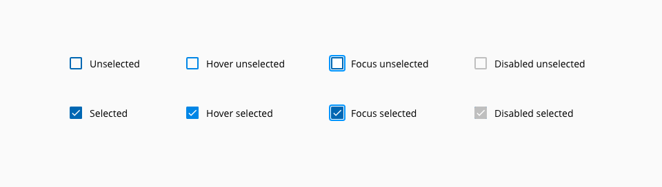
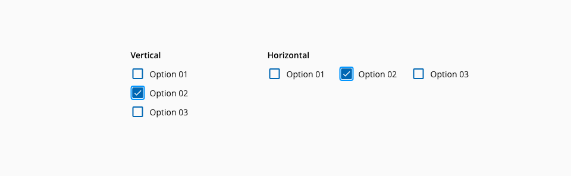
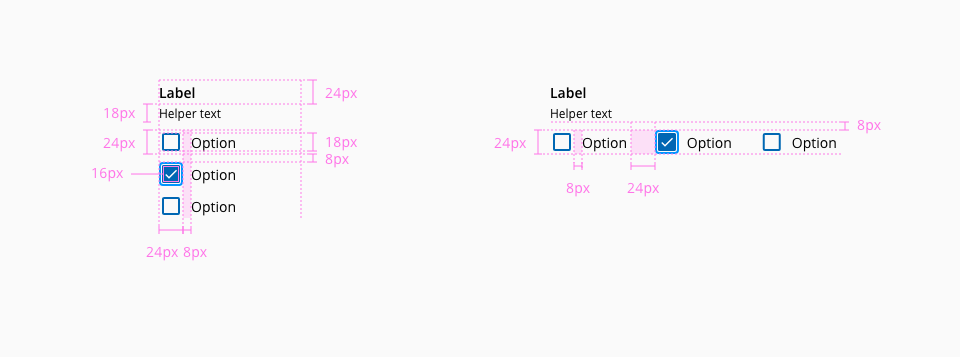

# Checkbox

Checkboxes are inputs that offer to the user the possibility to select one or more options from a range of attributes.

## Usage

Use the checkbox when: 

* Multiple choices offered 
* Binary response are requested (yes/no) 
* Accepting conditions and additional features


### States

The following states are defined in the life cycle of the component: **Unselected enabled**, **unselected hover**, **unselected focus**, **unselected disabled**, **selected enabled**, **selected hover**, **selected focus** and **selected disabled**



_Checkbox component states_

## Anatomy


1. Checkbox input
2. Label

## Stacking

Checkbox may be either vertically or horizontally stacked.



_Checkbox group stacking types_

| Type              | Usage                                                                                                                                      |
| :---------------- | :----------------------------------------------------------------------------------------------------------------------------------------- |
| **Vertical**      | Related checkboxes that belong to the same category. The horizontal spacing between horizontally stacked checkboxes should be 8px.         |
| **Horizontal**    | Checkboxes are independent of a category*. The vertical spacing between stacked checkboxes should be 32px. Don't stack more than 3 options |


## Design Specifications



_Component design specifications_

### Color

#### On-light

| Component token                      | Element                           | Core token               | Value        |
| :----------------------------------- | :-------------------------------- | :----------------------- | :----------- |
| `selectedBackgroundColor`            | Fill                              | `color-blue-800`         |   #0067b3    |
| `selectedHoverBackgroundColor`       | Fill:hover                        | `color-blue-900`         |   #003c66    |
| `selectedDisabledBackgroundColor`    | Fill:disabled                     | `color-grey-500`         |   #999999    |
| `borderColor`                        | Border                            | `color-blue-800`         |   #0067b3    |
| `hoverBorderColor`                   | Border:hover                      | `color-blue-900`         |   #003c66    |
| `disabledBorderColor`                | Border:disabled                   | `color-grey-500`         |   #999999    |
| `checkColor`                         | Check mark                        | `color-white`            |   #ffffff    |
| `disabledCheckColor`                 | Check mark:disabled               | `color-white`            |   #ffffff    |
| `fontColor`                          | Label                             | `color-black`            |   #000000    |
| `disabledFontColor`                  | Label:disabled                    | `color-grey-500`         |   #999999    |
| `focusColor`                         | Outline:focus                     | `color-blue-700`         |   #0095ff    |

#### On-dark

| Component token                         | Element                           | Core token               | Value        |
| :-------------------------------------- | :-------------------------------- | :----------------------- | :----------- |
| `selectedBackgroundColorOnDark`         | Fill                              | `color-grey-200`         |   #e6e6e6    |
| `selectedHoverBackgroundColorOnDark`    | Fill:hover                        | `color-white`            |   #ffffff    |
| `selectedDisabledBackgroundColorOnDark` | Fill:disabled                     | `color-grey-800`         |   #4d4d4d    |
| `borderColorOnDark`                     | Border                            | `color-grey-200`         |   #e6e6e6    |
| `hoverBorderColorOnDark`                | Border:hover                      | `color-white`            |   #ffffff    |
| `disabledBorderColorOnDark`             | Border:disabled                   | `color-grey-800`         |   #4d4d4d    |
| `checkColorOnDark`                      | Check mark                        | `color-black`            |   #000000    |
| `disabledCheckOnDark`                   | Check mark:disabled               | `color-grey-500`         |   #999999    |
| `fontColorOnDark`                       | Label                             | `color-white`            |   #ffffff    |
| `disabledFontColorOnDark`               | Label:disabled                    | `color-grey-500`         |   #999999    |
| `focusColorOnDark`                      | Outline:focus                     | `color-blue-600`         |   #0095ff    |


### Spacing

| Component token          | Element          | Core token                 | Value                        |
| :----------------------- | :--------------- | :------------------------- | :--------------------------- |
| `inputMargin`            | Checkbox input   | `spacing-03`               | 0.5rem / 8px                 |

### Typography

| Component token          | Element          | Core token                 | Value                        |
| :----------------------- | :--------------- | :------------------------- | :--------------------------- |
| `fontFamily`             | Label            | `font-family-sans`         | 'Open Sans', sans-serif      |
| `fontSize`               | Label            | `font-scale-02`            | 0.875rem / 14px              |
| `fontWeight`             | Label            | `font-weight-regular`      | 400                          |

### Border

| Property                 | Element          | Core token                 | Value            |
| :----------------------- | :--------------- | :------------------------- | :--------------- |
| `border-width`           | Checkbox input   | `border-width-2`           | 2px              |
| `border-style`           | Checkbox input   | `border-style-solid`       | solid            |
| `border-radius`          | Checkbox input   | `border-radius-small`      | 0.125rem / 2px   |
| `border-width`           | Focus border     | `border-width-2`           | 2px              |
| `border-style`           | Focus border     | `border-style-solid`       | solid            |
| `border-radius`          | Focus border     | `border-radius-medium`     | 0.25rem / 4px    |

### Margin

Margin can be set independently for `top`, `right`, `bottom`, `left`.

margin | value
-- | --
```xxsmall``` | 6px
```xsmall``` | 16px
```small``` | 24px
```medium``` | 36px
```large``` | 48px
```xlarge``` | 64px
```xxlarge``` | 100px


## Accessibility

### WCAG 2.2

* Understanding WCAG 2.2 - [SC 1.3.1: Info and Relationships](https://www.w3.org/WAI/WCAG22/Understanding/info-and-relationships.html)
* Understanding WCAG 2.2 - [SC 4.1.2: Name, Role, Value](https://www.w3.org/WAI/WCAG22/Understanding/name-role-value.html)

### WAI-ARIA 1.2

* WAI-ARIA Authoring Practices 1.2 - [3.7 Checkbox](https://www.w3.org/TR/wai-aria-practices-1.2/#checkbox)

## Links and references

- [React CDK component](https://developer.dxc.com/tools/react/next/#/components/checkbox)
- [Angular CDK component](https://developer.dxc.com/tools/angular/next/#/components/checkbox)

____________________________________________________________

[Edit this page on Github](https://github.com/dxc-technology/halstack-style-guide/blob/master/guidelines/components/checkbox/README.md)
