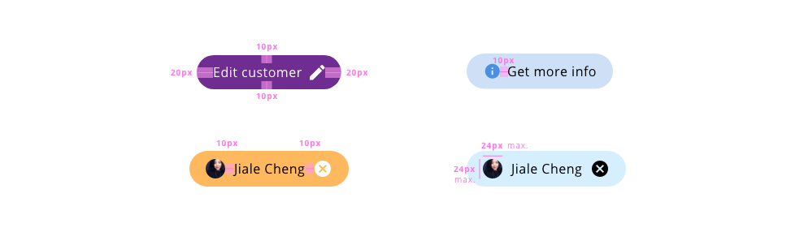

# Chip

Chips are elements that represent status, complementary information, or association between elements.

## Usage

* Do not use chips instead of buttons they have a total different aim in the UI
* Make clear and simple the content of the label
* Use chips to make tasks easier for the user

## States

The chip component container states are: **enabled** and **disabled**:

_Chip container states_

The chip action item has the following states: **enabled**, **hover**, **focus**, **active**, and **disabled**:

_Chip prefix and suffix states_

## Anatomy

1. Container
2. Prefix _(Optional)_
3. Label
4. Suffix _(Optional)_

## Design Specifications

_Component chip design specifications_

### Color

#### On-light

| Component token           | Element                   | Token                   | Value     |
| :------------------------ | :------------------------ | :---------------------- | :-------- |
| `backgroundColor`         | Chip container            | `color-grey-200`        | #e6e6e6   |
| `disabledBackgroundColor` | Chip container:disabled   | `color-grey-100`        | #f2f2f2   |
| `fontcolor`               | Label                     | `color-black`           | #000000	  |
| `disabledFontcolor`       | Label:disabled            | `color-grey-500`        | #999999	  |
| `focusColor`              | Focus outline             | `color-blue-600`        | #0095ff	  |
| `iconColor`               | Icon                      | `color-black`           | #000000	  |
| `disabledIconColor`       | Icon:disabled             | `color-grey-500`        | #999999	  |

#### On-dark

| Component token                 | Element                   | Token                   | Value     |
| :------------------------------ | :------------------------ | :---------------------- | :-------- |
| `backgroundColorOnDark`         | Chip container            | `color-grey-700`        | #666666   |
| `disabledBackgroundColorOnDark` | Chip container:disabled   | `color-grey-800`        | #4d4d4d   |
| `fontcolorOnDark`               | Label                     | `color-white`           | #ffffff   |
| `disabledfontcolorOnDark`       | Label:disabled            | `color-grey-500`        | #999999	|
| `focusColorOnDark`              | Focus outline             | `color-blue-600`        | #0095ff	|
| `iconColorOnDark`               | Icon                      | `color-white`           | #ffffff	|
| `iconColorOnDark`               | Icon:disabled             | `color-grey-500`        | #999999	|

### Typography

| Component token          | Element          | Core token                 | Value                      |
| :----------------------- | :--------------- | :------------------------- | :------------------------- |
| `fontFamily`             | Label            | `font-family-sans`         | 'Open Sans', sans-serif    |
| `fontSize`               | Label            | `font-scale-03`            | 1rem / 16px                |
| `fontStyle`              | Label            | `font-style-normal`        | normal                     |
| `fontWeight`             | Label            | `font-weight-regular`      | 400                        |

### Spacing

| Component token		    | Element		        | Core token      | Value	          |
| :-----------------------	| :-------------------- | :-------------- | :---------------- |
| `labelMarginLeft`	        | Label		            | `spacing-03`    | 0.5rem / 8px	  |
| `labelMarginRight`	    | Label		            | `spacing-03`    | 0.5rem / 8px	  |
| `containerPaddingLeft`	| Container		        | `spacing-03`    | 0.5rem / 8px	  |
| `containerPaddingRight`	| Container		        | `spacing-03`    | 0.5rem / 8px	  |

### Border

| Property                 | Element          | Core token                 | Value            |
| :----------------------- | :--------------- | :------------------------- | :--------------- |
| `border-width`           | Chip container   | `border-width-0`           | 0                |
| `border-style`           | Chip container   | `border-style-none`        | none             |
| `border-radius`          | Chip container   | `border-radius-full`       | 9999px           |
| `border-width`           | Focus border     | `border-width-2`           | 2px              |
| `border-style`           | Focus border     | `border-style-solid`       | solid            |
| `border-radius`          | Focus border     | `border-radius-medium`     | 0.25rem / 4px    |

### Size

| Component token		    | Element		        | Core token          | Value	        |
| :-----------------------	| :-------------------- | :------------------ | :-------------- |
| `iconSize`  		        | Prefix/Suffix		    | `size-icon-large`	  | 24x24px         |

## Links and references

* [Angular CDK component](https://developer.dxc.com/tools/angular/next/#/components/chip)
* [React CDK component](https://developer.dxc.com/tools/react/next/#/components/chip)

____________________________________________________________

[Edit this page on Github](https://github.com/dxc-technology/halstack-style-guide/blob/master/guidelines/components/chip/README.md)
