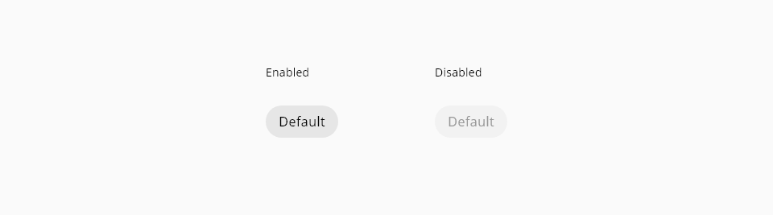

# Chip

Chips are elements that represent status, complementary information, or association between elements.

## Usage

* Do not use chips instead of buttons they have a total different aim in the UI
* Make clear and simple the content of the label
* Use chips to make tasks easier for the user

## States

The only interactive element on the chip component is the prefix/suffix and its states are: **enabled** and **focus**:

_Chip prefix and suffix states_

## Design Specifications

_Component chip design specifications_

### Color

| Component token           | Element                   | Token                   | Value     |
| :------------------------ | :------------------------ | :---------------------- | :-------- |
| `backgroundColor`         | Chip container            | `color-grey-200`        | #e6e6e6   |
| `disabledBackgroundColor` | Chip container:disabled   | `color-grey-100`        | #f2f2f2   |
| `fontcolor`               | Label                     | `color-black`           | #000000	  |
| `fontcolor`               | Label:disabled            | `color-grey-500`        | #999999	  |
| `focusColor`              | Focus outline             | `color-blue-800`        | #0067b3	  |
| `iconColor`               | Icon                      | `color-black`           | #000000	  |
| `iconColor`               | Icon:disabled             | `color-grey-500`        | #999999	  |

### Size

| Property		    | Element			                  | Value		      |
| --------------- | ----------------------------- | -------------	|
| `min-height`		| Chip container		            | 40px		      |
| `height`		    | Prefix/Suffix		              | 24px		      |
| `width`		      | Prefix/Suffix				          | 24px		      |

### Spacing

| Property		          | Element		            | Value	|
| ---------------------	| --------------------- | ----- |
| `padding-left/right`	| Chip container		    | 16px	|
| `margin`	            | Prefix/Suffix			    | 8px	  |

### Border

| Property                 | Element          | Core token                 | Value            |
| :----------------------- | :--------------- | :------------------------- | :--------------- |
| `border-width`           | Chip container   | `border-width-0`           | 0                |
| `border-style`           | Chip container   | `border-style-none`        | none             |
| `border-radius`          | Chip container   | `border-radius-full`       | 9999px           |
| `border-width`           | Focus border     | `border-width-2`           | 2px              |
| `border-style`           | Focus border     | `border-style-solid`       | solid            |
| `border-radius`          | Focus border     | `border-radius-medium`     | 0.25rem / 4px    |

### Typography

| Property  	  | Element	  | Value	|
| ------------- | --------- | ----- |
| `font-size`	  | Label 	  | 16px	|
| `font-weight`	| Label		  | 400	  |

## Links and references

* [Angular CDK component](https://developer.dxc.com/tools/angular/next/#/components/chip)
* [React CDK component](https://developer.dxc.com/tools/react/next/#/components/chip)

____________________________________________________________

[Edit this page on Github](https://github.com/dxc-technology/halstack-style-guide/blob/master/guidelines/components/chip/README.md)
