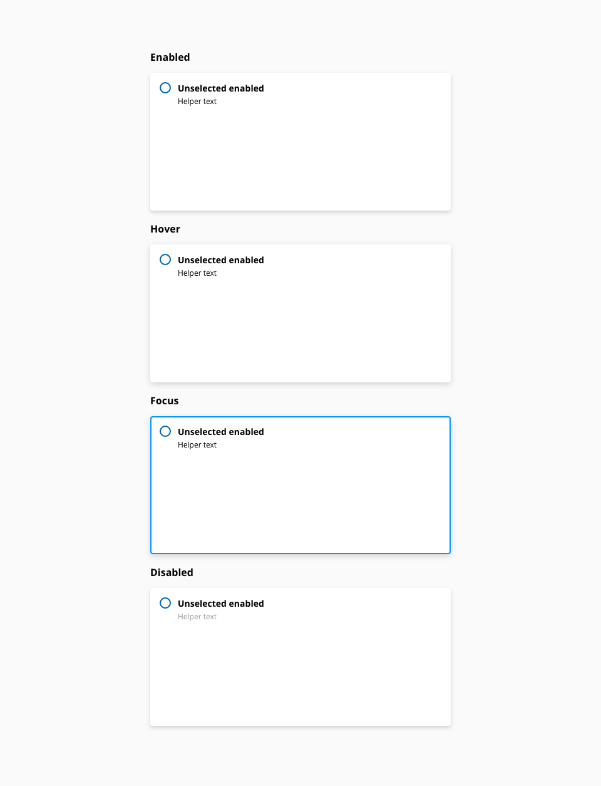
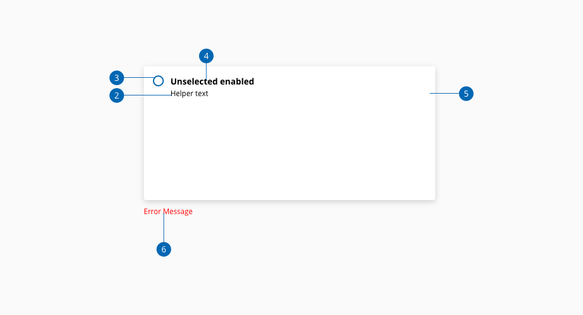
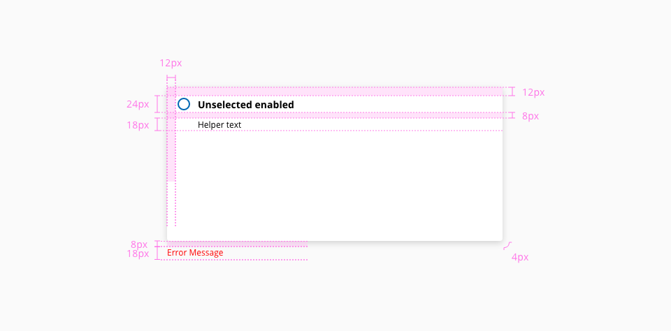

# Choice Card

Choice Card is a Complex UI Component with a combination of Box Component and Radio Group Component. Each Choice Card is enclosed with 2 blocks of interactive elements, One with all the interactive elements like image, link, button, list etc., which makes up a design layout and the other is a Radio Button with a label. The Choice cards can be used to create distinct grouping between different sections of content based on the user selections.

## Usage

* Single Choice Card should not be used
* Avoid using very long Choice Card title
* Organize the Choice card collection with a clear layout and apply the same style for every card in the group
* Choice card may be pre selected based on the requirement

## States

The following states are defined in the life cycle of the component: Unselected enabled, unselected hover unselected focus, unselected disabled, selected enabled, selected hover, selected focus and selected disabled.

_Image caption_

## Stacking

_Image caption_

### Horizontal

### Vertical

## Anatomy

_Image caption_

1. Container
2. Label
3. Helper text
4. Radio input
5. Radio input label
6. Custom contant
7. Error message

## Content

Any type of content can be place inside the box component.

## Design Specifications

_Image caption_

### Color
Same as box

### Typography
| Property          | Element          | Core token  | Value     |
| :---------------- | :--------------- | :---------- | :-------- |
| `property`        | Element-1        | `token-1`   | value-1   |

### Border

Same as box

### Shadow

Same as box

### Spacing
?

### Size
?

### Margin

Same as box

### Padding

Same as box

## Accessibility

### WCAG

*
*

### WAI-ARIA

*
*

## Links and references

*