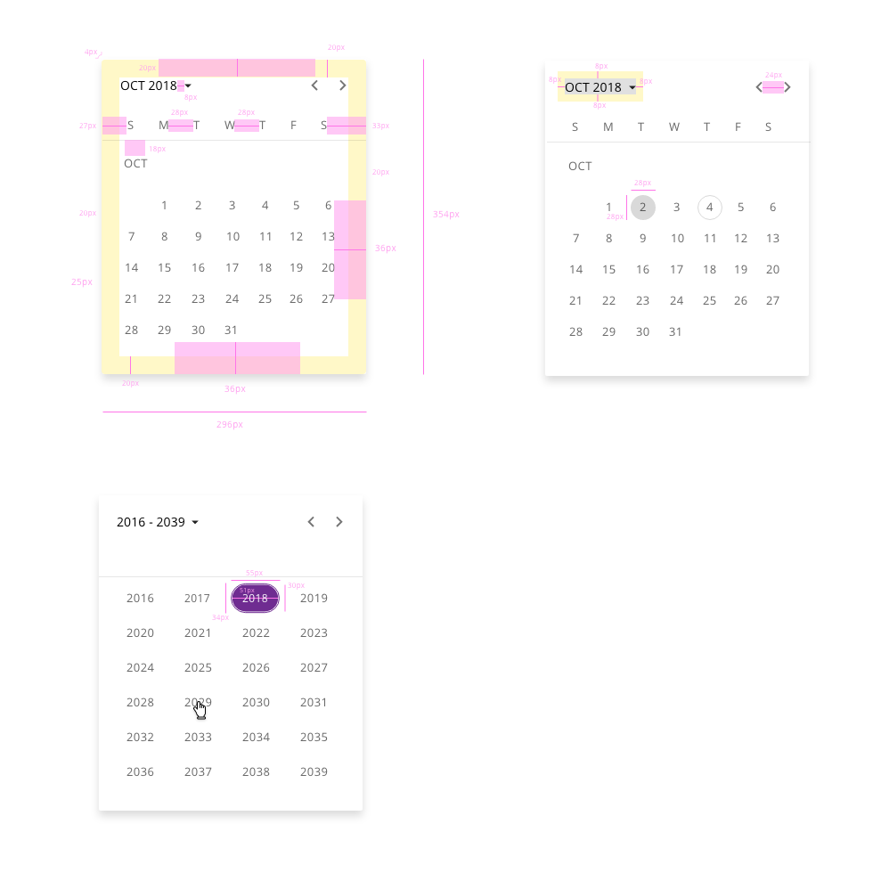

# Date-picker

A date input is a user interface element where the user can type or select a date in a predefined format. The date format depends on an ISO definition for each country and the preference of use within the application.

The format of the date may vary depending on language, region, country or customer. i.e.

- The default format for the United States is mm/dd/yyyy
- The default format for Australia, Europe, Africa, So America and much of Asia is dd/mm/yyyy
- The default format in China is yyyy/mm/dd

It is a good practice to give to the user some type of hint about the date format and in many cases, there is a second way to select the date with a date picker control.
In this component both options will be available to the user, so if the user gets stuck typing the correct format of the data it has an additional option with graphic representation that is easily used.

It is common to find a date picker in these scenarios: date of birth, date range or as an input to filter based on some criteria.


## Appereance

The date input should lead the user to interact with it to select a date and give appropiate feedback to the user to know what value is selected from the wide range. It should be intuitive, navigable and useful.


## States

### Date-input

States: **enabled**, **hover**, **focus**, **focus-suffix**, **error**, and **disabled**.


### Calendar pop-up

States: **enabled**, **hover**, **focus**, **focus-suffix**, **error**, and **disabled**.

The calendar pop-up displays the different views of days, months and years.
By default, the view of the calendar will be the current month with all of its days and it will appear right below the input.

The user can navigate through the calendar to select the desire date.


## Design Specifications

### Date-input


#### Height

| Property                              | Value     |
| ------------------------------------- | --------- |
| `height` (default)                    |      32px |
| `height` (selected)                   |      48px |
| `height` (selected + auxiliar text)   |      73px |


#### Width

| Property            |  Value           | 
| ------------------- |  -------------   |   
| `medium`_(default)_ |  240px           | 
| `large`             |  480px           |  
| `fillParent`        |  -               | 


#### Margin

Different values can be applied to each side of the component:
```top``` ```bottom``` ```left``` ```right```

margin | Value
-- | --
`xxsmall` | 6px
`xsmall` | 16px
`small` | 24px
`medium` | 36px
`large` | 48px
`xlarge` | 64px
`xxlarge` | 100px


#### Typography

| Property                            | Value     |
| ----------------------------------- | --------- |
| `font-size` label enabled           |   16px    |
| `font-size` label                   |   12px    |
| `font-size` placeholder             |   16px    |
| `font-size` assistive text          |   12px    |
| `font-weight`                       |   400     |

#### Other specs

| Property                            | Value     |
| ----------------------------------- | --------- |
| `border-width` enabled              |   1px     |
| `border-width` focus                |   2px     |
| Icon size                           | `20x20px` |
| Distance between text and underline |  7px |


### Calendar pop-up



#### Color

| Tokens                            | Default value |
| --------------------------------- | ------------: |
| pickerSelectedDateBackgroundColor |     `#6F2C91` |
| pickerSelectedDateColor           |     `#FFFFFF` |
| pickerBackgroundColor             |     `#FFFFFF` |
| pickerFontColor                   |     `#000000` |
| pickerActualDate                  |     `#D9D9D9` |
| pickerHoverDateBackgroundColor    |     `#D0BDDB` |
| pickerHoverDateFontColor          |     `#000000` |
| scrollBarThumbColor               |     `#666666` |
| scrollBarTrackColor               |     `#D9D9D9` |
| focusColor                        |     `#005FCC` |

The majority of the specifications are the same as in Angular Material datepicker component. In the table below is pointed all the relevant information.

| Property         |       Value |
| ---------------- | ----------: |
| Padding          |      `20px` |
| Height (default) |     `354px` |
| Widht (default)  |     `296px` |
| Circle size      | `28x28(px)` |
| Circle thickness |       `1px` |
| Font weight      |   `Regular` |
| Font size        |      `13px` |


### Helper text

Helper text can be used as additional instructions to the user when filling in the form. It should be visible even on focus state and it can be replaced by an error message until the error is fixed in order to prevent adding more lines of text.


#### Usage

##### Do:

* Keep helper text as short and specific as possible.
* Only use helper text when truly necessary to avoid overloading the user.
* Should give an example or an explanation of the field.

##### Don’t:

* Helper text should not run longer than the input area.


### Required

Required date fields are displayed in the same way the component text-input does.


## Links and references

- https://xd.adobe.com/view/23e2cca4-5021-490a-a548-e99a9b4a2006-76b1/screen/7965bd24-3ef3-427d-92de-0d2aac880402/variables/

