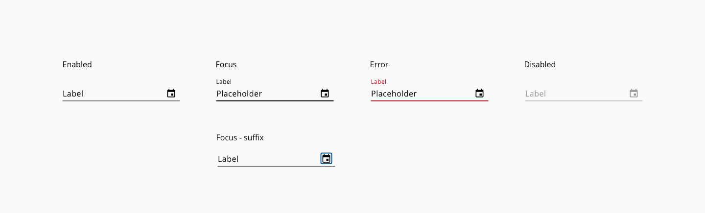
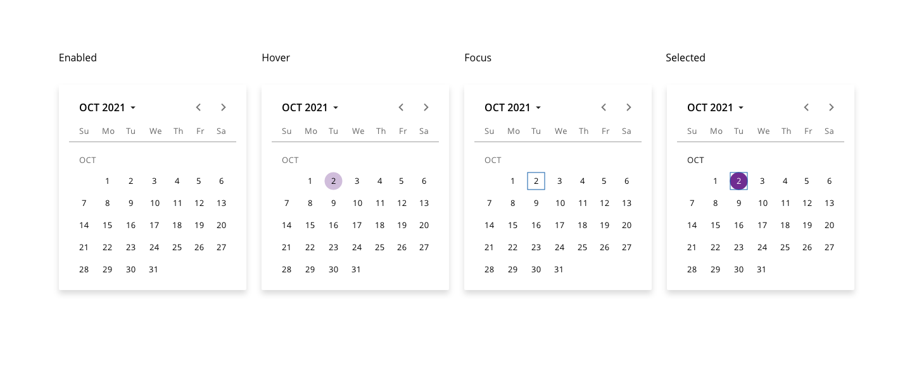
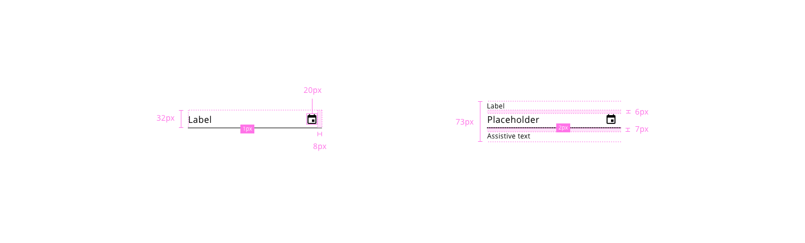
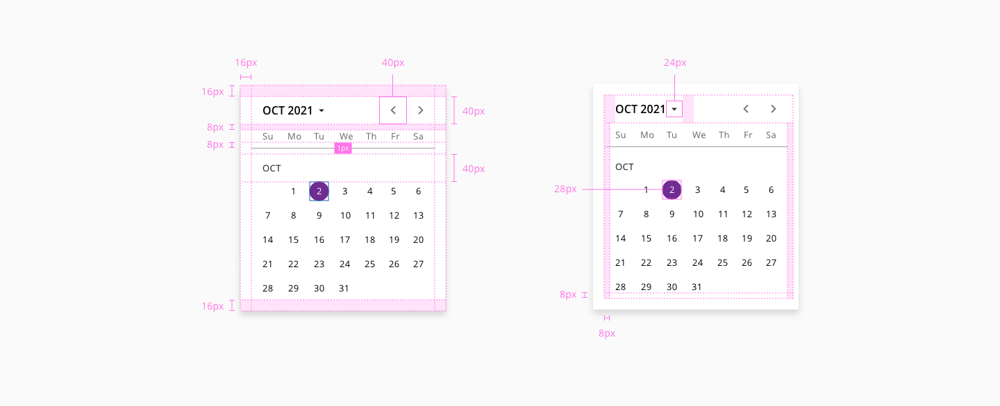
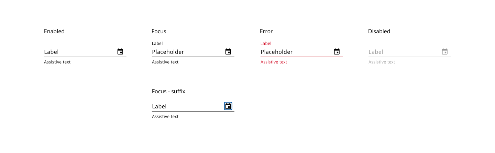
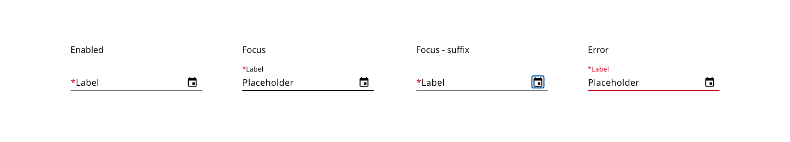

# Date-picker

A date input is a user interface element where the user can type or select a date in a predefined format. 

## States

### Date-input

States: **enabled**, **hover**, **focus**, **focus-suffix**, **error**, and **disabled**.



_Examples of date picker input states_

### Calendar pop-up

States: **enabled**, **hover**, **focus**, **focus-suffix**, **error**, and **disabled**.



_Examples of the calendar pop-up states_


## Design Specifications

### Date-input



_Structure and spacing for date picker inputs_

#### Height

| Property                              | Value     |
| ------------------------------------- | --------- |
| `height` (default)                    |      32px |
| `height` (selected)                   |      48px |
| `height` (selected + auxiliar text)   |      73px |


#### Width

| Property            |  Value           | 
| ------------------- |  -------------   |   
| `medium`_(default)_ |  240px           | 
| `large`             |  480px           |  
| `fillParent`        |  -               | 


#### Margin

Different values can be applied to each side of the component:
```top``` ```bottom``` ```left``` ```right```

margin | Value
-- | --
`xxsmall` | 6px
`xsmall` | 16px
`small` | 24px
`medium` | 36px
`large` | 48px
`xlarge` | 64px
`xxlarge` | 100px


#### Typography

| Property                      | Element          |  Value      |
| ----------------------------- | ---------------- | ----------- |
| `font-size`                   |  label enabled   |   16px      |
| `font-size`                   |  label           |   12px      |
| `font-size`                   |  placeholder     |   16px      |
| `font-size`                   |  assistive text  |   12px      |
| `font-weight`                 |  all             |   400       |


#### Border

| Property                 | Element          | Core token                 | Value            |
| :----------------------- | :--------------- | :------------------------- | :--------------- |
| `border-width`           | Input:enabled    | `border-width-1`           | 1px              |
| `border-style`           | Input:enabled    | `border-style-solid`       | solid            |
| `border-width`           | Input:focus      | `border-width-2`           | 2px              |
| `border-style`           | Input:focus      | `border-style-solid`       | solid            |

#### Other specs

| Property                            | Value     |
| ----------------------------------- | --------- |
| Icon size                           |   20x20px |
| Distance between text and underline |   7px     |


### Calendar pop-up



_Structure and spacing for date picker calendar pop-up_

#### Color

| Component token                        | Element                        | Core token                   | Value         |
| :------------------------------------- | :----------------------------- | :--------------------------- | :------------ |
| `pickerBackgroundColor`                | Dialog container               | `color-white`                | #ffffff       | 
| `pickerFontColor`                      | Dialog text                    | `color-black`                | #000000       | 
| `pickerActualDateColor`                | Dialog title                   | `color-grey-500`             | #999999       | 
| `pickerHoverDateBackgroundColor`       | Container background           | `color-purple-200`           | #e5d5f6       | 
| `pickerSelectedDateColor`              | Date text:selected             | `color-white`                | #ffffff       | 
| `pickerSelectedDateBackgroundColor`    | Date background:hover          | `color-purple-700`           | #5f249f       | 
| `pickerHoverDateFontColor`             | Date text:hover                | `color-black`                | #000000       | 
| `pickerYearFontColor`                  | Year label                     | `color-black`                | #000000       | 
| `pickerMonthFontColor`                 | Mont label                     | `color-black`                | #000000       | 
| `pickerWeekFontColor`                  | Weekday label                  | `color-black`                | #000000       | 
| `pickerBackgroundColorMonthArrows`     | Month selection controls       | `color-black`                | #000000       |  
| `focusColor`                           | Focus outline                  | `color-blue-800`             | #0067b3       | 

#### Typography

| Property                      | Element          |  Value      |
| ----------------------------- | ---------------- | ----------- |
| `font-size`                   |  year selector   |   16px      |
| `font-size`                   |  current month   |   13px      |
| `font-size`                   |  day             |   13px      |
| `font-weight`                 |  year selector   |   600       |
| `font-weight`                 |  current month   |   400       |
| `font-weight`                 |  day             |   400       |

#### Padding

| Property                      | Element               |  Value      |
| ----------------------------- | ----------------      | ----------- |
| `padding`                     |  calendar container   |   16px      |
| `padding-left/right`          |  month container      |   8px       |
| `padding-left/right`          |  year selector        |   16px      |
| `padding-top/bottom`          |  separator            |   8px       |


#### Sizing

| Property                      | Element                |  Value      |
| ----------------------------- | ----------------       | ----------- |
| `height/width`                |  selected date circle  |   28/28px   |
| `height/width`                |  year selection caret  |   24/24px   |
| `height/width`                |  calendar top controls |   24/24px   |


## Helper text

Helper text can be used as additional instructions to the user when filling in the form. It should be visible even on focus state and it can be replaced by an error message until the error is fixed in order to prevent adding more lines of text.



### Usage

#### Do:

* Keep helper text as short and specific as possible.
* Only use helper text when truly necessary to avoid overloading the user.
* Should give an example or an explanation of the field.

#### Don’t:

* Helper text should not run longer than the input area.


## Required

Required date fields are displayed in the same way the component text-input does.



## Internationalization

The date format depends on an ISO definition for each country and the preference of use within the application.

The format of the date may vary depending on language, region, country or customer. It is a good practice to give to the user some type of hint about the date format and in many cases.

- The default format for the United States is `mm/dd/yyyy`
- The default format for Australia, Europe, Africa, So America and much of Asia is `dd/mm/yyyy`
- The default format in China is `yyyy/mm/dd`

## Accessibility

### WCAG 2.2

* Understanding WCAG 2.2 - [SC 2.4.7: Focus Visible](https://www.w3.org/WAI/WCAG22/Understanding/focus-visible)
* Understanding WCAG 2.2 - [SC 1.4.13: Content on Hover or Focus](https://www.w3.org/WAI/WCAG22/Understanding/content-on-hover-or-focus.html)


### WAI-ARIA 1.2

* WAI-ARIA authoring practices 1.2 - [3.9 Dialog modal](https://www.w3.org/TR/wai-aria-practices-1.2/#dialog_modal)
* WAI-ARIA authoring practices - [Date picker design pattern](https://www.w3.org/TR/wai-aria-practices/examples/dialog-modal/datepicker-dialog.html)


## Links and references

- https://xd.adobe.com/view/23e2cca4-5021-490a-a548-e99a9b4a2006-76b1/screen/7965bd24-3ef3-427d-92de-0d2aac880402/variables/

____________________________________________________________

[Edit this page on Github](https://github.com/dxc-technology/halstack-style-guide/blob/master/guidelines/components/date/README.md)
